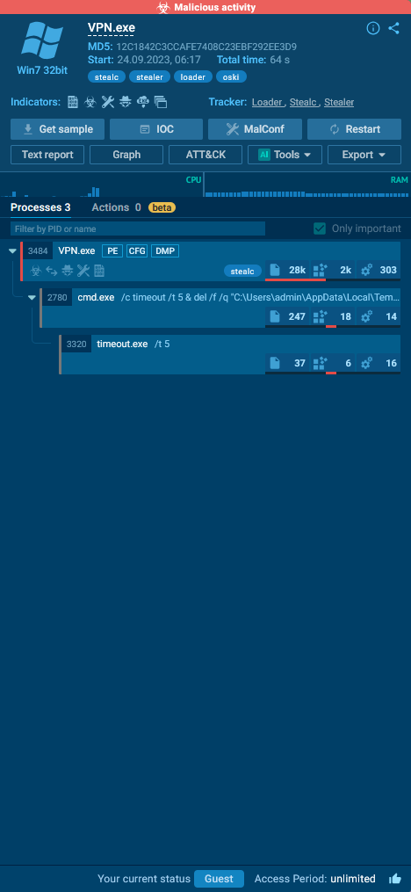
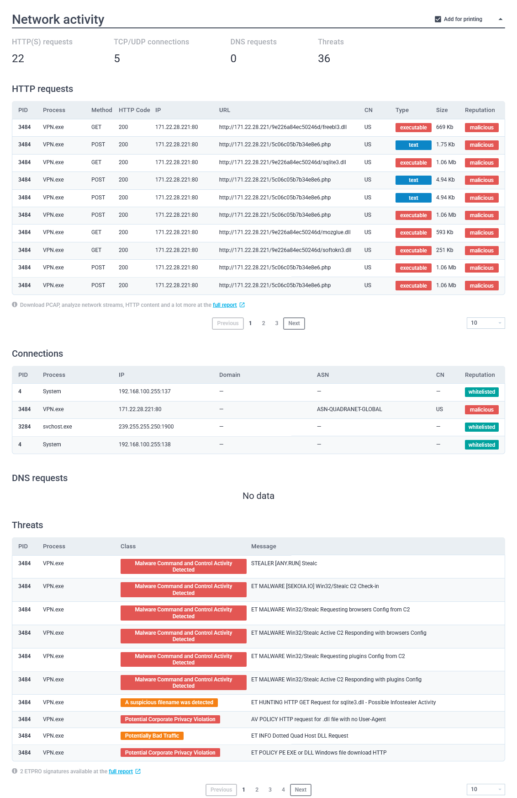

# Incident Response Report: Oski (CyberDefenders)

## Scenario
The accountant at the company received an email titled "Urgent New Order" from a client late in the afternoon. When he attempted to access the attached invoice, he discovered it contained false order information. Subsequently, the SIEM solution generated an alert regarding downloading a potentially malicious file. Upon initial investigation, it was found that the PPT file might be responsible for this download. Could you please conduct a detailed examination of this file?

Analyze a sandbox report using Any.Run to identify Stealc malware behavior, extract configuration details, and map observed tactics to MITRE ATT&CK.

### 1. Executive Summary
*A malicious PPT file was executed, resulting in the deployment of an Oski/Stealc information stealer. The malware successfully loaded database tools to harvest local credentials and exfiltrated them to a known C2 IP before self-deleting.*

### 2. Incident Details
* **Lab/Challenge:** Oski (CyberDefenders)
* **Category:** Threat Intel / SOC Analyst Tier 1
* **Tools Used:** VirusTotal, ANY.RUN
* **Date of Investigation:** 4-25-2026

### 3. Investigation Methodology & Findings
* **Step 1: Identifying the Threat actor**
  * *Method:* The payload was extracted. The MD5 hash associated with the payload was identified and analyzed using VirusTotal. Identifying it as a Trojan/Ransomware, which does data exfiltration and credential theft. The creation time of the malware was determined. This helps to build a timeline of the attack if it's targeted, active campaign or just a commodity malware.
  * *Finding:* `12c1842c3ccafe7408c23ebf292ee3d9` MD5 hash. `2022-09-28 17:40` pulled from file's Portable Executable or PE header. Can be found in VirusTotal's Detail Tab History section.
  `VPN.exe` is the name of the malware.
  * 

* **Step 2: Command & Control (C2) Communication**
  * *Method:* Network analysis revealed command and control (C2) server that the malware communicates with to help trace back to the attacker. Network activity was analyzed to identify the outbound connections to URLs or IP addresses, as these may indicate communication with a command and control (C2) server. Found the `GET` and `POST` HTTP requests which indicate that this device sent a `GET` request to download the `sqlite3.dll` from `171.22.28.221` and send `POST` request to upload data to `171.22.28.221/5c06c05b7b34e8e6.php` endpoint. 
  * *Finding:* The attacker's IP address was identified as `171.22.28.221`. `GET http://171.22.28.221/9e226a84ec50246d/sqlite3.dll` and `POST http://171.22.28.221/5c06c05b7b34e8e6.php` pulled from Relation Tab in Contact URLs field and Behavior tab Network Communication field. 

* **Step 3: Credential Access & Obfuscation**
  * *Method:* Post-infection analysis revealed `sqlite3.dll` as the first requested library DLL file that the malware request post-infection. Its objective is to steal information, harvest saved credentials, session cookies, credit card numbers, and autofill data from web browsers. To access these sensitive data, it has to access SQLite database. An `RC4 key` was identified within the malware configuration used for encryption or decryption (Obfuscation) from Any.run report. Analysis of the Any.run sandbox report identified the primary MITRE ATT&CK technique as `T1555` (Credentials from Password Stores), which specifically targets and extracts credentials from local system files, password managers, or browser databases.
  * *Finding:* `sqlite3.dll` pulled from Behavior tab File Dropped field. `5329514621441247975720749009` The RC4 key pulled from `https://any.run/report/a040a0af8697e30506218103074c7d6ea77a84ba3ac1ee5efae20f15530a19bb/d55e2294-5377-4a45-b393-f5a8b20f7d44` Malware Configuration section Key: RC4 field.

* **Step 4: Defense Evasion & Cleanup**
  * *Method:*  Malware often deletes files to cover its tracks. Child process analysis indicated the malware executed commands to delete all DLL files within the `C:\ProgramData\` directory in the Any.run sandbox report. This is Anti-Forensics / Indicator Removal on Host `(T1070.004)`.
  * *Finding:* Indicator Removal on Host `Starts CMD.EXE for self-deleting` with cmdline: `"C:\Windows\system32\cmd.exe" /c timeout /t 5 & del /f /q "C:\Users\admin\AppData\Local\Temp\VPN.exe" & del "C:\ProgramData\*.dll"" & exit`

* **Step 5: Compromised Data**
  * *Method:* Since the attack is Command and Control (C2), the HTTP request `POST http://171.22.28.221/5c06c05b7b34e8e6.php`, indicate the exfiltration but cannot identify which exact data is exfiltrated due to no further investigation (out of scope).
  * *Finding:* The attacker exfiltrated the credentials from the host via HTTP request to bypass DNS filtering and avoid signature-based detection mechanism by using `5c06c05b7b34e8e6.php` endpoint.
  * 

### 4. Indicators of Compromise (IoCs)
* **Attacker IP Address(es):** `171.22.28.221`
* **The Suspicious File:** Initial Access Vector: the `phishing email` with the malicious `PPT` attachment and the Execution/Payload: `VPN.exe` with MD5 hash: `12c1842c3ccafe7408c23ebf292ee3d9`
* **The Suspicious URI:** `GET http://171.22.28.221/9e226a84ec50246d/sqlite3.dll`and `POST http://171.22.28.221/5c06c05b7b34e8e6.php`

### 5. Mitigation & Recommendations
* Implement signature-based detection of known malware variants in IDS/IPS, AVs.
* Implement Endpoint Detection and Response (EDR) rules to flag anomalous `cmd.exe` usage, especially strings containing `timeout` and `del`.
* Implement strict file validation on the sending outbound HTTP request to an unknown endpoint.
* Block the specific C2 IP (171.22.28.221) at the Firewall.
* Force the accountant to change every single password they had saved on that machine (Mandatory Global Password Reset).
* Clear all active login tokens so the attacker can't use the stolen session cookies to bypass login screens (Revoke Active Sessions).
* Ensure Multi-Factor Authentication is turned on for all corporate accounts so that even if the attacker tries to use the stolen password, they are blocked by the MFA prompt (Enforce MFA).

### 6. MITRE ATT&CK Mapping
|Tactic|Technique ID|Technique Name |Lab Evidence|
|----------------|-------------------------------|-----------------------------|-----------------------------|
|Execution|**T1204.002**|User Execution: Malicious File|The infection chain was initiated by the execution of a malicious payload (`VPN.exe`) originating from an attached PPT file.|
|Defense Evasion|**T1070.004**|Indicator Removal: File Deletion|The malware executed `cmd.exe` with commands (`del /f /q`) to delete its own executable and associated DLLs to cover its tracks.|
|Credential Access|**T1555.003**|Credentials from Password Stores: Credentials from Web Browsers|The malware downloaded `sqlite3.dll` to target, decrypt, and extract credentials stored in local web browser databases.|
|Command and Control|**T1071.001**|Application Layer Protocol: Web Protocols|The malware established communication with its C2 infrastructure (`171.22.28.221`) using standard HTTP GET and POST requests.|
|Exfiltration|**T1041**|Exfiltration Over C2 Channel|Stolen endpoint data and credentials were exfiltrated to the attacker-controlled server via a specific PHP endpoint (`5c06c05b7b34e8e6.php`).|

### 7. Lessons Learned
-   **Sandbox Analysis:** Developed proficiency in reading dynamic analysis sandbox reports (e.g., ANY.RUN) to trace malicious process trees, file drops, and network communication vectors.
    
-   **Info-Stealer Mechanics:** Gained a deep understanding of the Stealc malware family's operational objectives, specifically its reliance on `sqlite3.dll` to harvest local browser data and its use of RC4 encryption for obfuscation.
    
-   **Defense Evasion Tracking:** Learned to identify host-level cleanup operations, such as malware spawning `cmd.exe` to self-delete and remove artifacts from the `C:\ProgramData\` directory.