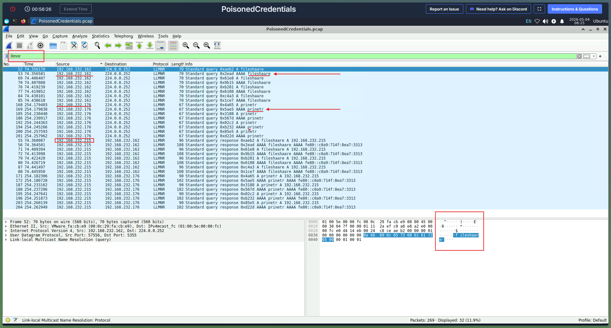
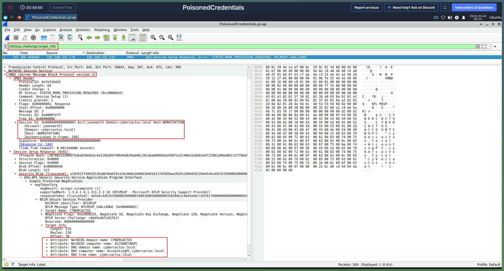

# Incident Response Report: PoisonedCredentials (CyberDefenders)

## Scenario
Your organization's security team has detected a surge in suspicious network activity. There are concerns that LLMNR (Link-Local Multicast Name Resolution) and NBT-NS (NetBIOS Name Service) poisoning attacks may be occurring within your network. These attacks are known for exploiting these protocols to intercept network traffic and potentially compromise user credentials. Your task is to investigate the network logs and examine captured network traffic.

Analyze network traffic for LLMNR/NBT-NS poisoning attacks using Wireshark to identify the rogue machine, compromised accounts, and affected systems.

### 1. Executive Summary
*An attacker successfully used poisoning attacks using a rogue machine to intercept network traffic `LLMNR` and compromise user credentials. Network traffic (PCAP) was analyzed to identify the attacker's IP address and the rogue machine, the mistyped queries, the affected machines and the compromised accounts in `cybercactus.local` domain name.*

#### 2. Incident Details
* **Lab/Challenge:** PoisonedCredentials (CyberDefenders)
* **Category:** Network Forensics / SOC Analyst Tier 1
* **Tools Used:** Wireshark
* **Date of Investigation:** 5-3-2026

### 3. Investigation Methodology & Findings
* **Step 1: Identifying the Attacker and the Affected Machines**
  * *Method:* The PCAP file was analyzed to determine the IP address of the rogue machine. `llmnr` filter was used in WireShark to isolate LLMNR traffic. Followed the initial query, focusing on response packets. Network analysis revealed the victim machine `192.168.232.162` sent a multicast LLMNR query to `224.0.0.252` looking for the mistyped share `fileshaare`. The response to the LLMNR query for `192.168.232.162` was `192.168.232.215`, which identified the rogue machine that initiated the poisoning attack. The attacker initiated their actions by taking advantage of benign network traffic from legitimate machines. The mistyped query `fileshaare` was identified in packet details in the `Queries` field. Sent from the `192.168.232.162` LLMNR queries. Also another affected machine `192.168.232.176` was identified during the same process with mistyped query `prinetr`. To understand the extent of the attacker's activities, the hostname of the machine that the attacker accessed via SMB was identified. `ntlmssp.challenge.target_info` filter was used to locate relevant packets. SMB2 header was examined, searching for the field `NetBIOS Computer Name` to identify the hostname `AccountingPC`.
   * *Finding:* Rogue Machine: `192.168.232.215`. Affected Machines: `192.168.232.162` (Hostname: `AccountingPC`) and `192.168.232.176` Mistyped Queries: `fileshaare` and `prinetr` Domain name: `cybercactus.local`
   * 

* **Step 2: Credential Theft**
  * *Method:* The username associated with the compromised account was identified by applying the `ntlmssp.auth.username` filter to locate packets containing NTLM authentication data. The username `janesmith` was found in the NTLM Secure Service Provider in the SMB Header of the SMB2 packet. But the username had already been found while examining the session setup within that same `target_info` packet stream with the `ntlmssp.challenge.target_info` filter.
  * *Finding:* The compromised account: `janesmith`
  * 

### 4. Indicators of Compromise (IoCs)
* **Attacker IP Address(es):** `192.168.232.215`

### 5. Mitigation & Recommendations
* Disable LLMNR.
* Disable NetBIOS Name Service (NBT-NS).
* Enforce SMB Signing.
* Initiate a mandatory password reset for the compromised account (janesmith).
* Ensure Multi-Factor Authentication is turned on for all corporate accounts so that even if the attacker tries to use the stolen password, they are blocked by the MFA prompt (Enforce MFA).

### 6. MITRE ATT&CK Mapping
|Tactic|Technique ID|Technique Name |Lab Evidence|
|----------------|-------------------------------|-----------------------------|-----------------------------|
|Credential Access|**T1557.001**|Adversary-in-the-Middle: LLMNR/NBT-NS Poisoning|The attacker intercepted a mistyped `fileshaare` LLMNR query to trick the victim machine into handing over authentication data.|
|Credential Access|**T1110.002**|Brute Force: Password Cracking|The attacker captured the NetNTLMv2 response with the intent to take it offline and crack the plaintext password for `janesmith`.|

### 7. Lessons Learned
-   **Legacy Protocol Vulnerabilities:** Gained practical understanding of how legacy Windows broadcast protocols (LLMNR and NBT-NS) act as fallbacks when DNS fails, and how attackers exploit this mechanism to intercept traffic.
    
-   **NTLM Authentication Analysis:** Mastered the use of Wireshark filters (e.g., `ntlmssp.auth.username`, `ntlmssp.challenge.target_info`) to dig deeply into SMB2 headers and extract compromised hostnames and user identities.
    
-   **Active Directory Mitigations:** Solidified knowledge on how enforcing SMB Signing prevents real-time NTLM Relay attacks, and why disabling LLMNR/NBT-NS entirely is a critical hardening step for corporate networks.