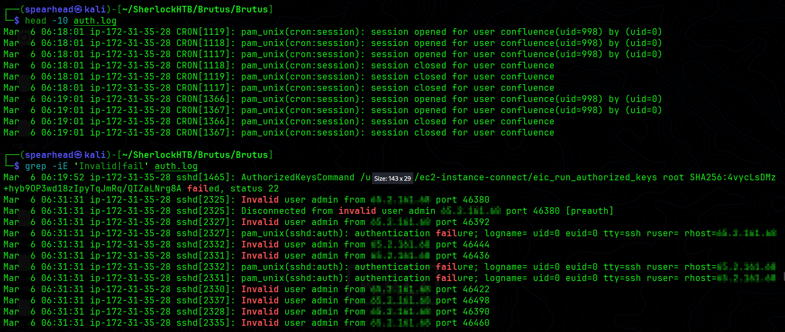
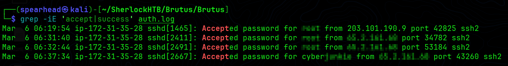
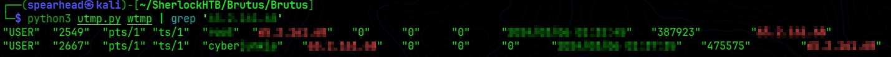
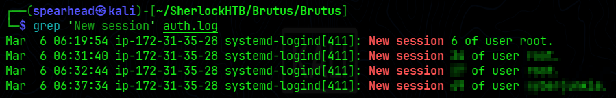
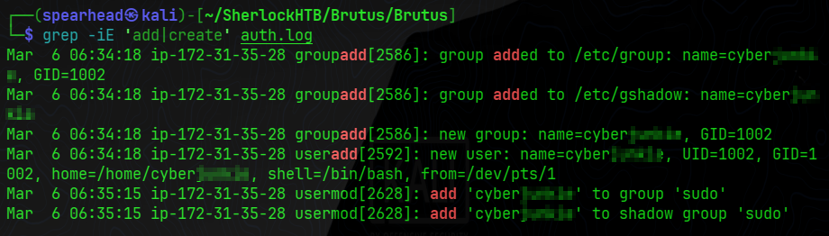
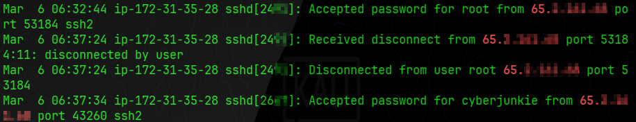
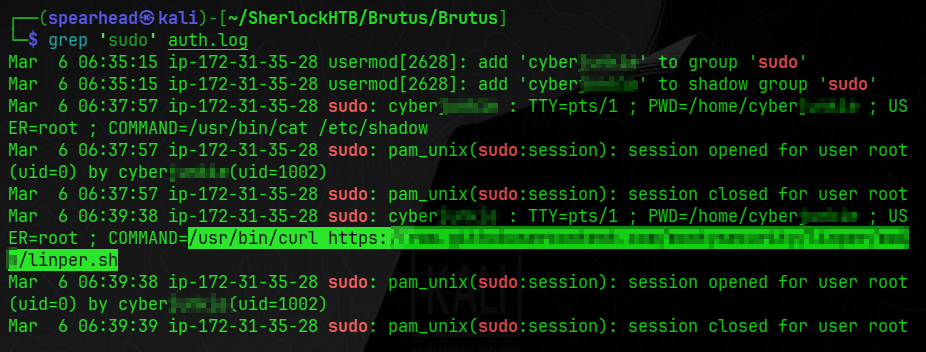

# Brutus — HTB Sherlock Write-up

**Date:** 2026-06-13   
**Prepared by:** uriel0byte  
**Machine Author:** CyberJunkie  
**Difficulty:** Very Easy  
**Platform:** Hack The Box — Sherlocks  

---

## Executive Summary

A Confluence server at `172.31.35.28` was breached through SSH brute-force from a single external IP. The attacker cycled through generic usernames until cracking the `root` account, then logged in manually, created a backdoor local account with `sudo` privileges, and pulled a Linux persistence enumeration script (`linper.sh`) from a public GitHub repository before disconnecting.

---

## Scenario

> *In this Sherlock, you will familiarize yourself with Unix auth.log and wtmp logs. We'll explore a scenario where a Confluence server was brute-forced via its SSH service. After gaining access to the server, the attacker performed additional activities, which we can track using auth.log. Although auth.log is primarily used for brute-force analysis, we will delve into the full potential of this artifact in our investigation, including aspects of privilege escalation, persistence, and even some visibility into command execution.*

---

## Artifacts

| Artifact | Type | Description |
|---|---|---|
| `auth.log` | ASCII text | Standard Unix authentication log |
| `wtmp` | Binary data | Historical record of user logins and logouts |
| `utmp.py` | Python script | Provided parser for binary `wtmp` data |

Initial triage with `file` and `wc`: `auth.log` is 385 lines / 43,911 bytes, `wtmp` is raw binary with 9 entries, `utmp.py` is a readable Python script.

---

## Investigation

### Phase 1: Brute Force & Initial Access

**Task 1 — What is the IP address used by the attacker to carry out a brute force attack?**

> `[REDACTED — Attacker IP]`

Running `grep -iE 'invalid|fail' auth.log` produced a long stream of failed SSH attempts against generic usernames, all from one external IP. The host machine (`ip-172-31-35-28`) appears throughout as the destination, not the source.

```bash
grep -iE 'invalid|fail' auth.log
```


*Expected output: Dense stream of "Invalid user" and "authentication failure" lines, all from the same external IP.*

---

**Task 2 — The brute force was successful. What is the username of the account?**

> `[REDACTED — Compromised Account]`

Filtering for accepted authentications showed the attacker got into the highest-privileged account on the system. A second IP (`203.101.190.9`) also has an accepted login, but with zero failed attempts preceding it. Treated as a legitimate user and excluded.

```bash
grep -iE 'accept|success' auth.log
```


*Expected output: Four "Accepted password" lines — one from the legitimate IP, two from the attacker IP for root, one later for the backdoor account.*

---

### Phase 2: Session Establishment

**Task 3 — Identify the UTC timestamp when the attacker logged in manually and established a terminal session.**

> `[REDACTED — Format: YYYY-MM-DD HH:MM:SS]`

`wtmp` is binary. Running `head` on it produces garbage; `strings | grep` returned the IP but no usable timestamp. After looking up the format, the correct tools are `last`, `utmpdump`, or a dedicated parser. I used the provided `utmp.py`.

```bash
python3 utmp.py wtmp | grep '[REDACTED_ATTACKER_IP]'
```


*Expected output: Two rows — one for root, one for the backdoor account — both showing the attacker IP and timestamp columns.*

The parsed timestamp came out wrong. The binary value was being read in local time, not UTC, causing a 5-hour offset. Cross-referencing against `auth.log` corrected it. Worth noting: `auth.log` shows two accepted root logins from the attacker IP within about a minute of each other. The first is the brute-force tool finding the password. The second is the operator manually logging in. `wtmp` records only the manual session, which is why it shows one root entry.

---

**Task 4 — What is the session number assigned to the attacker's session for the compromised account?**

> `[REDACTED — Session Number]`

I didn't know the right keyword to grep for and had to look it up. `systemd-logind` writes a "New session N of user X" line each time a terminal session opens. Filtering on that string produced four events; the one matching the attacker's manual login timestamp from Task 3 is the target.

```bash
grep 'New session' auth.log
```


*Expected output: Four lines — multiple root sessions and one for the backdoor account, each with a session number and timestamp.*

---

### Phase 3: Persistence & Privilege Escalation

**Task 5 — The attacker created a new account for persistence and gave it higher privileges. What is the account name?**

> `[REDACTED — Backdoor Account]`

The account was already visible from the Task 2 output — a suspicious username logged in from the attacker IP a few minutes after the root session. `grep -iE 'add|create' auth.log` confirmed creation via `useradd` and elevation via `usermod` into the `sudo` group.

```bash
grep -iE 'add|create' auth.log
```


*Expected output: Group creation, user creation with UID/GID/home/shell, and two usermod lines adding the account to the sudo and shadow sudo groups.*

---

**Task 6 — What is the MITRE ATT&CK sub-technique ID for this persistence method?**

> `[REDACTED — Format: TXXXX.XXX]`

Creating a local system account maps to **T1136 — Create Account**. Sub-technique numbering confirmed on attack.mitre.org.

---

**Task 7 — What time did the attacker's first SSH session end according to auth.log?**

> `[REDACTED — Format: YYYY-MM-DD HH:MM:SS]`

My first answer was wrong. I grabbed the timestamp of the first accepted login, which is when the brute-force script found the password, not when the manual session ended. The fix: take the `sshd` PID from the `Accepted password` line in Task 3 and filter on that PID to find `Received disconnect`.

```bash
grep 'sshd\[REDACTED_PID\]' auth.log
```


*Expected output: Three lines for that PID — accepted password, received disconnect, and disconnected from user, all tied to the attacker IP.*

---

**Task 8 — The attacker used the backdoor account to download a script via sudo. What is the full command?**

> `[REDACTED — Full path and URL]`

`grep 'sudo' auth.log` showed two elevated commands run by the backdoor account. The second used `curl` to pull `linper.sh`, a Linux persistence enumeration script, from a public GitHub repository.

```bash
grep 'sudo' auth.log
```


*Expected output: sudo log lines showing TTY, PWD, USER=root, and COMMAND fields. One is /usr/bin/cat /etc/shadow, the other is /usr/bin/curl [REDACTED URL]/linper.sh.*

---

## Indicators of Compromise

| Type | Value | Description |
|---|---|---|
| Attacker IP | `[REDACTED]` | Source of the SSH brute-force and interactive sessions |
| Compromised Account | `[REDACTED]` | Initial access via brute-forced credentials |
| Backdoor Account | `[REDACTED]` | Local account created for persistence with sudo rights |
| Malicious URL | `[REDACTED]` | Hosted `linper.sh`, pulled via curl under sudo |

---

## MITRE ATT&CK Mapping

| Tactic | Technique ID | Name | Evidence |
|---|---|---|---|
| Credential Access | T1110.001 | Brute Force: Password Guessing | Mass failed SSH attempts against generic usernames from attacker IP |
| Initial Access | T1078.003 | Valid Accounts: Local Accounts | Successful root login using brute-forced credentials |
| Persistence | T1136.001 | Create Account: Local Account | `useradd` and `usermod` creating and elevating the backdoor account |
| Privilege Escalation | T1548.003 | Abuse Elevation Control Mechanism: Sudo and Sudo Caching | Backdoor account added to sudo group; elevated commands executed |
| Execution | T1059.004 | Command and Scripting Interpreter: Unix Shell | Bash commands run; `linper.sh` pulled and staged |

---

## Lessons Learned

**Filter by PID, not by IP**

I grepped by IP and scrolled through the output for Tasks 7 and 8. That works on a 385-line log and nowhere else. The right approach is to grab the `sshd` PID from the `Accepted password` line, then filter on that PID. It isolates the full session lifecycle — connect, activity, disconnect — without noise from concurrent sessions or background cron jobs. `grep 'sshd\[2491\]'` is precise. `grep '65.2.161.68'` is not.

**Run `file` before reading any artifact**

My first move on `wtmp` was `head` (garbage), then `strings | grep` (got the IP, no timestamp). Binary files need the right parser. `last`, `utmpdump`, or a dedicated script are the correct tools for `wtmp`. Running `file` on every artifact before touching it would have saved that detour.

**Binary timestamps may not be UTC**

`utmp.py` gave me a timestamp I submitted and got wrong. A 5-hour offset pointed to local time being applied instead of UTC. Cross-referencing against `auth.log` (which logs in UTC) was the fix. When timestamps from two artifacts don't align, check timezone before assuming the data is bad.

**Two accepted logins does not mean two manual sessions**

`auth.log` showed two accepted root logins from the attacker within about a minute. The first was the brute-force tool hitting the right password. The second was the operator logging in manually. `wtmp` recorded only one root session, which is how it should look — it tracks interactive terminal sessions, not automated auth attempts. Conflating the two gave me the wrong timestamp on Task 3.

**Know your `systemd-logind` grep keywords**

I had no idea what to filter for when hunting the session number. The line reads `New session N of user X`. That phrase is the keyword. Goes on the grep reference list next to `Accepted password`, `Invalid user`, and `Received disconnect`.

---

## Proof

Sherlock completion: https://labs.hackthebox.com/achievement/sherlock/2566537/631

---

*Prepared by uriel0byte | github.com/uriel0byte*
