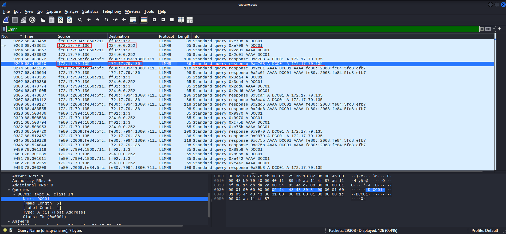
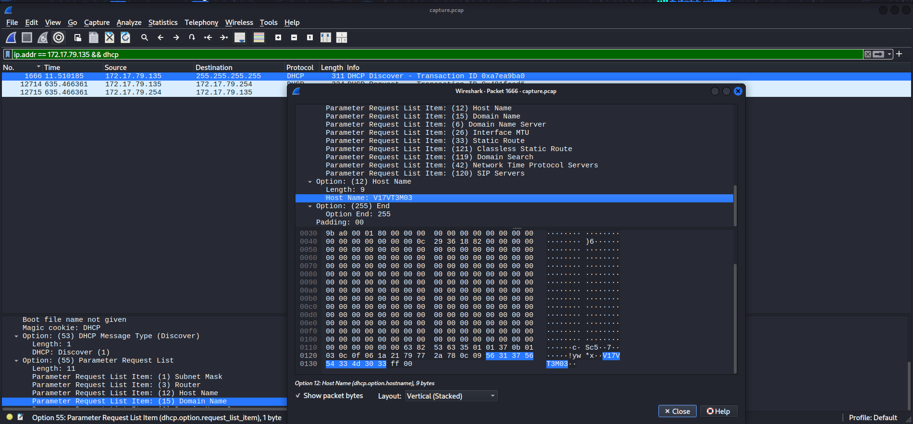
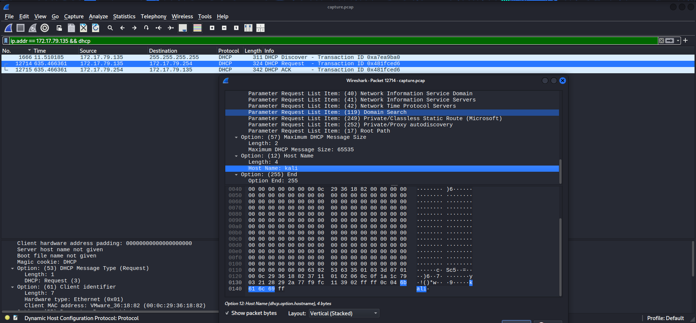
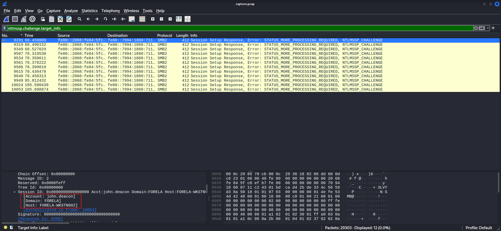
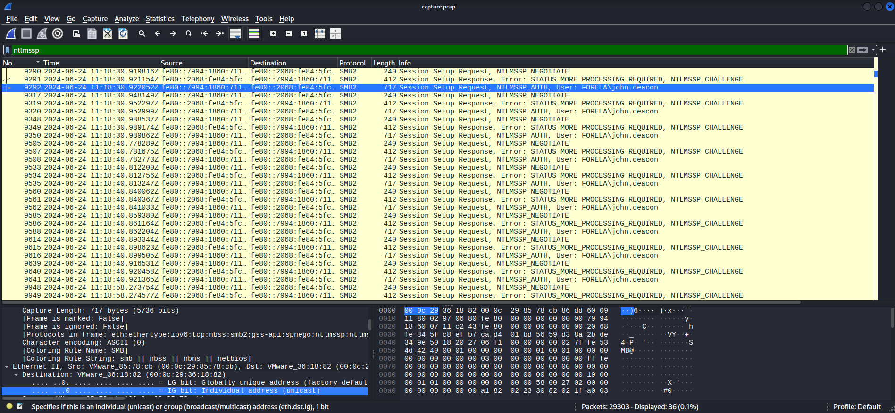
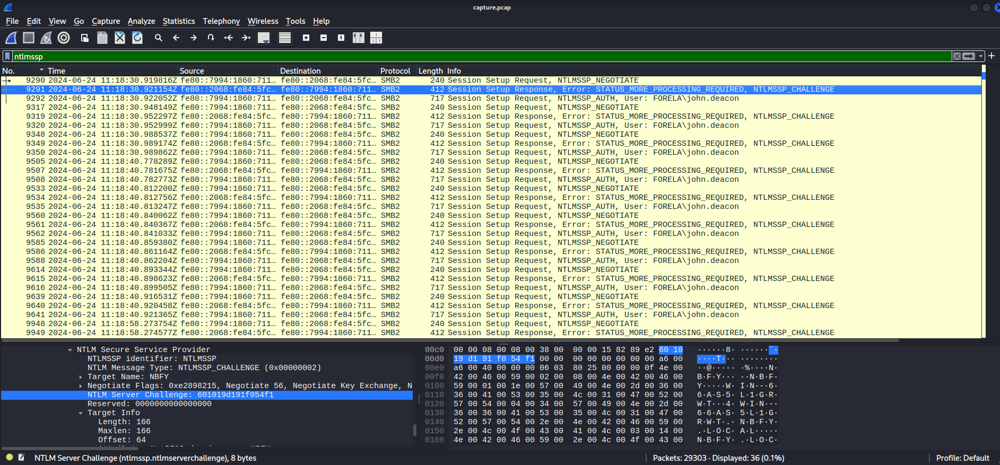
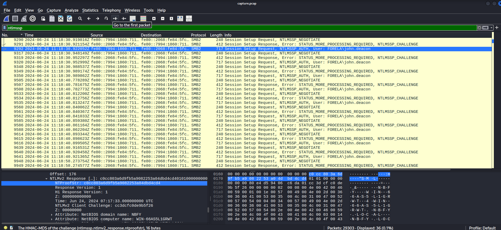
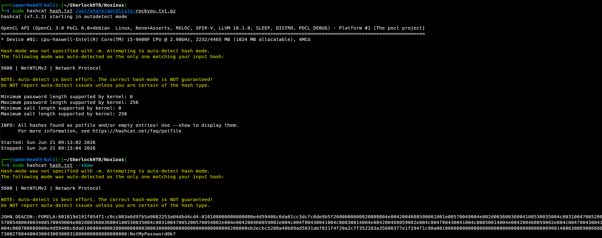
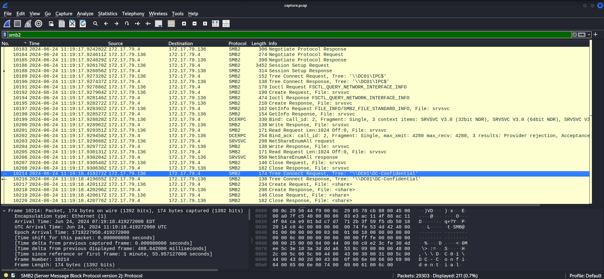

# Noxious — HTB Sherlock Write-up

**Date:** 2026-06-21  
**Prepared by:** uriel0byte  
**Machine Author:** CyberJunkie  
**Difficulty:** Very Easy  
**Platform:** Hack The Box — Sherlocks  

---

## Executive Summary

An IDS alert flagged unusual LLMNR traffic in Forela's internal Active Directory network, pointing to a possible rogue device. The PCAP confirmed an LLMNR poisoning attack: a Kali machine at `172.17.79.135` ran Responder, intercepted a mistyped file share query from `Forela-WKstn002` (`172.17.79.136`), and captured the NetNTLMv2 hash of `john.deacon`. The hash was crackable. The victim's intended destination was `\\DC01\DC-Confidential`, reached roughly 40 seconds after the poisoning began.

---

## Scenario

> *The IDS device alerted us to a possible rogue device in the internal Active Directory network. The Intrusion Detection System also indicated signs of LLMNR traffic, which is unusual. It is suspected that an LLMNR poisoning attack occurred. The LLMNR traffic was directed towards Forela-WKstn002, which has the IP address 172.17.79.136. A limited packet capture from the surrounding time is provided to you, our Network Forensics expert. Since this occurred in the Active Directory VLAN, it is suggested that we perform network threat hunting with the Active Directory attack vector in mind, specifically focusing on LLMNR poisoning.*

---

## Artifacts

| Artifact | Type | Description |
|---|---|---|
| `capture.pcap` | pcap capture file | 131M packet capture, pcap version 2.4 |

Initial triage with `file` and `ls -lh`: 131M, pcap version 2.4, 29,303 packets total.

---

## Investigation

### Phase 1: Identifying the Rogue Machine

**Task 1 — Its suspected by the security team that there was a rogue device in Forela's internal network running responder tool to perform an LLMNR Poisoning attack. Please find the malicious IP Address of the machine.**

> `172.17.79.135`

Applied the `llmnr` display filter. Four IPs appeared: `172.17.79.135`, `172.17.79.136` (known victim, Forela-WKstn002), `172.17.79.29`, and `224.0.0.252` (the LLMNR multicast address).

To find the legitimate domain controller, I enabled name resolution (View → Name Resolution → all three options) and filtered for `dns`. DNS traffic confirmed `dc01.forela.local` resolves to `172.17.79.4`.

So `172.17.79.4` is the real DC. The victim (`172.17.79.136`) sent an LLMNR query for `DCC01` to `224.0.0.252`, and `172.17.79.135` responded instead of the DC. A device answering LLMNR queries it has no business answering is the attack.

```
Filter: llmnr
```



---

**Task 2 — What is the hostname of the rogue machine?**

> `kali`

Filtered for DHCP traffic from the attacker's IP:

```
Filter: ip.addr == 172.17.79.135 && dhcp
```

Three DHCP packets: Discover, Request, ACK. The Discover showed hostname `V17VT3M03`, which was my first wrong answer. The correct hostname is in the DHCP Request packet: `kali`.

Why Discover is wrong: Discover is a broadcast sent before the device has an IP. The hostname in that packet belongs to whatever machine previously occupied this IP address, not the attacker. The Request is sent by the attacker's machine when it formally claims the IP, and that's where its own hostname appears.





---

### Phase 2: Credential Capture

**Task 3 — What is the username whose hash was captured?**

> `john.deacon`

Filtered for `ntlmssp`. The NTLMSSP_AUTH packets contain the victim's username in the NTLM Secure Service Provider header.

```
Filter: ntlmssp
```

`FORELA\john.deacon` is visible in the AUTH packets.

Worth noting: I tried `ntlmssp.challenge.target_info` first because I'd used it before. That filter surfaces NTLMSSP_CHALLENGE packets, which are sent by the attacker's machine pretending to be the DC. The domain and host values inside are what the attacker is claiming to be, not the victim. The victim's credentials appear in the AUTH packet. Wrong packet, wrong filter.



---

**Task 4 — When were the hashes captured the first time?**

> `2024-06-24 11:18:30`

Changed Wireshark time display first: View → Time Display Format → UTC Date and Time of Day.

With `ntlmssp` filter still active, the first three packets are NEGOTIATE, CHALLENGE, AUTH. The timestamp on the NEGOTIATE packet is the answer.



---

**Task 5 — What was the typo the victim made when navigating to the file share?**

> `DCC01`

Already visible from Task 1. The victim queried for `DCC01` instead of `DC01`. DNS couldn't resolve it because `DCC01` doesn't exist, so Windows fell back to LLMNR and broadcast the query to the local network. Responder was listening.

---

### Phase 3: Hash Extraction

**Task 6 — What is the NTLM server challenge value?**

> `601019d191f054f1`

With `ntlmssp` active, opened packet 9291 (NTLMSSP_CHALLENGE) and expanded the tree:

```
SMB2 → Session Setup Response (0x1) → Security Blob → GSS-API Generic
→ Simple Protected Negotiation → negTokenTarg
→ NTLM Secure Service Provider → NTLM Server Challenge
```



---

**Task 7 — What is the NTProofStr value?**

> `c0cc803a6d9fb5a9082253a04dbd4cd4`

Opened packet 9292 (NTLMSSP_AUTH) and expanded:

```
SMB2 → Session Setup Response (0x1) → Security Blob → GSS-API Generic
→ Simple Protected Negotiation → negTokenTarg
→ NTLM Secure Service Provider → NTLM Response → NTLMv2 Response → NTProofStr
```



---

**Task 8 — Recover the plaintext password from the captured hash.**

> `NotMyPassword0K?`

NetNTLMv2 hashes crack with hashcat mode 5600. The hash format pulls values from three different NTLMSSP packets:

```
User::Domain:ServerChallenge:NTProofStr:NTLMv2Response_without_first_32_chars
```

The NTLMv2 Response is in the same packet as NTProofStr. Strip the first 32 characters before using it because those first 32 characters are the NTProofStr. It's already in the format as its own field; including it twice breaks the hash.

Assembled hash:
```
john.deacon::FORELA:601019d191f054f1:c0cc803a6d9fb5a9082253a04dbd4cd4:010100000000000080e4d59406c6da01cc3dcfc0de9b5f2600000000020008004e0042004600590001001e00570049004e002d00360036004100530035004c003100470052005700540004003400570049004e002d00360036004100530035004c00310047005200570054002e004e004200460059002e004c004f00430041004c00030014004e004200460059002e004c004f00430041004c00050014004e004200460059002e004c004f00430041004c000700080080e4d59406c6da0106000400020000000800300030000000000000000000000000200000eb2ecbc5200a40b89ad5831abf821f4f20a2c7f352283a35600377e1f294f1c90a001000000000000000000000000000000000000900140063006900660073002f00440043004300300031000000000000000000
```

```bash
sudo hashcat hash.txt /usr/share/wordlists/rockyou.txt.gz 
```



---

### Phase 4: Intent Confirmation

**Task 9 — What is the actual file share the victim was trying to navigate to?**

> `\\DC01\DC-Confidential`

Filtered for `smb2` and scrolled for tree connect requests. The victim hit `\\DC01\IPC$` first (that's a default admin share), then `\\DC01\DC-Confidential`. That second one is non-default and connects directly to the DCC01 typo from Task 5. About 40 seconds passed between the LLMNR poisoning and the victim reaching the real share.

```
Filter: smb2
```



---

## Indicators of Compromise

| Type | Value | Description |
|---|---|---|
| Attacker IP | `172.17.79.135` | Rogue machine running Responder |
| Attacker Hostname | `kali` | Confirmed via DHCP Request packet |
| Victim Host | `Forela-WKstn002` / `172.17.79.136` | Sent the mistyped LLMNR query |
| Compromised Account | `john.deacon` | FORELA domain account; NetNTLMv2 hash captured and cracked |
| Mistyped Query | `DCC01` | Triggered LLMNR fallback; intended DC01 |
| Target Share | `\\DC01\DC-Confidential` | Victim's intended destination |

---

## MITRE ATT&CK Mapping

| Tactic | Technique ID | Name | Evidence |
|---|---|---|---|
| Credential Access | T1557.001 | Adversary-in-the-Middle: LLMNR/NBT-NS Poisoning and SMB Relay | Responder intercepted LLMNR query for DCC01 and responded with attacker IP |
| Credential Access | T1110.002 | Brute Force: Password Cracking | NetNTLMv2 hash cracked offline with hashcat against rockyou.txt |

---

## Lessons Learned

**The LLMNR/SMB2 Attack Chain Architecture**
This investigation clarified how broadcast protocols and authentication mechanisms interact during a Man-in-the-Middle attack:
1. **The Trigger (DNS Failure):** A user mistypes a network share path (e.g., `\\DCC01`), causing standard DNS resolution to fail[cite: 24].
2. **The Fallback (LLMNR):** Windows defaults to LLMNR, broadcasting a request to the local subnet asking if any device claims the unknown hostname[cite: 24, 26].
3. **The Poisoning (Responder):** The attacker's rogue machine immediately responds, falsely claiming the requested hostname and directing the victim to their IP[cite: 24, 26].
4. **The Capture (SMB2/NTLM):** The victim attempts to connect to the spoofed file share via SMB2. When the attacker's machine demands authentication, the victim's system automatically transmits the NetNTLMv2 cryptographic hash, which is captured for offline password cracking[cite: 24, 26].

**LLMNR is a fallback that trusts everyone**

When DNS fails to resolve a name, Windows broadcasts the query to the local network via LLMNR and accepts the first response. No authentication, no verification. The attacker just has to respond first. Disabling LLMNR and NBT-NS at the Group Policy level is the fix. If both are active in an AD environment, Responder will work.

**DHCP Discover vs. DHCP Request: different packets, different hostnames**

Discover is a broadcast sent before the device has an IP. It can carry stale hostname data from the previous occupant of that address. The Request is the device formally claiming the IP, and the hostname in that packet belongs to the device making the request. Always use the Request packet for hostname attribution.

**`ntlmssp.challenge.target_info` shows what the attacker claims, not who the victim is**

NTLMSSP_CHALLENGE packets are sent by the attacker's machine pretending to be the DC. The domain and host values in those packets are the attacker's cover identity. The victim's credentials appear in NTLMSSP_AUTH, which is the victim responding to the challenge. Filter `ntlmssp`, look at the AUTH packets.

**Why you strip 32 characters from NTLMv2 Response**

The hashcat 5600 format is `User::Domain:ServerChallenge:NTProofStr:NTLMv2Response_without_first_32_chars`. The first 32 characters of NTLMv2 Response are the NTProofStr. It's already a separate field in the format, so leaving it in the response block duplicates it and breaks the hash. Strip 32 characters, assemble in order.

**Set Wireshark to UTC before reading any timestamp**

Default display is seconds since capture start, not wall clock time. Before touching timestamps, go to View → Time Display Format → UTC Date and Time of Day. Not doing this first cost me a wrong answer on Task 4.

**Cross-protocol timeline is the full picture**

The typo at `DCC01` triggered LLMNR fallback. Responder answered at 11:18:30. Credentials were relayed repeatedly over the next few minutes. Forty seconds later, the victim reached `\\DC01\DC-Confidential` on the real DC. Each protocol in isolation tells part of the story. LLMNR shows the bait, NTLMSSP shows the credential capture, SMB2 shows where the victim was trying to go. Reading all three together is what makes the attack chain legible.

---

## Wireshark Filter Reference

This is the thing I kept getting stuck on: knowing the theory but not knowing which filter to type. Here's a practical breakdown of the filters used in this investigation and why each one works.


**`llmnr`**

Shows all Link-Local Multicast Name Resolution packets. Use this when the alert mentions LLMNR or name resolution poisoning. LLMNR runs on UDP port 5355. You can also use `udp.port == 5355` for the same result. The `llmnr` protocol name is faster to type.

**`dns`**

Shows DNS traffic. In AD environments, the domain controller handles DNS, so filtering DNS is a quick way to find the DC's IP from its FQDN. Look at the Source column on DNS response packets.

**`ip.addr == [IP] && dhcp`**

Combines an IP filter with a protocol filter using `&&` (logical AND). Use this when you have a suspect IP and want to see what DHCP negotiation it did to get that address. DHCP Discover, Request, and ACK all show up. Read the Request packet for the device's actual hostname.

**`ntlmssp`**

Shows all NTLM Security Support Provider packets. In an LLMNR poisoning scenario, filtering this gives you the full NEGOTIATE → CHALLENGE → AUTH exchange. The AUTH packet has the username. The CHALLENGE packet has the server challenge value. Both are in the same filter result.

**`smb2`**

Shows SMB2 (Server Message Block version 2) traffic. Use this for Windows file share activity. Tree Connect Request packets show which shares a client tried to access. Useful for confirming what the victim was actually doing when they got poisoned.

**`ntlmssp.ntlmserverchallenge`**

A field-specific filter that surfaces only the NTLMSSP_CHALLENGE packets containing the server challenge value. More precise than `ntlmssp` if you want to go straight to the challenge without scrolling through negotiation packets.


**General pattern for AD network forensics:**

Start broad (`llmnr`, `dns`) to orient yourself and identify IPs. Narrow down with `ip.addr == [suspect]` combined with protocol filters (`&& dhcp`, `&& smb2`). Once you know the full picture, use field-level filters (`ntlmssp.ntlmserverchallenge`) to extract specific values. Work outside-in: protocol first, then packet type, then field.

---

## Proof

Sherlock completion: https://labs.hackthebox.com/achievement/sherlock/2566537/747

---

*Prepared by uriel0byte | github.com/uriel0byte*
