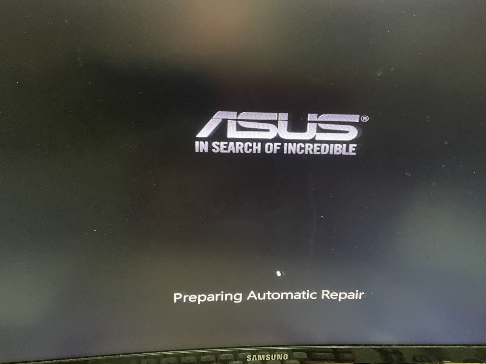

# Incident Report: Windows 11 Boot Failure and Filesystem Corruption (Error 0xc0000102)

- **Date:** 4/20/2026
- 

---

## Executive Summary

I came back from vacation and my PC wouldn't boot. It got stuck on the ASUS logo and wouldn't move past it. What started as a single boot failure turned into a chain of problems: attempting a hard shutdown and opening the command prompt caused the system to freeze completely; unplugging all external USB devices made it stop posting; pulling and reseating the CMOS battery got the system to respond again, but the ASUS logo still wouldn't appear. At that point I had to open the case, pull the RAM sticks, clean the contacts with an eraser, and reseat them before POST cleared.

Once I had a stable machine to work with, the actual problem was still there — a corrupted OS. I borrowed a friend's PC to create a Windows 11 installation USB, booted from it, and worked from the external recovery environment. From there I had to manually enter a 48-digit BitLocker key just to unlock the drive before running any repairs. After running `chkdsk` and `sfc` offline against the encrypted volume, the system threw error `0xc0000102` — Windows' way of saying the OS files themselves were too corrupted to load — until repairs completed and the system finally loaded back into Windows 11.

After recovery, I focused on making sure this wouldn't happen again: disabled hibernation, compacted the WSL virtual disk, cleared out gigabytes of Chrome cache, ran DISM to pull clean system files from Windows Update, and set up a proper air-gapped backup.

---

## Environment Setup

| Field | Detail |
|-------|--------|
| **Operating System** | Microsoft Windows 11 Pro (64-bit) |
| **CPU** | Intel Core i5-9400F @ 2.90GHz |
| **GPU** | NVIDIA GeForce GTX 1660 Ti |
| **Motherboard** | ASUS PRIME B365M-K |
| **C: Drive** | WDC WDS240G2G0B-00EPW0 (SSD — OS) |
| **D: Drive** | WDC WD10EZEX-08WN4A0 (HDD — VMs/Storage) |
| **Security** | UEFI, TPM 2.0, BitLocker (Active) |

---

## Incident Description

The system entered a persistent "Preparing Automatic Repair" loop on boot. A physical inspection of the motherboard showed an active DRAM debug LED — indicating a memory fault during POST. My initial attempts to repair the boot configuration (using `bootrec`) worked on paper, but changing the boot sector triggered BitLocker's TPM lockout. After authenticating with the recovery key, the system threw error `0xc0000102`, confirming the bootloader was fine but the OS files underneath it were too damaged to load.

---

## Root Cause Analysis

This wasn't one thing going wrong — it was several problems hitting at the same time.

**Hardware fault (RAM):** The DRAM debug LED pointed to a memory fault during POST. Improperly seated or oxidized RAM can silently corrupt data as it's being written from memory to disk.

**Full OS drive:** The C: drive was nearly out of space due to uncompressed virtualization files and bloated caches. A full drive causes write failures, which adds to corruption.

**Filesystem corruption (`0xc0000102`):** This stop code translates to `STATUS_FILE_CORRUPT_ERROR`. It means the NTFS filesystem's internal structures — specifically the Master File Table — or critical registry hives were unreadable. The bootloader loaded fine, but crashed when it tried to hand off to a corrupted kernel.

**TPM/BitLocker lockout:** The TPM monitors the boot environment by hashing it on every startup. When `bootrec` rewrote the boot sector, the hash no longer matched the stored baseline. The TPM correctly treated this as a potential tampering event and locked the drive, requiring the manual 48-digit recovery key.

---

## Troubleshooting Methodology

### Phase 1: Physical Hardware Diagnostics

Software repairs are pointless if the hardware is still causing corruption. I had to confirm the machine was physically stable first.

1. Powered down and disconnected the PSU.
2. Inspected the motherboard and confirmed the DRAM debug LED was lit.
3. Pulled both RAM sticks (DIMMs) and cleaned the gold contact pins with a rubber eraser. This removes microscopic oxidation and carbon buildup that causes bridging errors or memory faults. Reseated the DIMMs firmly.
4. Rebooted to confirm the DRAM LED cleared and POST succeeded.

---

### Phase 2: Local Boot Configuration Repair

Tried to fix the boot sequence using the built-in Windows Recovery Environment (WinRE).

1. Accessed the local WinRE Command Prompt.
2. Ran the following boot record repair commands in order:

```
bootrec /fixmbr
bootrec /fixboot
bootrec /scanos
bootrec /rebuildbcd
```

- `bootrec /fixmbr` — Writes a new Master Boot Record to the system partition.
- `bootrec /fixboot` — Writes a new boot sector.
- `bootrec /scanos` — Scans all disks for valid Windows installations.
- `bootrec /rebuildbcd` — Rebuilds the Boot Configuration Data store using the found installation.

3. **Result:** Boot files were rebuilt successfully. However, rewriting the BCD altered the boot sector signature, which is exactly what triggers a TPM mismatch. On the next boot, BitLocker demanded the 48-digit key. After entering it, the system immediately threw `0xc0000102` — confirming the bootloader was fine but the OS itself was too corrupted to load.

---

### Phase 3: External Boot Environment

The local WinRE couldn't be trusted because the host OS corruption likely extended into it. I needed to work from completely outside the damaged drive.

1. Created a Windows 11 Installation USB using the Media Creation Tool on a secondary machine.
2. Entered the BIOS/UEFI on boot and changed the boot priority to the USB drive.
3. Accessed the WinRE Command Prompt from the external USB environment.

---

### Phase 4: Manual Volume Decryption

The OS volume was still BitLocker-encrypted. Before any repair tools could touch it, I had to decrypt it from the command line.

1. **Command:** `manage-bde -status`
   - When booted from an external USB, the system assigns the USB environment to `X:` and shifts the original drive letters around. This command lists all attached volumes so I could confirm which letter was currently assigned to the locked OS partition.

2. **Command:** `manage-bde -unlock C: -RecoveryPassword [48-DIGIT-KEY]`
   - This bypasses the TPM lockout entirely and decrypts the filesystem using the cryptographic recovery key, granting read/write access needed for the repair tools.

---

### Phase 5: Offline Filesystem and Integrity Repair

With the drive decrypted, I ran aggressive offline repair tools against it.

1. **Command:** `chkdsk C: /f /r /x`
   - Confirm the drive letter from the previous step before running — in WinRE booted from USB, the original OS drive may not be assigned `C:`.
   - `/f` — Fixes logical filesystem errors.
   - `/r` — Scans for and recovers readable data from bad sectors.
   - `/x` — Forces the volume to dismount before scanning so nothing is holding it open.

2. **Command:** `sfc /scannow /offbootdir=C:\ /offwindir=C:\Windows`
   - Again, substitute `C:` with whatever letter `manage-bde -status` confirmed in Phase 4.
   - Running a standard `sfc /scannow` from the external USB would check the USB environment (the `X:` RAM disk), not the broken drive. The `/offbootdir` and `/offwindir` flags redirect the System File Checker to verify the cryptographic signatures of the files on the actual offline C: drive and replace any corrupted ones from the component store.

---

### Phase 6: Boot Restoration

1. On reboot, the system booted back into the Windows 11 Setup environment because the USB still had boot priority.
2. Forced a hard restart, re-entered BIOS/UEFI, and moved the internal Windows Boot Manager back to the top of the boot order.
3. Authenticated the BitLocker prompt to confirm the TPM accepted the repaired boot sequence.
4. System loaded into Windows 11.

---

## Resolution and System Hardening

The system recovered without data loss. After confirming everything loaded correctly, I worked through several follow-up steps to close the gaps that caused this.

**System Integrity Audit:**

- Opened Event Viewer (`eventvwr.msc`) and filtered Windows Logs > System for "Critical" and "Error" events to identify the exact timestamp and hardware state (kernel-power loss, disk-write fault) that preceded the boot loop.
- Updated NVIDIA graphics drivers and the motherboard chipset drivers to remove any legacy driver conflicts as a potential future trigger.
- Ran the DISM sequence before running `sfc` a final time online:
  - `DISM /Online /Cleanup-Image /CheckHealth`
  - `DISM /Online /Cleanup-Image /ScanHealth`
  - `DISM /Online /Cleanup-Image /RestoreHealth`
  - The reason for this order: `sfc` repairs files using a local cache called the Windows Component Store (`WinSxS`). If that cache was corrupted (which was likely), `sfc` would replace bad files with other bad files. DISM goes directly to Windows Update servers to download clean binaries and rebuild the cache first. Once DISM finished, a final `sfc /scannow` pushed those clean files into the active OS directory.
- Ran CrystalDiskInfo to check SSD SMART data and confirm drive health.
- Ran Windows Memory Diagnostic to stress-test the RAM after the physical reseating.

**Storage Cleanup:**

- Identified a `.vhdx` file from the Windows Subsystem for Linux that had grown large with unused space. Used `diskpart` (`select vdisk` > `compact vdisk`) to shrink it and reclaim storage on the host.
- Ran `powercfg.exe /hibernate off` to permanently delete `hiberfil.sys`. By default, Windows reserves roughly 75% of installed RAM for this file. Deleting it reclaims that space and forces clean cold-boots by disabling Fast Startup.
- Ran Disk Cleanup, including Windows Update caches and old OS installation files. Cleared browser caches and redirected default download paths to the D: drive.

**Backup Implementation:**

- Set up a 3-2-1 backup: 3 copies of important files, on 2 different media types, with 1 copy stored offline on an external USB (air-gapped).

**BitLocker/TPM Procedure Going Forward:**

- Before any future hardware changes or BIOS updates, the step is: BitLocker > Manage BitLocker > Suspend Protection. This tells the TPM to accept the upcoming changes as authorized, which prevents the system from locking itself out and demanding the 48-digit key again.

---

## Lessons Learned

**1. Fix the hardware before touching the software.** Running repair commands against a drive that's still being fed corrupted data from a faulty RAM stick would have been pointless. Physical hardware stability has to be confirmed first.

**2. `bootrec` will trigger BitLocker — that's expected.** Rewriting the boot sector changes the hash values the TPM uses to verify the boot environment (these are called Platform Configuration Registers, or PCRs). When those values no longer match the stored baseline, the TPM locks the drive. This isn't a bug or a sign something went wrong — it's the security working correctly. Knowing this in advance means you don't panic when it happens, you just enter the recovery key and continue.

**3. Keep a bootable USB ready.** The local recovery partition lives on the same drive that was corrupted. When the OS is damaged badly enough, it can take the recovery environment down with it. An external WinRE on a USB is the fallback that actually works when things get this bad.

**4. A full OS drive is a slow-moving disaster.** Filesystem writes fail when there's no space to write to. That failure mode doesn't always announce itself loudly — it contributes to silent corruption that builds up until something breaks. Keeping the OS partition under 80-85% capacity is basic maintenance, not optional.

**5. The D: drive is not a backup.** Using a secondary internal drive as your primary backup means both drives are exposed to the same failure modes: power surges, ransomware, motherboard failure. A real backup requires physically separate, offline media. This incident made that obvious in a way that no documentation ever had.

---

---

# What I Learned — Concepts & Reference

*Everything below is a reference dump for future review. These are the concepts, tools, and commands I encountered during this incident that I had little or no prior knowledge of.*

---

## 1. Hardware Concepts

### POST (Power-On Self-Test)

Every time you power on a PC, the motherboard runs a quick self-diagnostic before handing control to the OS. This is called POST. It checks that the CPU, RAM, GPU, and storage are all responding correctly. If POST detects a hardware fault, it will halt the boot process and signal the problem — either through a debug LED on the motherboard, a series of beep codes from a speaker, or both.

On the ASUS PRIME B365M-K, there are four debug LEDs labeled CPU, DRAM, VGA, and BOOT. Each one lights up during the corresponding POST check. If a check fails, that LED stays lit and the system stops. In this incident, the DRAM LED was lit, meaning POST found a problem with the RAM during its memory check.

### RAM (Random Access Memory) and DIMMs

RAM is the short-term working memory of the PC. Every program running on the system — including the OS kernel — lives in RAM while it's active. Data gets written from RAM to disk constantly.

The physical RAM sticks you install into a motherboard are called DIMMs (Dual Inline Memory Modules). They slot into memory channels on the motherboard and connect via gold-plated contact pins. These contacts can develop oxidation over time (a thin layer of corrosion from air exposure) or collect carbon buildup, which increases electrical resistance and causes intermittent read/write errors. Cleaning them with a rubber eraser works because the mild abrasive surface removes that oxidation layer without damaging the pins.

When RAM has a fault — whether from oxidation, physical damage, or incorrect seating — it can silently corrupt data. The OS writes what it thinks is correct data to disk, but the data arriving is already scrambled. This is one of the harder failure modes to diagnose because there's no immediate visible error — the corruption just builds up quietly until something critical breaks.

### CMOS Battery

The CMOS battery (usually a CR2032 coin cell on the motherboard) powers a small chip that stores BIOS/UEFI settings when the PC is off — things like the system clock, boot order, and hardware configuration. Removing and reinserting the CMOS battery resets those settings to factory defaults. In this incident it helped get the system to respond again after it stopped posting, likely because a corrupted or stuck BIOS state was cleared.

### SMART Data (Self-Monitoring, Analysis and Reporting Technology)

SMART is a monitoring system built into hard drives and SSDs. The drive continuously tracks internal health metrics — things like reallocated sector counts, read error rates, temperature, and total hours of operation — and stores them in a log. CrystalDiskInfo reads this log and presents it in a readable format. If a drive is developing hardware failure, SMART data often shows warning signs before the drive dies completely.

---

## 2. The Windows Boot Process

Understanding this is important because the entire repair process in this incident involved fixing something that went wrong at one of these stages.

```
Power On
    |
    v
UEFI/BIOS Firmware
    - Runs POST (hardware check)
    - Locates the bootable drive
    - Loads the bootloader from the EFI System Partition
    |
    v
Windows Boot Manager (bootmgr)
    - Reads the Boot Configuration Data (BCD)
    - Selects which OS to load
    - Hands off to the OS loader
    |
    v
Windows OS Loader (winload.efi)
    - Loads the Windows kernel (ntoskrnl.exe) into memory
    - Loads critical drivers
    - This is where 0xc0000102 fires — if the kernel files are corrupted,
      the loader crashes here before the OS can start
    |
    v
Windows Kernel Initialization
    - Kernel takes control
    - Initializes hardware, registry, system services
    |
    v
Windows Desktop (GUI loads)
```

**Key terms from this process:**

| Term | What It Is |
|------|-----------|
| UEFI | Unified Extensible Firmware Interface. The modern replacement for BIOS. It's the firmware that runs before any OS — handles POST, finds the bootloader, and provides a setup interface. |
| BIOS | Basic Input/Output System. The older predecessor to UEFI. Still commonly used as a term even on UEFI systems. |
| EFI System Partition (ESP) | A small partition on the drive (usually ~100MB) where the bootloader files live. Windows Boot Manager sits here. |
| MBR (Master Boot Record) | On older MBR-partitioned disks, the very first sector of the drive. Contains basic code that points to the bootloader. `bootrec /fixmbr` rewrites this. |
| BCD (Boot Configuration Data) | A database that tells Windows Boot Manager what OS installations exist, where they are, and how to load them. `bootrec /rebuildbcd` reconstructs this. |
| Boot sector | The sector on the partition that contains the initial loading code. `bootrec /fixboot` rewrites this. |
| WinRE (Windows Recovery Environment) | A stripped-down version of Windows that boots when the main OS can't. It provides access to diagnostic tools and a command prompt. Lives on a hidden partition on the same drive. |

---

## 3. BitLocker and TPM

### What BitLocker Does

BitLocker is Windows' full-disk encryption feature. When enabled, all data written to the drive is automatically encrypted. Without the correct key, the data on the drive is unreadable — even if someone pulled the drive and plugged it into another PC.

BitLocker can use several methods to unlock the drive on boot. The most common setup (and what was running here) uses the TPM chip to automatically handle unlocking during normal boots so you don't need to type a password every time.

### What the TPM Does

The TPM (Trusted Platform Module) is a dedicated security chip on the motherboard. Its job in a BitLocker setup is to hold the encryption key and only release it when the boot environment looks exactly like it should. It does this by taking measurements of the boot process — hashing the firmware, the bootloader, and the boot configuration — and comparing those hashes against a stored baseline every time the PC starts.

If everything matches, the TPM releases the Volume Master Key (VMK) silently, BitLocker decrypts the drive automatically, and Windows loads normally. The user sees nothing.

If something has changed — even a legitimate repair like `bootrec` rewriting the boot sector — the hash values no longer match. The TPM withholds the VMK. BitLocker can't decrypt. The system prompts for the 48-digit recovery key instead.

### Platform Configuration Registers (PCRs)

PCRs are slots inside the TPM where the boot measurements are stored. Each PCR holds the hash of a specific component in the boot chain. The specific PCRs BitLocker monitors by default include:

| PCR | What It Measures |
|-----|-----------------|
| PCR 0 | Core UEFI firmware |
| PCR 2 | Extended firmware (option ROMs) |
| PCR 4 | Boot Manager code (what `bootrec` modifies) |
| PCR 7 | Secure Boot state |
| PCR 11 | BitLocker access control |

When `bootrec /fixboot` and `bootrec /rebuildbcd` ran in Phase 2, they modified the boot sector and BCD. This changed the values that get hashed into PCR 4. On the next boot, the TPM compared the new PCR 4 value against the stored baseline, found a mismatch, and withheld the key.

### The 48-Digit Recovery Key

The recovery key is a 256-bit numerical password that can unlock the drive independently of the TPM. Microsoft generates it when BitLocker is first enabled and offers to save it to a Microsoft account, print it, or save it to a file. If the TPM ever locks you out — whether from a legitimate repair or actual tampering — this key is the only way back in. Losing it means the drive is permanently unreadable.

### Suspend Protection vs. Disable BitLocker

There are two ways to tell BitLocker to stand down before doing something that would change the boot environment:

| Action | What It Does |
|--------|-------------|
| **Suspend Protection** | Temporarily tells the TPM to accept any new boot measurements as the new baseline. BitLocker stays on; data stays encrypted. On the next boot after the change, the TPM updates its baseline and resumes normal operation. This is the correct option before BIOS updates or hardware changes. |
| **Disable BitLocker** | Fully decrypts the entire drive. All data is written back to disk unencrypted. Takes a long time and is rarely necessary. |

For hardware maintenance, always use Suspend Protection.

---

## 4. Error Codes and What They Mean

### `0xc0000102` — `STATUS_FILE_CORRUPT_ERROR`

This is an NTSTATUS code — a standardized set of codes Windows uses internally to describe error conditions. The format is always `0x` followed by eight hex digits.

`0xc0000102` specifically means the OS loader tried to read a critical file and found its contents were invalid — the data doesn't match what a valid Windows system file should look like. In this context, it fired because the NTFS structures or OS binary files on the C: drive were corrupted to the point where the kernel couldn't be loaded.

**How to read NTSTATUS codes:** The first digit after `0x` indicates severity. `C` (1100 in binary) means a hard error — not a warning, not informational, but an unrecoverable failure. This is why it caused an immediate crash instead of a degraded boot.

### Common Boot-Related Error Codes for Reference

| Code | Name | Meaning |
|------|------|---------|
| `0xc0000102` | STATUS_FILE_CORRUPT_ERROR | A file the OS tried to read is corrupted |
| `0xc000000f` | STATUS_NO_SUCH_FILE | Boot file not found (BCD missing or unreadable) |
| `0xc000000d` | STATUS_INVALID_PARAMETER | Invalid BCD data |
| `0xc0000001` | STATUS_UNSUCCESSFUL | General failure — often a missing boot partition |
| `0xc000014C` | STATUS_REGISTRY_CORRUPT | Registry hive is corrupted |

---

## 5. NTFS Filesystem Concepts

### What NTFS Is

NTFS (New Technology File System) is the filesystem Windows uses on all modern drives. A filesystem is the organizational system that tracks where every file and folder is stored on the physical drive. Without it, the drive is just raw bytes with no way to find anything.

### The Master File Table (MFT)

The MFT is the most critical structure in NTFS. Think of it as a database — every single file and folder on the drive has a record in the MFT. Each record stores the file's name, size, timestamps, permissions, and the actual physical location of the file's data on the disk.

If the MFT is corrupted, Windows can't find any of its files — including the system files it needs to boot. This is why `0xc0000102` fired even after the bootloader was fixed. The bootloader knew where to look for the OS, but when it got there, the filesystem structures that should have pointed to `ntoskrnl.exe` and other critical files were damaged.

`chkdsk` specifically targets MFT corruption. The `/f` flag tells it to repair inconsistencies in the filesystem metadata rather than just reporting them.

### Registry Hives

The Windows Registry is a hierarchical database that stores configuration for the OS, hardware, and software. It's physically stored as a set of binary files called hives on the C: drive (in `C:\Windows\System32\config\`). Critical hives include SYSTEM, SOFTWARE, SAM, and SECURITY.

These hive files are loaded into memory on boot and constantly read/written during operation. If they're corrupted — which happens when a drive fills up and writes start failing — the OS can't load. `sfc` checks the integrity of these files against known-good hashes.

---

## 6. Recovery Commands — Full Reference

### `bootrec`

Used to repair the Windows boot environment from WinRE.

| Flag | Full Syntax | What It Does |
|------|-------------|-------------|
| `/fixmbr` | `bootrec /fixmbr` | Writes a new, clean MBR to the system disk. Doesn't touch the partition table. |
| `/fixboot` | `bootrec /fixboot` | Writes a new boot sector to the active system partition. This is what changed the PCR values and triggered the TPM lockout. |
| `/scanos` | `bootrec /scanos` | Scans all connected disks for Windows installations not currently in the BCD. |
| `/rebuildbcd` | `bootrec /rebuildbcd` | Rebuilds the entire BCD store from scratch, adding any installations found by `/scanos`. |

**Important:** Always run these in this order. Each command builds on the previous one.

---

### `manage-bde`

The command-line interface for managing BitLocker Drive Encryption.

| Command | What It Does |
|---------|-------------|
| `manage-bde -status` | Lists all volumes and their BitLocker status, encryption percentage, and current drive letter assignments. |
| `manage-bde -unlock C: -RecoveryPassword [KEY]` | Unlocks the specified volume using the 48-digit numerical recovery key. |
| `manage-bde -protectors -disable C:` | Suspends BitLocker protection (same as clicking "Suspend" in the GUI). |
| `manage-bde -protectors -enable C:` | Re-enables BitLocker protection. |

---

### `chkdsk`

Checks and repairs the NTFS filesystem on a volume.

| Flag | What It Does |
|------|-------------|
| `/f` | Fixes filesystem errors. Without this, `chkdsk` only reports problems without fixing them. |
| `/r` | Locates bad physical sectors and attempts to recover any readable data from them. Implies `/f`. |
| `/x` | Forces the volume to dismount before the scan. Required when scanning a volume that Windows might otherwise try to keep mounted. |

Full command used: `chkdsk C: /f /r /x`

Running `chkdsk` on the boot volume (C:) while Windows is live will prompt you to schedule it for the next restart instead of running immediately, since Windows keeps that volume mounted.

---

### `sfc` (System File Checker)

Scans all protected Windows system files and replaces corrupted ones using cached copies from the Component Store.

| Command | What It Does |
|---------|-------------|
| `sfc /scannow` | Scans and repairs all protected system files in the currently running OS. |
| `sfc /scannow /offbootdir=C:\ /offwindir=C:\Windows` | Targets an offline OS on the C: drive instead of the current running environment. Use this when running from an external WinRE. |
| `sfc /verifyonly` | Scans without making any repairs. Useful for a read-only health check. |

**Why the offline flags matter:** When booted from a USB, you're running inside a RAM disk mapped to `X:`. A plain `sfc /scannow` would check the `X:` environment, not the broken drive. The offline flags explicitly point `sfc` at the disconnected OS on C:.

---

### `DISM` (Deployment Image Servicing and Management)

Repairs the Windows Component Store (`WinSxS`) by downloading clean files from Windows Update. Must be run before `sfc` when corruption is suspected in the component store itself.

| Command | What It Does |
|---------|-------------|
| `DISM /Online /Cleanup-Image /CheckHealth` | Quick check — reads a flag in the component store that Windows sets if it detects corruption. Fast but limited. |
| `DISM /Online /Cleanup-Image /ScanHealth` | Full scan of the component store for corruption. Takes several minutes. |
| `DISM /Online /Cleanup-Image /RestoreHealth` | Detects and repairs corruption by downloading replacement files from Windows Update. Requires an internet connection. |

**The correct order is always: DISM RestoreHealth first, then `sfc /scannow`.** DISM rebuilds the source files that `sfc` uses. If you run `sfc` first against a corrupted component store, it replaces bad files with other bad files from that store.

---

### `diskpart` — WSL Disk Compaction

WSL (Windows Subsystem for Linux) stores its entire Linux filesystem inside a `.vhdx` file (a virtual hard disk) on the Windows drive. This file grows as you use it but doesn't automatically shrink when you delete files inside Linux. To reclaim that space:

```
diskpart
> select vdisk file="C:\Users\[username]\AppData\Local\Packages\[distro-name]\LocalState\ext4.vhdx"
> compact vdisk
> exit
```

The `compact vdisk` command rewrites the virtual disk, removing unused space and shrinking the file back down to reflect its actual contents.

---

### `powercfg /hibernate off`

```
powercfg.exe /hibernate off
```

Disables the hibernation feature and permanently deletes `hiberfil.sys`. By default, Windows reserves roughly 75% of your installed RAM for this file (for example, on a system with 16GB of RAM, this file is approximately 12GB). Disabling hibernation also disables Fast Startup, which means Windows performs a full cold boot each restart rather than loading from a saved kernel state — this is better for long-term kernel stability.

---

## 7. Windows Diagnostic Tools

### Event Viewer (`eventvwr.msc`)

Event Viewer is Windows' centralized log management console. Every significant event on the system — hardware errors, driver failures, application crashes, security events — gets written to a log here with a timestamp, source, and event ID.

For post-incident analysis, the relevant location is:

```
Windows Logs > System
```

Filter by Level: Critical and Error. Look for events timestamped just before the system went down. Common relevant Event IDs:

| Event ID | Source | Meaning |
|----------|--------|---------|
| 41 | Kernel-Power | Unexpected shutdown / power loss (the system shut down without a clean shutdown sequence) |
| 6008 | EventLog | Previous unexpected shutdown was logged here when the system came back up |
| 7 | disk | Bad block detected on a storage device |
| 11 | disk | Driver detected a controller error on a drive |
| 1001 | BugCheck | A BSOD occurred — the parameters here contain the stop code |

The Event Viewer audit after recovery is standard first-responder practice in SOC work. Before you decide what to fix, you need to know exactly when things broke and in what order.

### CrystalDiskInfo

A free tool that reads SMART data directly from storage devices and presents it in a readable interface. Gives each drive an overall health status (Good, Caution, Bad) and shows the raw values for key attributes.

Key SMART attributes to watch:

| Attribute | Why It Matters |
|-----------|---------------|
| Reallocated Sectors Count | Number of bad sectors the drive has mapped out and replaced with spare sectors. Any value above 0 on an SSD is a warning sign. |
| Uncorrectable Sector Count | Sectors with errors the drive couldn't recover. A non-zero value here is serious. |
| Power-On Hours | Total operating time. Useful context for drive age. |
| Wear Leveling Count (SSD) | How much of the SSD's write endurance has been consumed. |

### Windows Memory Diagnostic

A built-in tool that tests RAM by writing known patterns to every memory address and reading them back to verify they match. Can be accessed by searching "Windows Memory Diagnostic" in the Start menu, or by running `mdsched.exe`. It runs on the next restart and logs results to Event Viewer (Event ID 1201 in the System log) when Windows boots back up.

---

## 8. Storage Concepts

### `hiberfil.sys`

A hidden system file on the root of C: that stores a snapshot of RAM when the PC hibernates (full power-off with session saved) or uses Fast Startup (a hybrid shutdown that saves the kernel state to speed up the next boot). Its size is set by Windows to approximately 75% of installed RAM by default.

Disabling hibernation with `powercfg /hibernate off` deletes this file and frees that space immediately.

### WSL `.vhdx` Virtual Disk

When you install a Linux distribution under WSL2, Windows creates a virtual hard disk file (`.vhdx`) to hold the entire Linux filesystem. This file grows dynamically as you install packages and create files inside Linux — but it never shrinks automatically, even when you delete those files. The `diskpart compact vdisk` process rewrites the file to reclaim that lost space.

### WinSxS (Windows Component Store)

Located at `C:\Windows\WinSxS`, this folder is the local cache that `sfc` uses to repair damaged system files. It stores known-good copies of every protected Windows file, including multiple versions for backward compatibility. It looks enormous (can appear to be 10-20GB) but Windows manages it — much of what appears to be in the folder are hard links to the same physical files elsewhere.

When this store itself is corrupted, `sfc` can't repair anything reliably because it's pulling replacements from a damaged source. That's the exact scenario that makes DISM necessary: DISM reaches out to Windows Update servers for clean source files, bypassing the local cache entirely.

---

## 9. Backup Strategy — 3-2-1 Explained

The 3-2-1 rule is a standard backup framework used across IT and enterprise environments:

| Number | Rule | Why |
|--------|------|-----|
| **3** | Keep 3 copies of your data | If you only have 1 and it fails, everything is gone. If you have 2, a single event can destroy both. 3 provides a meaningful buffer. |
| **2** | Store on 2 different types of media | A cloud copy and an external SSD, for example. Different media types fail in different ways and from different causes. |
| **1** | Keep 1 copy offsite (air-gapped) | A backup in the same physical location as your main system is exposed to the same disasters: fire, flood, theft, ransomware on the network. An offline, disconnected copy is immune to most of these. |

In this incident, the D: drive was being used as a "backup" — but it's in the same case as the C: drive, connected to the same motherboard, exposed to the same power surges, and accessible to the same ransomware. It is not a backup by any reasonable definition. The 3-2-1 rule makes this explicit.
