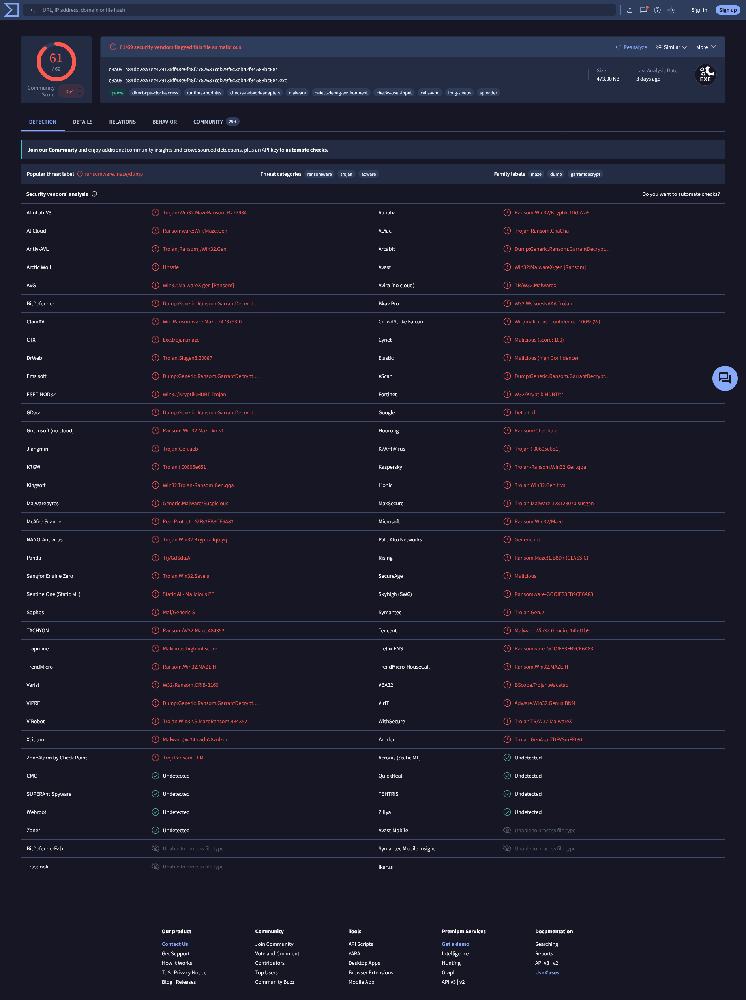
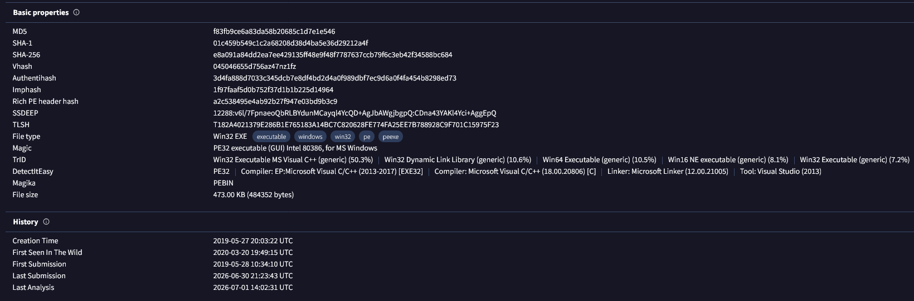
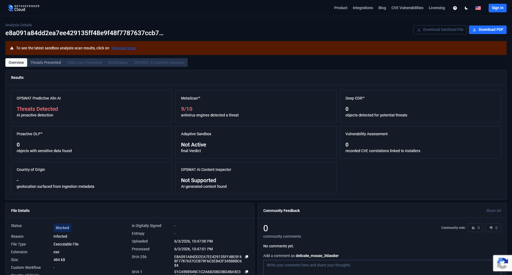
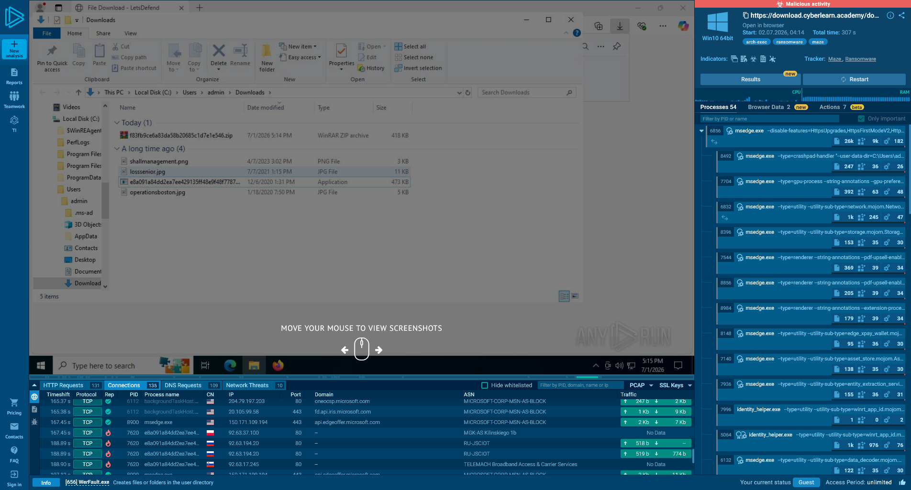
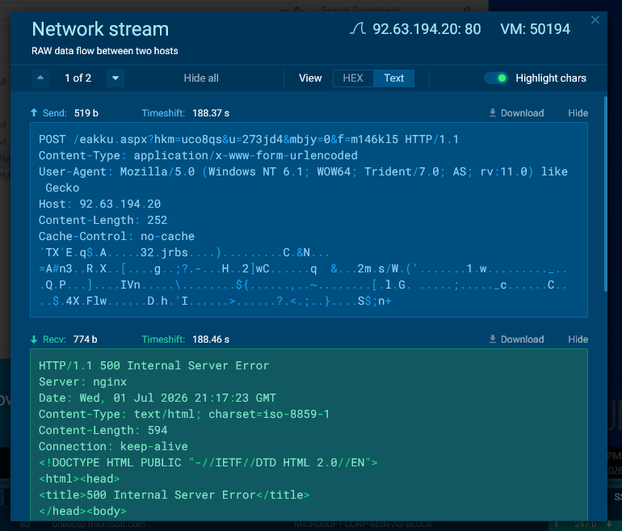
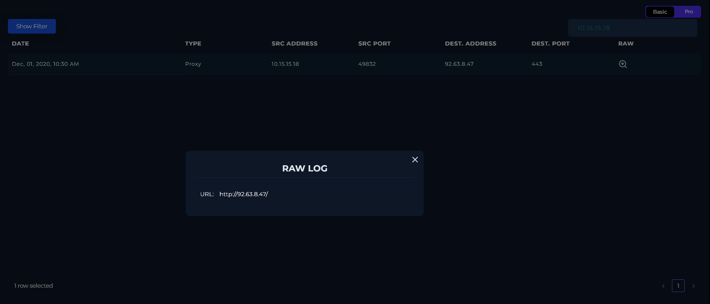
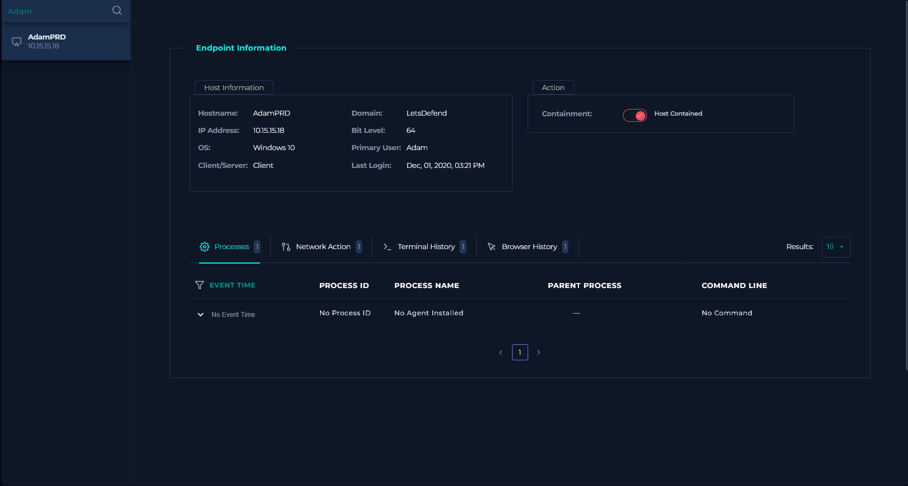
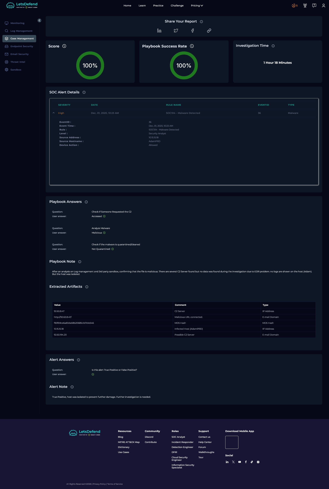

# SOC104 — Malware Detected

| Field               | Value                              |
|---------------------|------------------------------------|
| **Platform**        | LetsDefend                         |
| **Alert ID**        | EventID 36                         |
| **Alert Time**      | Dec 01, 2020 — 10:23 AM            |
| **Category**        | Malware / Execution                |
| **Verdict**         | True Positive — Host Compromised   |
| **Status**          | Closed                             |

---

## Executive Summary

An EDR alert fired on host `AdamPRD` (`10.15.15.18`) for a file named `Invoice.exe`. The file hash confirmed Maze ransomware across multiple threat intelligence sources. No email delivering the file was found, the initial access vector remains unknown. SIEM logs confirmed an outbound connection from the host to a known C2 IP at the time of infection. The EDR returned no process or terminal history, which may reflect agent failure or active log wiping by the malware. The host was contained. Sandbox analysis identified several additional C2 IPs, one of which had confirmed two-way traffic.

---

## Kill Chain

### 1. Threat Intelligence & Hash Verification

The alert provided the MD5 hash `f83fb9ce6a83da58b20685c1d7e1e546` for `Invoice.exe`.

| Source           | Result                                                                                                                                  |
|------------------|-----------------------------------------------------------------------------------------------------------------------------------------|
| LetsDefend TI    | No data returned.                                                                                                                       |
| VirusTotal       | Flagged malicious by 61 security vendors. Family labels: `maze`, `dump`, `generikdecrypt`. Threat categories: ransomware, trojan, adware. File type: Win32 EXE, 473 KB, compiled with Microsoft Visual C++ (2013–2017). Created 2019-05-27. |
| Metadefender     | Status: Blocked. Reason: Infected. MetaScan: 9/10 engines detected a threat. File confirmed as a malicious executable.                 |

The VirusTotal detection confirmed this is Maze ransomware, a family known for double extortion: encrypting files and exfiltrating data before dropping the ransom note. Metadefender independently confirmed the file as infected. Verdict: Malicious.

---

### 2. Sandbox Analysis (AnyRun)

Searched AnyRun using the SHA-256 hash and found an existing public report for this sample.

**Process behavior:**

The sample executed as `e8a091a84dd2ea7ee429135ff48e9f48f7787637ccb79f6c3eb42f34588bc684.exe`, which matches the file retrieved from the LetsDefend download link. AnyRun identified a MAZE mutex and a ransom note, confirming the Maze ransomware family. The sandbox also flagged modification of files in the Chrome extension directory, consistent with credential or session theft before encryption.

**Network activity:**

The sample generated outbound connections to multiple IPs on port 80. Most returned no data, indicating failed C2 contact. One IP had confirmed two-way traffic:

- `92.63.194.20` (Russia) the sample sent a POST request to `/eakku.aspx` with encoded form data. The server responded with HTTP 500 Internal Server Error from an Apache backend. The connection was attempted but the C2 was not functional at the time of sandboxing.

Other IPs contacted by the sample with no response data: `92.63.8.47`, `92.63.11.151`, `92.63.32.2`, `92.63.32.55`, `92.63.37.100`, `92.63.194.3`, `92.63.17.245`.

---

### 3. Email Analysis

Email Security was searched using multiple terms: `Invoice.exe`, `10.15.15.18`, `AdamPRD`, and `Adam`. No associated email was found. The delivery method for `Invoice.exe` could not be determined from available logs. It may have arrived via a network share, removable media, or a prior compromise not captured in the current log window.

---

### 4. SIEM Log Analysis

Filtered Log Management by source address `10.15.15.18`. One Proxy log entry returned:

| Field            | Value                  |
|------------------|------------------------|
| Date             | Dec 01, 2020, 10:30 AM |
| Type             | Proxy                  |
| Source IP        | 10.15.15.18            |
| Source Port      | 49832                  |
| Destination IP   | 92.63.8.47             |
| Destination Port | 443                    |
| Raw Log URL      | `http://92.63.8.47/`   |

The destination port is 443 (HTTPS), but the raw log URL is plaintext HTTP. This is a discrepancy worth noting, the malware may be sending unencrypted traffic over a port typically associated with HTTPS, or the log capture stripped the TLS layer. Either way, the outbound connection to a known Maze C2 IP at the time of infection is confirmed.

---

### 5. Endpoint Analysis (EDR)

Checked host `AdamPRD` (`10.15.15.18`) in Endpoint Security. All tabs: Processes, Network Action, Terminal History, Browser History returned no data. The EDR showed "No Agent Installed" in the process view.

The host was contained regardless. No agent data could mean the EDR agent was never deployed on this machine, failed after the infection, or the malware cleared the logs. None of those can be ruled out without hands-on forensics.

---

## Containment & Remediation

**Containment**

- Host `AdamPRD` (`10.15.15.18`) was isolated via the EDR platform to cut any active C2 connection and prevent lateral movement or further encryption.

**Remediation**

- Escalate to Tier 2 / Incident Response for full forensic investigation. If Maze ransomware fully executed, encrypted files and potential data exfiltration need to be assessed before any recovery attempt.
- Block all confirmed and suspected C2 IPs at the perimeter firewall: `92.63.8.47`, `92.63.194.20`, and the remaining IPs identified in sandbox analysis.
- Determine how `Invoice.exe` arrived on the host. Email was ruled out, check network shares, RDP session history, and any shared drives accessible from `AdamPRD`.
- Audit all hosts on the same network segment for signs of lateral movement or similar file hashes.
- Do not attempt decryption or system recovery until forensics confirms the scope of encryption and whether data was exfiltrated.

---

## Playbook Notes

**EDR blind spot:** The EDR returned no agent data for AdamPRD. The platform showed "No Agent Installed" rather than a specific error, which suggests this machine may never have had a functioning EDR agent rather than a case of the malware disabling it. Either way, the absence of process and terminal history is a gap. The SIEM and sandbox analysis had to carry the investigation.

**Unknown delivery vector:** No email was found despite searching multiple identifiers tied to the host and user. This is documented as unresolved, not assumed to be a non-issue. A machine running Maze with no email trail points toward a possible network-based delivery or prior foothold that wasn't captured in available logs.

**Port/protocol mismatch in SIEM:** The outbound connection logged on port 443 contains a plaintext HTTP URL in the raw log. This was flagged rather than ignored. Maze is known to use non-standard port assignments for C2 traffic.

---

## Indicators of Compromise (IOCs)

| Type                        | Value                                    |
|-----------------------------|------------------------------------------|
| Malicious File              | `Invoice.exe`                            |
| MD5 Hash                    | `f83fb9ce6a83da58b20685c1d7e1e546`       |
| SHA-256 Hash                | `e8a091a84dd2ea7ee429135ff48e9f48f7787637ccb79f6c3eb42f34588bc684` |
| Malware Family              | Maze Ransomware                          |
| Affected Host               | `AdamPRD` / `10.15.15.18`               |
| C2 IP (SIEM confirmed)      | `92.63.8.47`                             |
| C2 URL (SIEM confirmed)     | `http://92.63.8.47/`                     |
| C2 IP (sandbox, active)     | `92.63.194.20`                           |
| C2 IPs (sandbox, no response) | `92.63.11.151`, `92.63.32.2`, `92.63.32.55`, `92.63.37.100`, `92.63.194.3`, `92.63.17.245` |

---

## MITRE ATT&CK Mapping

| Tactic              | Technique                                                                                   |
|---------------------|---------------------------------------------------------------------------------------------|
| Execution           | T1204.002 — User Execution: Malicious File                                                  |
| Discovery           | T1082 — System Information Discovery                                                        |
| Discovery           | T1012 — Query Registry                                                                      |
| Defense Evasion     | T1176 — Browser Extensions (Chrome extension directory modified)                            |
| Command and Control | T1071.001 — Application Layer Protocol: Web Protocols (HTTP POST to C2 on port 80/443)     |
| Impact              | T1486 — Data Encrypted for Impact (Maze ransom note and mutex confirmed in sandbox)         |

---

---

*Written by: Supawat H. (uriel0byte) | LetsDefend SOC Practice*
