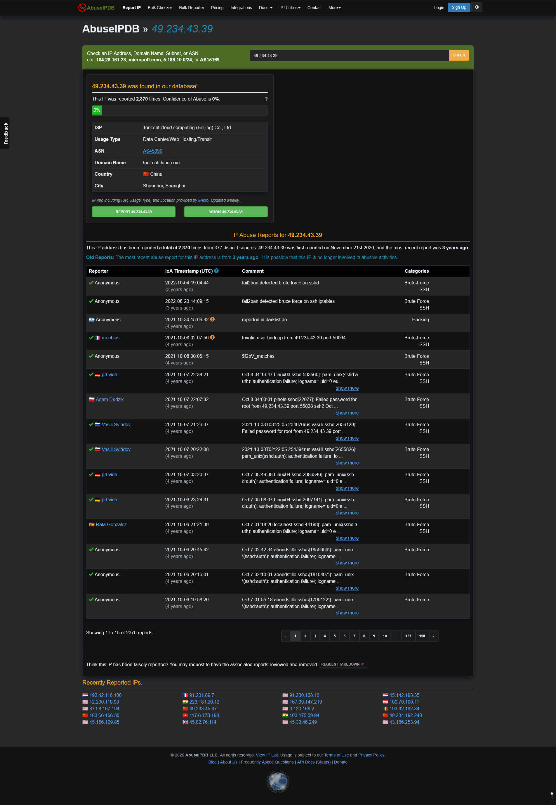
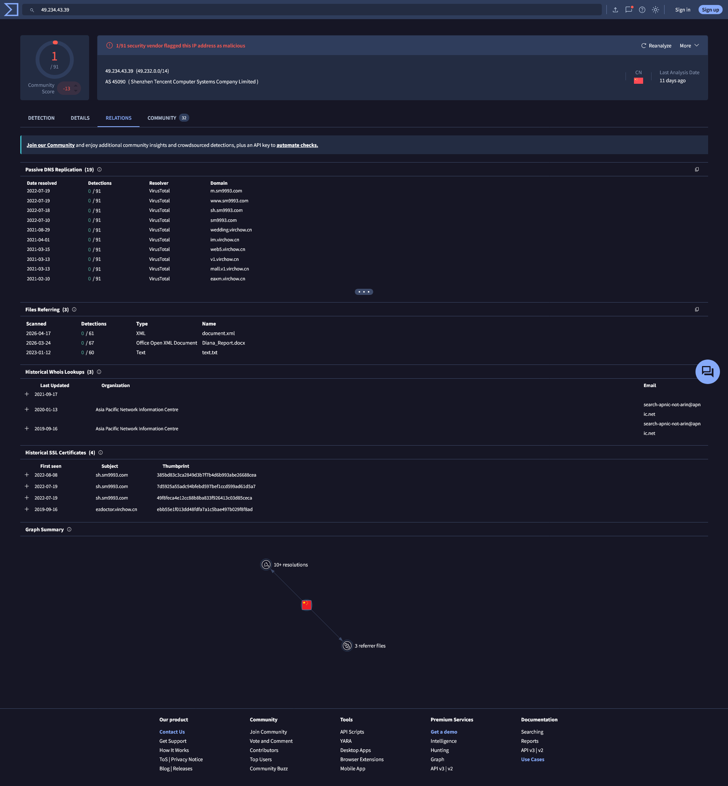
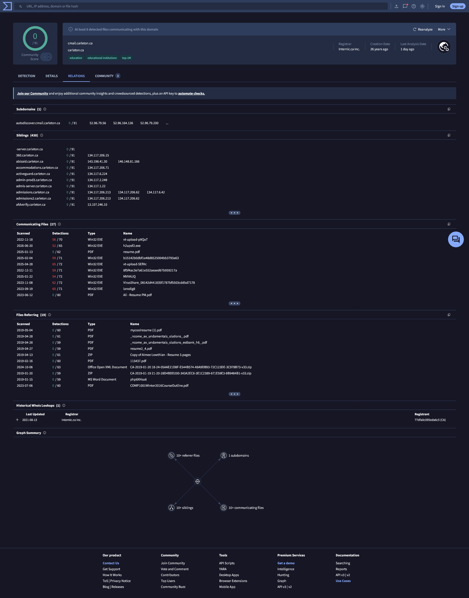
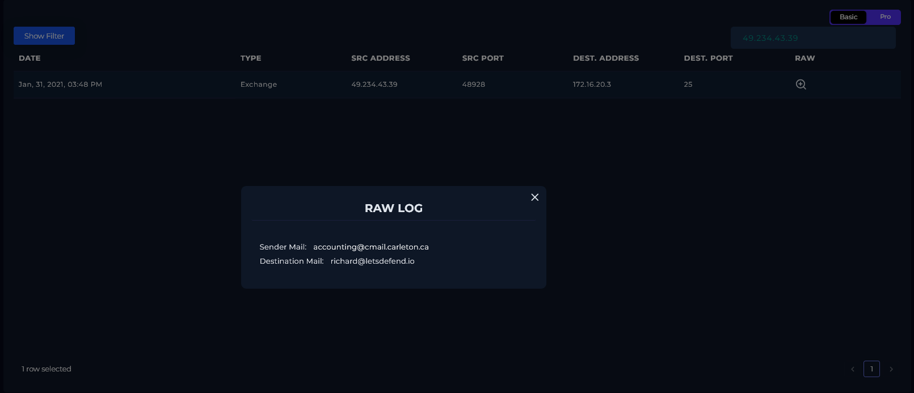
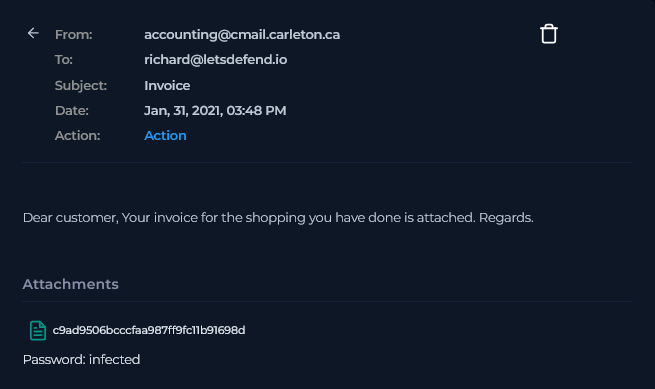
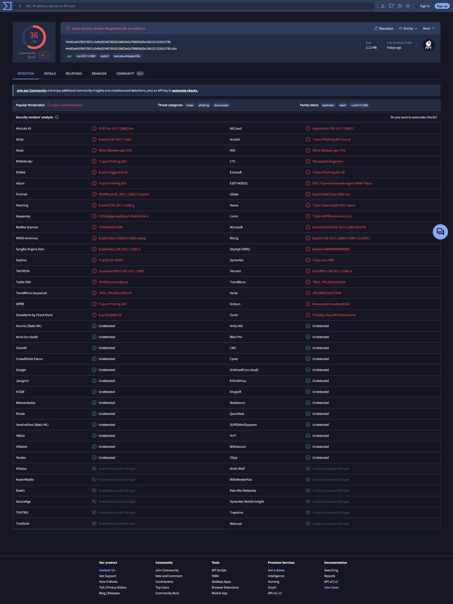
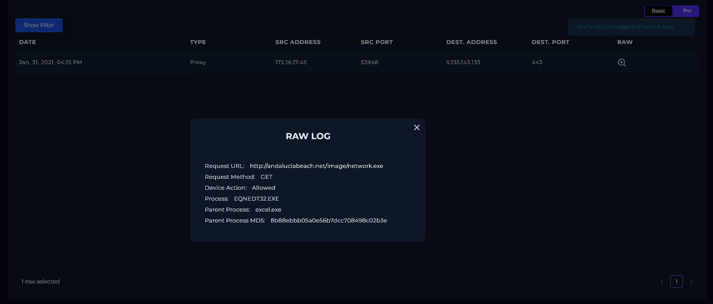
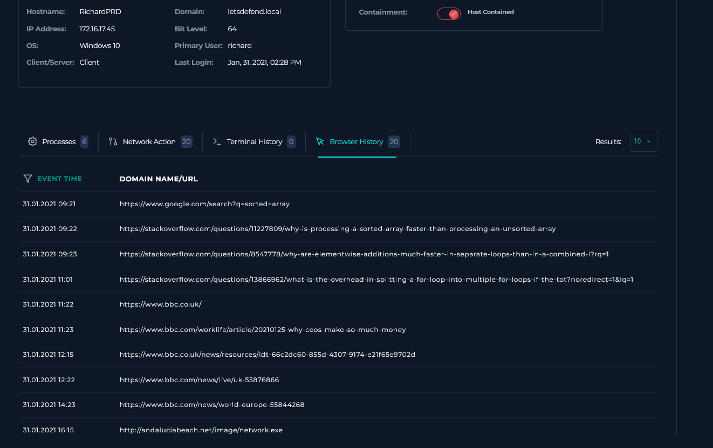
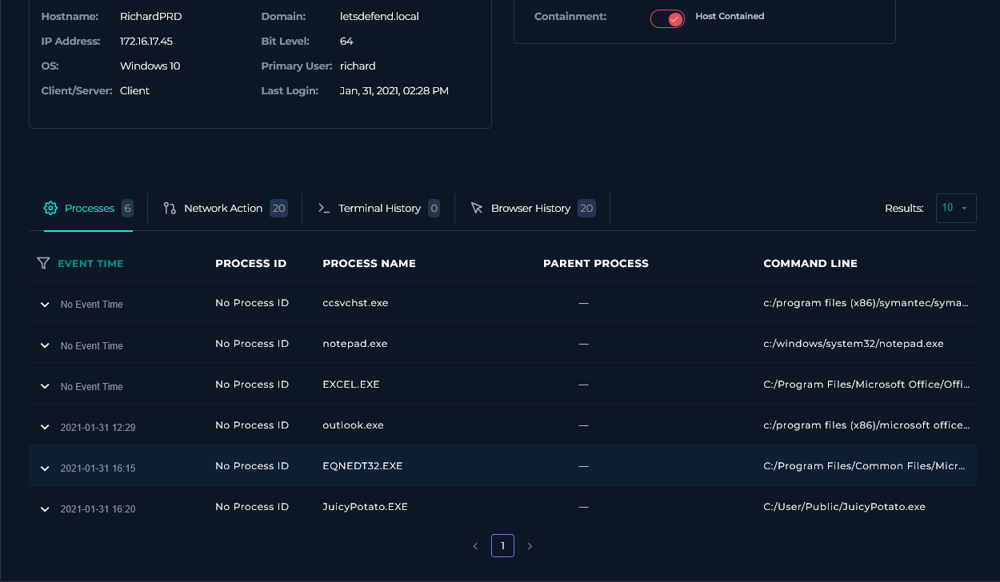
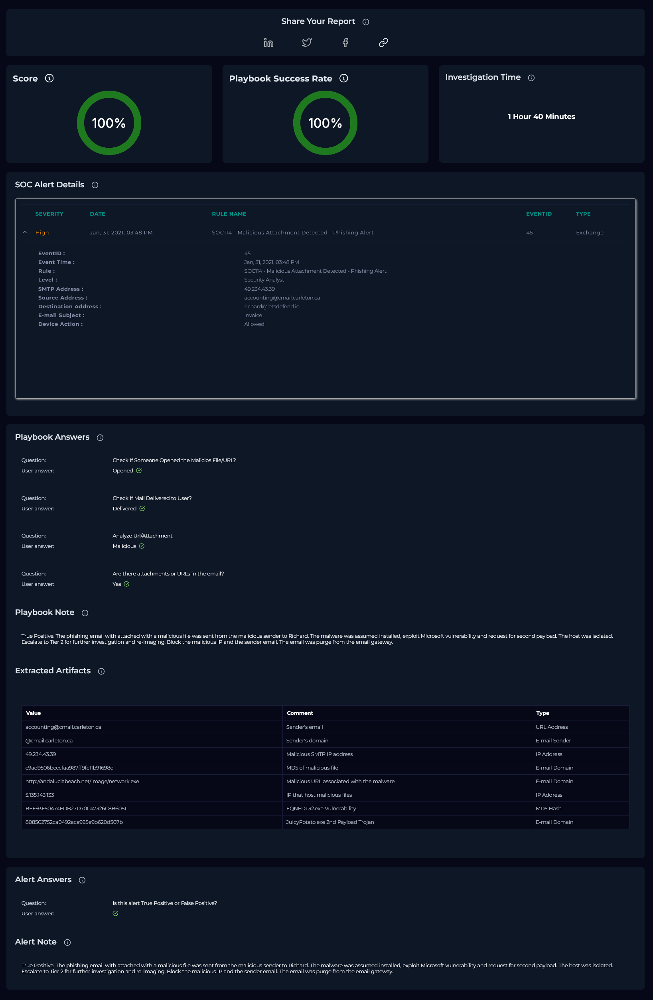

# SOC114 — Malicious Attachment Detected - Phishing Alert

| Field | Value |
| --- | --- |
| **Platform** | LetsDefend |
| **Alert ID** | 45 |
| **Alert Time** | January 31, 2021 — 03:48 PM |
| **Category** | Phishing / Malware Execution |
| **Verdict** | True Positive — Host Compromised |
| **Status** | Closed |

---

## Executive Summary

A phishing email was delivered from `accounting@cmail.carleton.ca` to `richard@letsdefend.io` on January 31, 2021, subject "Invoice," carrying a password-protected Office attachment. The email gateway allowed it through. Richard's host opened the attachment, which triggered `EQNEDT32.EXE`, the legacy Microsoft Equation Editor, exploiting CVE-2017-11882 to execute code without any further user interaction. The exploit reached out to an external server and pulled down a second-stage payload, JuicyPotato, a known local privilege escalation tool. The host was isolated. The sender address is confirmed malicious, but the domain behind it, Carleton University's real webmail service, could not be confirmed as compromised or spoofed given the tools available.

---

## Kill Chain

### 1. Threat Intelligence & IP Reputation

Queried the SMTP source IP `49.234.43.39` before touching internal logs.

| Source | Result |
| --- | --- |
| LetsDefend TI | No data returned. |
| AbuseIPDB | Reported 2,370 times by 377 distinct sources, first seen November 21, 2020. Confidence of Abuse reads 0%, the same stale-report weighting pattern seen in prior alerts, most reports here are years old relative to this lookup. Every visible report category is tagged Brute-Force/SSH, not phishing. |
| VirusTotal | 1/91 vendors flagged the IP, community score -13. Passive DNS shows a string of recently resolved domains with no vendor detections of their own (`sm9993.com`, several `virchow.cn` subdomains). Three referring files, low detection counts. Historical whois ties back to Asia Pacific Network Information Centre. |
| Cisco Talos | Poor reputation, not on the active block list. |

Same pattern as before: this IP carries a documented bad history for a completely different attack type than what fired this alert. I'm treating it as generally disreputable infrastructure, not confirmed phishing infrastructure specifically.

Also queried `cmail.carleton.ca`. Zero vendor detections, but VirusTotal's banner flags at least 8 files communicating with the domain, and the Communicating Files list shows 27 entries, several with high detection counts (up to 65/71). This is Carleton University's real domain, tagged `education` / `educational institutions` on VirusTotal, not a spoofed lookalike. As with the prior alert from this same domain, LetsDefend doesn't support pulling raw headers here, so SPF, DKIM, and DMARC couldn't be checked. Whether this specific account was compromised or the header was forged is unconfirmed. The sender address is treated as malicious. The domain is not.

---

### 2. Alert Verification

Searched Log Management using the SMTP IP `49.234.43.39`. One Exchange event returned.

| Field | Value |
| --- | --- |
| Date | Jan 31, 2021, 03:48 PM |
| Type | Exchange |
| Source Address | 49.234.43.39 |
| Source Port | 48928 |
| Destination Address | 172.16.20.3 |
| Destination Port | 25 |
| Sender Mail | accounting@cmail.carleton.ca |
| Destination Mail | richard@letsdefend.io |

This lines up cleanly with the alert. Unlike the earlier SOC140 case from the same sender domain, there's no Blocked/Allowed contradiction to untangle here, Device Action is Allowed at every layer, and endpoint evidence later confirms the email actually reached Richard and was acted on.

---

### 3. Email Analysis

Searched Email Security by sender `accounting@cmail.carleton.ca`. One result.

| Field | Value |
| --- | --- |
| Sender | accounting@cmail.carleton.ca |
| Recipient | richard@letsdefend.io |
| Subject | Invoice |
| Date | Jan 31, 2021, 03:48 PM |
| Final Action | Unknown |

The gateway's own Final Action field reads "Unknown," same inconsistency pattern seen in the prior alert from this domain. It doesn't change the outcome here since the endpoint evidence independently confirms delivery and execution, but I'm flagging it rather than ignoring it since it's the second time this exact field has shown up blank on an alert from `cmail.carleton.ca`.

No recipient name, no specific transaction detail, no signature. This is a generic invoice lure, not a targeted spear-phishing attempt built around Richard specifically.

---

### 4. File Hash Verification

The attachment filename in the email is itself an MD5 hash: `c9ad9506bcccfaa987ff9fc11b91698d`. Searched it in VirusTotal.

**Result:** 36/62 vendors flagged the file as malicious, community score -9. SHA-256: `44e65a641fb970031c5efed324676b5018803e0a768608d3e186152102615795`. Tags: `ppt`, `cve-2017-11882`, `exploit`, `executes-dropped-file`.

VirusTotal's own file type detection reads this as an **MS PowerPoint Presentation**, magic bytes show `CDFV2 Encrypted`, and TrID breaks it down as a Microsoft Encrypted Structured Storage Object (73.7%) or an encrypted Microsoft Office document (23.9%), a generic encrypted OLE2 compound container either way. But the filename attached to the VirusTotal record ends in `.xlsx`, and the endpoint evidence (below) shows the file was actually opened through Excel, with `excel.exe` as the parent process. Three sources, three different signals on what this file is supposed to be. I'm not resolving that discrepancy, just reporting it plainly, it's consistent with a maliciously crafted OLE2 container built to be format-flexible rather than a single clean file type.

This detail also explains the password in the email. The encryption sits at the Office document level (`EncryptedPackage`, confirmed by both Cyren and Varist packer detection), not inside a zip archive. The "password: infected" line in the email unlocks the document itself.

First submission to VirusTotal was 2021-02-01 01:38:50 UTC, about ten hours after this alert fired. That timing lines up with this being close to the original detonation of the payload rather than a long-known sample being reused.

---

### 5. SIEM Log Analysis

VirusTotal's record for the file hash surfaced a related URL: `http://andaluciabeach.net/image/network.exe`. Searched Log Management for that URL and found one Proxy event.

| Field | Value |
| --- | --- |
| Date | Jan 31, 2021, 04:15 PM |
| Type | Proxy |
| Source Address | 172.16.17.45 |
| Source Port | 53948 |
| Destination Address | 5.135.143.133 |
| Destination Port | 443 |
| Request URL | `http://andaluciabeach.net/image/network.exe` |
| Request Method | GET |
| Device Action | Allowed |
| Process | EQNEDT32.EXE |
| Parent Process | excel.exe |
| Parent Process MD5 | 8b88ebbb05a0e56b7dcc708498c02b3e |

`5.135.143.133` is the confirmed destination for the second-stage payload retrieval, the GET request that pulled `network.exe`. A second IP, `194.5.98.8`, showed up alongside this URL during the earlier VirusTotal lookup on the file hash. I checked Log Management for it directly and found nothing. It stays logged as an OSINT-only reference, not something confirmed against this environment's traffic.

The parent process, `excel.exe`, wasn't independently checked against VirusTotal in this investigation. I'm treating it as the standard installed Excel binary being abused through the embedded exploit chain rather than a replaced or tampered binary, but that's an assumption, not a verified finding.

---

### 6. Endpoint Analysis (EDR)

Checked Richard's host (`RichardPRD`, `172.16.17.45`, Windows 10) in Endpoint Security. Host containment was already toggled on.

**Browser History:** Normal daily browsing from 09:21 through 14:23, Google searches, StackOverflow, BBC News. At 16:15, one entry: `http://andaluciabeach.net/image/network.exe`. This isn't Richard navigating there manually, nobody browses directly to a raw `.exe` download URL. The timestamp lines up exactly with the SIEM proxy log entry and the process execution below, this is the EDR tagging the network request generated by `EQNEDT32.EXE` under the Browser History tab, not user activity.

**Network Action:** Same pattern, ordinary CDN and search traffic through the day, then a connection to `5.135.143.133` at 16:15, matching the proxy log exactly.

**Process / Terminal History:** Six processes total. Two are the relevant ones, both firing after the attachment was opened:

- `EQNEDT32.EXE` (MD5 `BFE93F50474FDB27D70C47326C8B6051`) at 16:15. This is the legacy Microsoft Equation Editor, an OLE server bundled with older Office installations for inserting math and science formulas. It's tied directly to CVE-2017-11882, a memory corruption vulnerability that lets an attacker achieve code execution the moment a crafted document is opened, no macros, no further clicks required. The binary itself isn't malicious, the vulnerability inside it is what got exploited.
- `JuicyPotato.EXE` (MD5 `808502752ca0492aca995e9b620d507b`) at 16:20, launched from `C:/User/Public/JuicyPotato.exe`. This is a known public Windows local privilege escalation tool. It abuses `SeImpersonatePrivilege` through COM/DCOM server impersonation to escalate a process token to SYSTEM. VirusTotal's generic label calls it a trojan, but that undersells what it actually does, this is privilege escalation tooling, dropped and run five minutes after the exploit fired, staged in the Public user folder, a location writable by any local account and a common drop point for tools like this.

The sequence reads as a clean chain: attachment opened, exploit fires through the Equation Editor, second-stage payload retrieved over HTTPS, privilege escalation tool dropped and executed shortly after.

---

## Containment & Remediation

**Containment**

- Host `RichardPRD` (`172.16.17.45`) was isolated via the EDR platform.
- Phishing email removed from the environment via Email Security Gateway.

**Remediation**

- Block sender address `accounting@cmail.carleton.ca` and IP `49.234.43.39` at the email gateway and perimeter firewall. Do not block `cmail.carleton.ca` at the domain level, it's a legitimate university mail service and the account may simply be compromised rather than attacker-owned.
- Block `andaluciabeach.net` and `5.135.143.133` at the perimeter firewall and web proxy.
- Escalate to Tier 2 for full forensics and reimaging. A privilege escalation tool executed on this host, any assumption that containment alone resolved the compromise is not safe without deeper review.
- Confirm whether CVE-2017-11882 patches are applied across the fleet. Microsoft's actual fix for this vulnerability is to remove the Equation Editor component entirely, since the legacy binary can't be properly sandboxed or patched in place.
- Verify whether the `excel.exe` binary on this host matches a known-good baseline.

---

## Playbook Notes

**File type doesn't agree across sources:** VirusTotal's own detection reads the attachment as an MS PowerPoint Presentation, the filename on record carries a `.xlsx` extension, and endpoint telemetry shows it opened through Excel. All three disagree. Reported as-is rather than picking one and treating it as settled.

**Second OSINT IP unconfirmed against internal logs:** `194.5.98.8` appeared alongside the malicious URL during the VirusTotal lookup but returned nothing when searched directly in Log Management. It's logged as a reference indicator only, not treated as equally confirmed as `5.135.143.133`.

---

## Indicators of Compromise (IOCs)

| Type | Value | Note |
| --- | --- | --- |
| Malicious SMTP IP | `49.234.43.39` | Broad negative reputation (Brute-Force/SSH reports), not phishing-specific |
| Sender Address | `accounting@cmail.carleton.ca` | Confirmed malicious sender; underlying domain not verified as attacker-owned infrastructure |
| Attachment Hash (MD5) | `c9ad9506bcccfaa987ff9fc11b91698d` | 36/62 VT detections; file type identification inconsistent across VT, filename, and endpoint evidence |
| Malicious URL | `http://andaluciabeach.net/image/network.exe` | Second-stage payload delivery |
| Second-Stage Payload Host IP | `5.135.143.133` | Confirmed via SIEM proxy log |
| EQNEDT32.EXE | MD5 `BFE93F50474FDB27D70C47326C8B6051` | Legitimate legacy Office component, exploited via CVE-2017-11882, not malicious on its own |
| JuicyPotato.exe | MD5 `808502752ca0492aca995e9b620d507b` | Local privilege escalation tool, second-stage payload |

---

## MITRE ATT&CK Mapping

| Tactic | Technique |
| --- | --- |
| Initial Access | T1566.001 — Phishing: Spearphishing Attachment |
| Execution | T1204.002 — User Execution: Malicious File |
| Execution | T1203 — Exploitation for Client Execution (CVE-2017-11882 via EQNEDT32.EXE) |
| Command and Control | T1071.001 — Application Layer Protocol: Web Protocols (second-stage payload retrieval over HTTPS) |
| Privilege Escalation | T1134.001 — Access Token Manipulation: Token Impersonation/Theft (JuicyPotato) |

---

---

*Written by: Supawat H. (uriel0byte) | LetsDefend SOC Practice*
