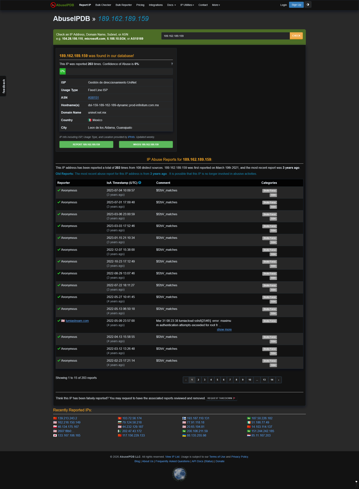
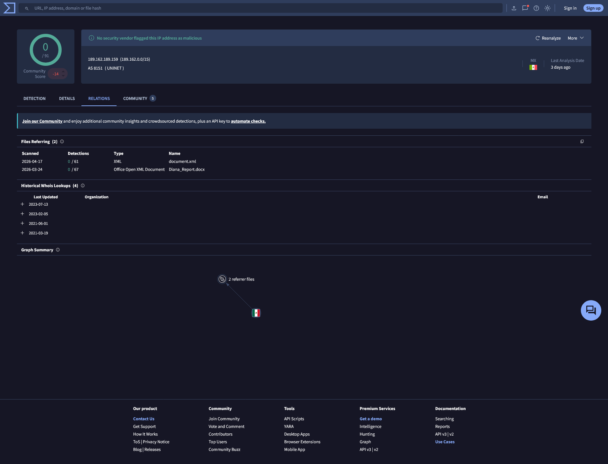
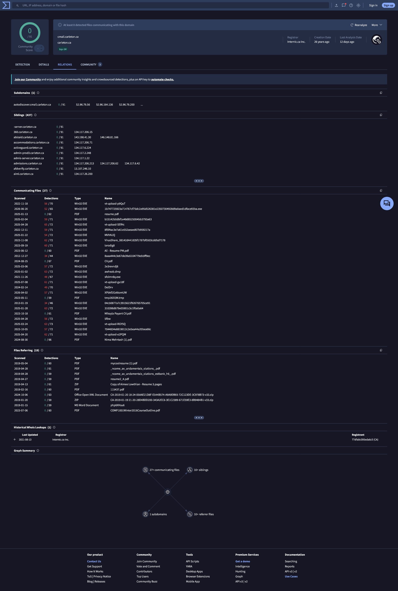
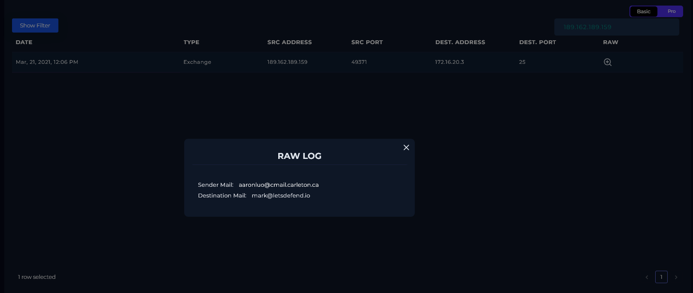
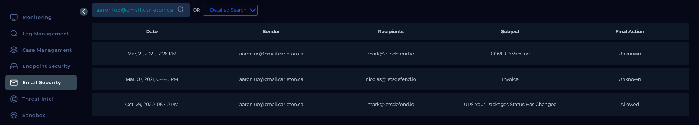
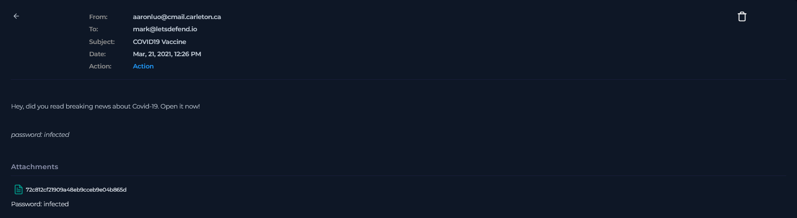
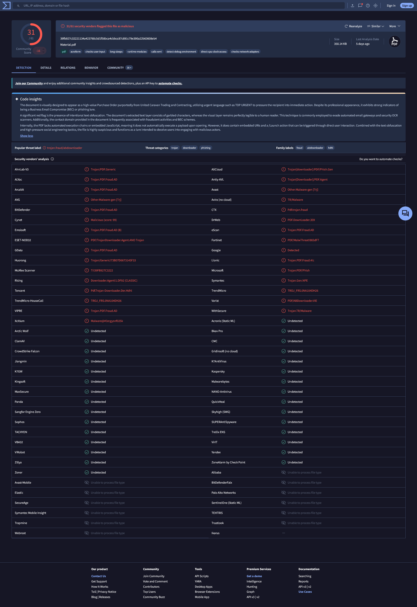
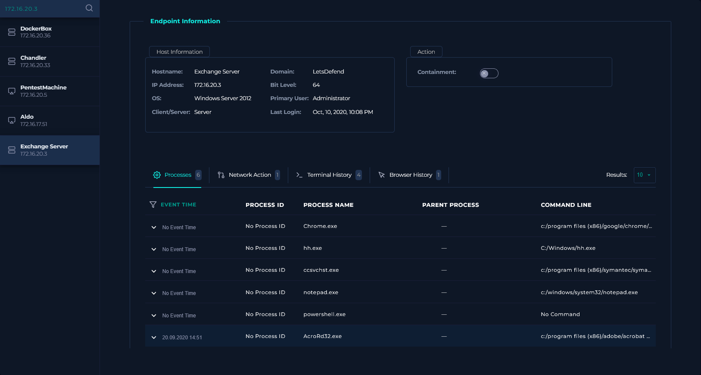
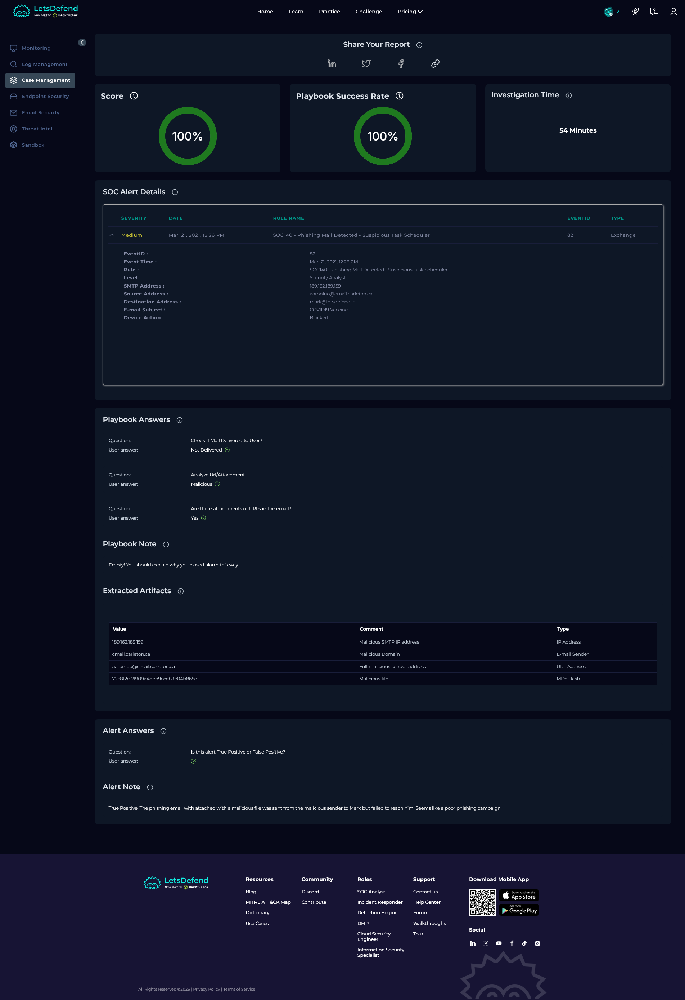

# SOC140 — Phishing Mail Detected - Suspicious Task Scheduler

| Field | Value |
| --- | --- |
| **Platform** | LetsDefend |
| **Alert ID** | 82 |
| **Alert Time** | March 21, 2021 — 12:26 PM |
| **Category** | Phishing / Initial Access |
| **Verdict** | True Positive — Delivery Blocked |
| **Status** | Closed |

---

## Executive Summary

A phishing email was sent from `aaronluo@cmail.carleton.ca` to `mark@letsdefend.io` on March 21, 2021, subject "COVID19 Vaccine," carrying a password-protected attachment. The email security gateway blocked the message before it reached Mark's mailbox. The attachment's MD5 hash matched an existing VirusTotal record flagged malicious by 31 vendors, but the lure content VirusTotal associates with that hash (a purchase order document) doesn't match the COVID-19 pretext used in this email. The file has likely been reused across more than one campaign. No endpoint activity correlates to this incident, and the sender had contacted the same recipient once before, five months earlier, under a different pretext.

---

## Kill Chain

### 1. Threat Intelligence & IP Reputation

Queried the SMTP source IP `189.162.189.159` before touching internal logs.

| Source | Result |
| --- | --- |
| LetsDefend TI | No data returned. |
| AbuseIPDB | Reported 203 times by 108 distinct sources, first seen March 19, 2021. Confidence of Abuse reads 0%, which is a stale-report weighting artifact, not a clean result, most reports are years old relative to this lookup. Every visible report category is tagged Brute-Force/SSH, not phishing or spam. |
| VirusTotal | Zero vendor detections on the IP and on the domain `cmail.carleton.ca`. Both carry a negative community score, meaning other analysts flagged them through crowd voting even without a formal vendor signature. The domain's Relations tab lists 27 communicating files, several with high detection counts, and 19 referring files. |
| Cisco Talos | Poor reputation, not on the active block list. |

The IP has a documented bad history, but it's for a different attack pattern than what fired this alert. AbuseIPDB confirms the IP is generally disreputable. It doesn't confirm this specific IP as a known phishing sender. VirusTotal's zero detections on the domain are offset by the volume of malicious files tied to it in the Relations graph, which is the more useful signal here.

`cmail.carleton.ca` is Carleton University's real webmail domain, not a spoofed lookalike. LetsDefend doesn't support downloading the raw email or headers for this alert, so SPF, DKIM, and DMARC results couldn't be checked. I can't confirm whether this came from a compromised Carleton account or a forged From header. Because of that, I'm treating the sender address as associated with malicious activity and the domain itself as unconfirmed.

---

### 2. Alert Verification

Searched Log Management using the SMTP IP `189.162.189.159`. One Exchange event returned.

| Field | Value |
| --- | --- |
| Date | Mar 21, 2021, 12:06 PM |
| Type | Exchange |
| Source Address | 189.162.189.159 |
| Source Port | 49371 |
| Destination Address | 172.16.20.3 |
| Destination Port | 25 |
| Sender Mail | aaronluo@cmail.carleton.ca |
| Destination Mail | mark@letsdefend.io |

The log timestamp (12:06 PM) sits twenty minutes ahead of the alert's own event time (12:26 PM). Not treating that as suspicious on its own, more likely normal lag between the SMTP connection and the alert firing, but noting it since I'm not smoothing over timing gaps in this report.

This log entry is also how I'm resolving what looks like a contradiction in the alert: Device Action reads "Blocked," but this same log shows the connection reaching the Exchange server. It isn't a contradiction. Inbound mail has to complete an SMTP connection to the receiving server before any content inspection can happen, the message has to physically arrive before a gateway can read it and make a call. This log entry is step one, the connection landed. The "Blocked" verdict is step two, the gateway inspected the message and stopped it from reaching Mark's mailbox. Connection succeeding and delivery getting blocked are two different steps in the same pipeline, not conflicting outcomes.

---

### 3. Email Analysis

Searched Email Security by sender `aaronluo@cmail.carleton.ca`. Three results returned.

| Date | Sender | Recipient | Subject | Final Action |
| --- | --- | --- | --- | --- |
| Mar 21, 2021, 12:26 PM | aaronluo@cmail.carleton.ca | mark@letsdefend.io | COVID19 Vaccine | Unknown |
| Oct 29, 2020, 06:40 PM | aaronluo@cmail.carleton.ca | mark@letsdefend.io | UPS Your Package Status Has Changed | Allowed |

Same sender, same recipient, five months apart, under two different lures. That October email was allowed through. Whether Mark interacted with it isn't part of this alert's scope, but it shows this sender had prior contact with Mark specifically, not a cold blast.

A third result from the same sender to a different recipient (Nicolas) is dated March 2023, two years after this alert. That's outside the timeline for this investigation, so I left it out.

One inconsistency worth flagging directly: this table lists Final Action as "Unknown" for the March 21 email, while the alert's own metadata records Device Action as "Blocked." I used the alert metadata as the deciding source since that's the field the alert was actually generated from, but the two views don't agree, and I want that on record rather than smoothed over.

No recipient name, no signature, generic phrasing. This reads as a mass phishing run, not something built for Mark specifically. The password-protected attachment is a standard evasion move, the password lets the file bypass gateway content scanning since an encrypted archive can't be inspected.

---

### 4. File Hash Verification

The attachment filename in the email is itself an MD5 hash: `72c812cf21909a48eb9cceb9e04b865d`. Searched it in VirusTotal.

**Result:** 31 vendors flagged the file as malicious. Threat categories include trojan, downloader, and phishing. Filename on record: `Material.pdf`. First seen 2020-06-11.

VirusTotal's code insights describe the document as designed to look like a high-value Purchase Order from "United Canseo Trading and Contracting," using urgent language like "TOP URGENT" to pressure the recipient, with intentional text obfuscation built to defeat OCR-based gateway scanners.

That description doesn't match the email in front of me. This email's lure is a COVID-19 vaccine story, not a purchase order. Same hash, two different pretexts. The most likely explanation is the attacker reused an existing payload file across more than one unrelated campaign rather than building something new for each lure, which tracks with a phishing operation running on volume rather than precision.

I want to be direct about what was and wasn't done here. This is a hash lookup against VirusTotal's existing database entry, not static or dynamic analysis of the attachment pulled from this specific email. The file type of PDF and the malicious verdict both come from VirusTotal's record for the hash. Nobody opened or analyzed the actual attachment in this investigation.

---

### 5. Endpoint Analysis (EDR)

Checked the Exchange Server (`172.16.20.3`) in Endpoint Security, since the email never reached a user workstation.

**Processes:** Six entries, none carrying an event timestamp except one. Standard processes: Chrome.exe, hh.exe, ccsvchst.exe, notepad.exe, powershell.exe, AcroRd32.exe. The AcroRd32.exe entry shows a timestamp of September 20, 2020, unrelated to this alert.

**Last login:** October 10, 2020, 10:08 PM. This predates the March 21, 2021 alert by roughly five months.

Nothing on this host, process activity, network action, or terminal history, lines up with the incident timeframe. That's consistent with the email being blocked before delivery. The outdated last-login timestamp on a server this old is a separate concern worth a look on its own, but it isn't something this alert's evidence connects to.

---

## Containment & Remediation

**Containment**

- No host containment required. The email never reached a user endpoint.
- Phishing email removed from the environment via Email Security Gateway.

**Remediation**

- Block sender address `aaronluo@cmail.carleton.ca` and the file hash at the email gateway.
- Do not block `cmail.carleton.ca` at the domain level. It's a legitimate university mail service, blocking it outright would affect unrelated legitimate mail from the same domain. Block the sender address only.
- Escalate for header analysis if raw email access becomes available, to determine whether the Carleton account was compromised or the From header was spoofed. Not answerable with the tools available on this platform.
- Escalate to Tier 2 for direct static or dynamic analysis of the attachment. The malicious verdict here rests on a VirusTotal hash lookup, not firsthand analysis of the actual file.
- Confirm whether the October 2020 email to Mark from the same sender led to any prior compromise, since this is a repeat contact against the same target under a different pretext.

---

## Playbook Notes

**SPF/DKIM/DMARC not analyzed:** LetsDefend doesn't support downloading raw email headers for this alert, so authentication results couldn't be checked. The domain classification above reflects that gap directly instead of assuming a clean or compromised account either way.

**File identification unverified beyond hash lookup:** The PDF file type and malicious classification for the attachment come from VirusTotal's existing record for the hash, not from analyzing the attachment pulled from this specific email. The mismatch between VirusTotal's described lure (a purchase order document) and this email's actual pretext (COVID-19 vaccine) is why I'm treating this as a reused payload rather than assuming VT's description applies directly to this email.

**Rule name doesn't match investigated behavior:** The alert is titled "Suspicious Task Scheduler," but nothing in this investigation, the email, the attachment, the logs, or the endpoint check, touches scheduled tasks anywhere. Kept the rule name as-is in the metadata table since that's what the platform generated. I don't have an explanation for it and I'm not going to force one.

---

## Indicators of Compromise (IOCs)

| Type | Value | Note |
| --- | --- | --- |
| Malicious SMTP IP | `189.162.189.159` | Broad negative reputation (Brute-Force/SSH reports), not phishing-specific |
| Sender Address | `aaronluo@cmail.carleton.ca` | Confirmed malicious sender; underlying domain not verified as attacker-owned infrastructure |
| Malicious File Hash (MD5) | `72c812cf21909a48eb9cceb9e04b865d` | VirusTotal hash record only, filename and lure content not independently verified against this email's actual attachment |
| Domain (reference only) | `cmail.carleton.ca` | Legitimate university domain, logged for sender-tracking purposes, not recommended for blanket block |

---

## MITRE ATT&CK Mapping

| Tactic | Technique |
| --- | --- |
| Initial Access | T1566.001 — Phishing: Spearphishing Attachment |

Delivery was blocked before reaching the mailbox. No execution-stage technique is mapped because nothing ran and nothing was opened.

---

---

*Written by: Supawat H. (uriel0byte) | LetsDefend SOC Practice*
