# SOC141 — Phishing URL Detected

| Field                | Value                                                        |
|----------------------|--------------------------------------------------------------|
| **Platform**         | LetsDefend                                                   |
| **Alert ID**         | EventID 86                                                   |
| **Alert Time**       | Mar 22, 2021 — 09:23 PM                                      |
| **Category**         | Phishing / Initial Access                                    |
| **Verdict**          | True Positive — Credentials Potentially Compromised          |
| **Status**           | Closed                                                       |

---

## Executive Summary

A proxy alert fired for `EmilyComp` (`172.16.17.49`) connecting to a confirmed phishing domain on March 22, 2021 at 09:23 PM. The request URL passed Emily's email address as a parameter, consistent with a credential harvesting page pre-populated for the target. VirusTotal flagged the domain across 12 vendors and Hybrid Analysis confirmed the full URL as malicious. The SIEM proxy log confirmed the connection went through, the firewall allowed it and the proxy passed it. The EDR returned no data matching March 22, 2021 across all tabs, which means what happened after the connection cannot be confirmed from available logs. The host was contained and a credential reset was carried out for the affected account.

---

## Kill Chain

### 1. Threat Intelligence & URL Analysis

The alert provided the destination IP `91.189.114.8` and the full request URL. I queried both across multiple sources before touching the SIEM.

| Source          | Result                                                                                                                          |
|-----------------|---------------------------------------------------------------------------------------------------------------------------------|
| LetsDefend TI   | No data returned for `mogagrocol.ru`, `http://mogagrocol.ru`, or `91.189.114.8`.                                               |
| AbuseIPDB       | No previous reports for `91.189.114.8`. WHOIS confirmed ISP: JSC RU-CENTER, usage type: Data Center/Web Hosting/Transit, country: Russian Federation, city: Moscow. No abuse history does not mean clean, it means the IP hasn't been reported yet. |
| VirusTotal      | 12/92 vendors flagged `http://mogagrocol.ru` as malicious or phishing. Flagging vendors include BitDefender, CyRadar, Fortinet, G-Data, Sophos, VIPRE (phishing) and ADMINUSLabs, Chong Lua Dao, Lionic, Rising, Webroot (malicious). Serving IP: `195.24.68.4`, Russian Federation. Web technologies fingerprint confirmed a WordPress installation running the Akismet plugin, consistent with a compromised legitimate site being used as phishing infrastructure. |
| Hybrid Analysis | Submitted the full request URL `http://mogagrocol.ru/wp-content/plugins/akismet/fv/index.php?email=ellie@letsdefend.io`. Result: Malicious. Falcon sandbox confirmed the URL is a phishing site. |

The `akismet/fv/` path in the URL is not a legitimate Akismet endpoint. Akismet is a spam filtering plugin for WordPress. The `/fv/index.php` page under that path is an attacker-planted file on a compromised WordPress site, not part of the plugin itself. The `email=ellie@letsdefend.io` parameter pre-populates the victim's address on whatever credential form the page serves, which is standard for targeted phishing campaigns.

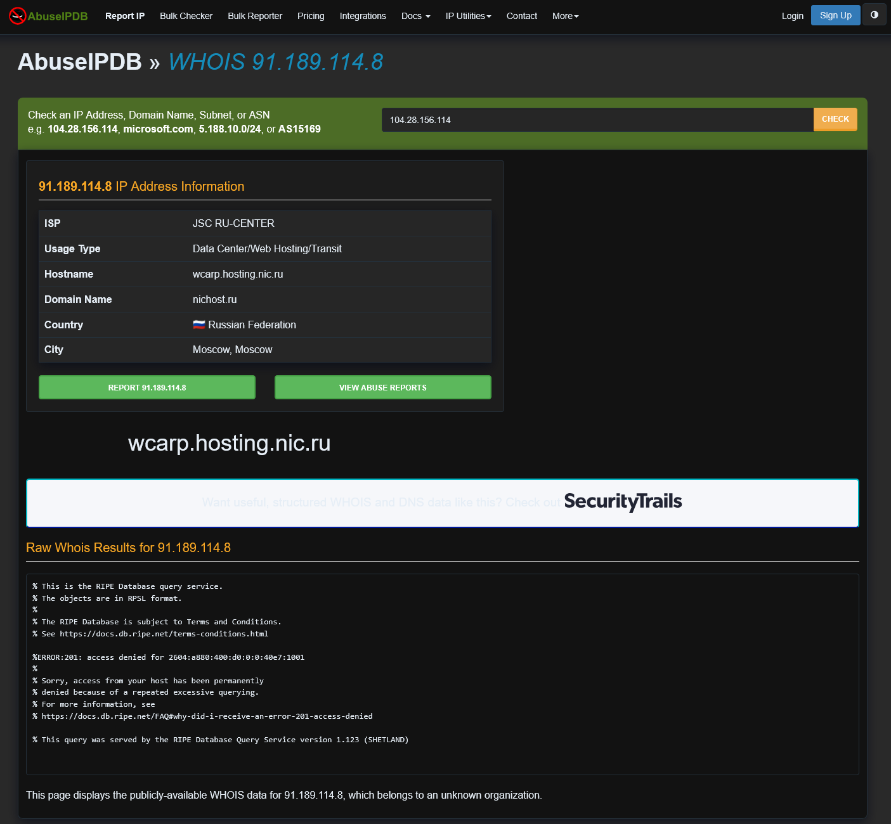

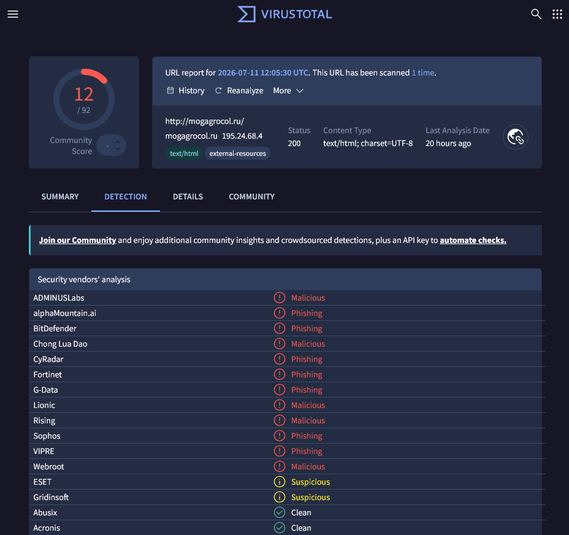

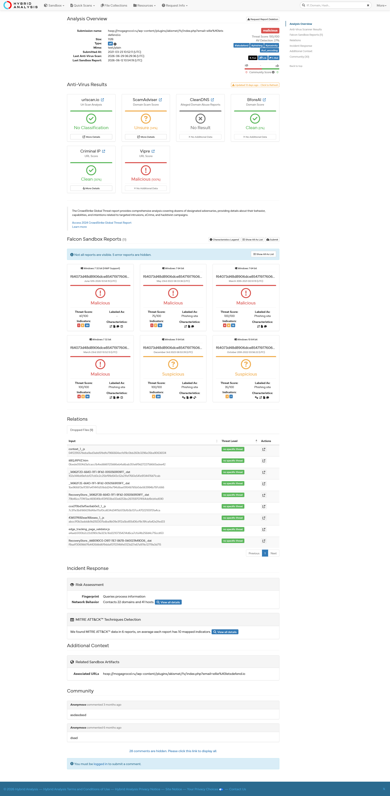

---

### 2. SIEM Log Analysis

Searched Log Management using source address `172.16.17.49`. Seven logs returned across firewall and proxy sources. Adding filters for destination `91.189.114.8` and date March 22, 2021 narrowed it to two logs, one firewall entry and one proxy entry, both timestamped at 09:23 PM.

| Field               | Value                                                                                              |
|---------------------|----------------------------------------------------------------------------------------------------|
| Date                | Mar 22, 2021, 09:23 PM                                                                             |
| Type                | Proxy                                                                                              |
| Source IP           | 172.16.17.49                                                                                       |
| Source Port         | 55662                                                                                              |
| Destination IP      | 91.189.114.8                                                                                       |
| Destination Port    | 80                                                                                                 |
| Request URL         | `http://mogagrocol.ru/wp-content/plugins/akismet/fv/index.php?email=ellie@letsdefend.io`         |

The firewall entry shows the same source and destination, the connection was allowed to pass through the firewall first, then flagged as it went through the proxy. The device action in the alert is **Allowed**, meaning the request was not blocked at either layer.

A follow-up search using only the destination IP `91.189.114.8` across all source addresses returned the same two logs. No other host on the network accessed this destination.

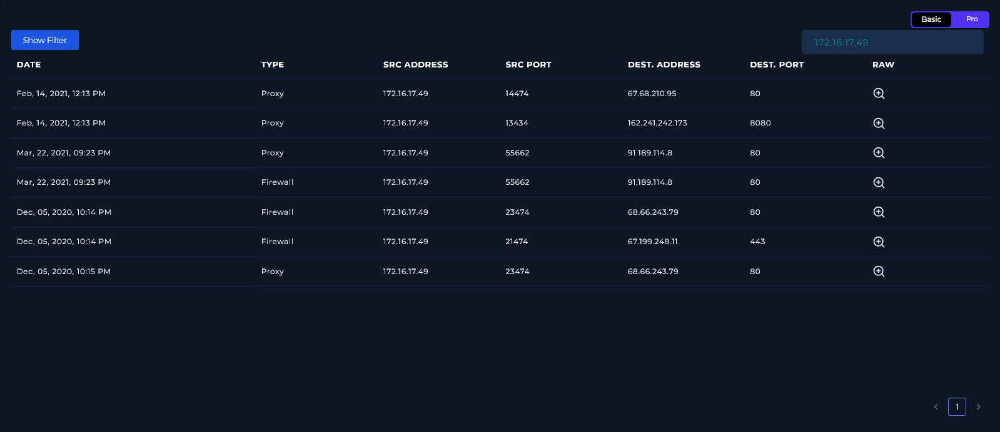

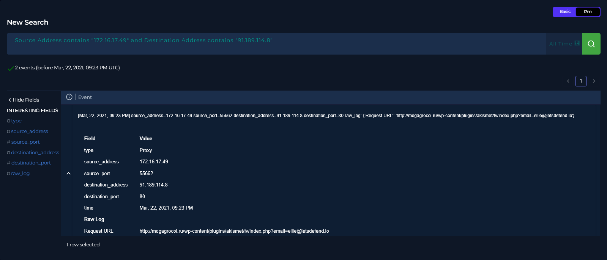

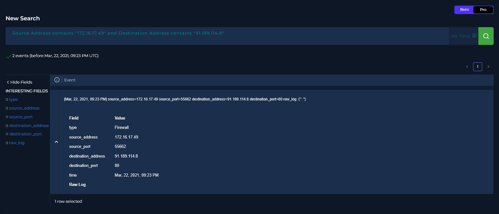

---

### 3. Endpoint Analysis (EDR)

Checked `EmilyComp` (`172.16.17.49`) in Endpoint Security across all four tabs.

**Browser History:** Six entries, all dated December 5, 2020. Nothing from March 22, 2021. The phishing URL does not appear.

**Network Action:** Eight entries. Dates range from December 5, 2020 to February 14, 2021. No connections to `91.189.114.8` or `mogagrocol.ru` at any point.

**Terminal History:** Eight entries. The most recent is dated February 14, 2021, a `rundll32.exe` command invoking `javascript:../mshtml,RunHTMLApplication`. Everything else is from December 5, 2020. Nothing from March 22, 2021.

**Processes:** Six entries, all showing "No Event Time." Standard processes, `Chrome.exe`, `AcroRd32.exe`, `notepad.exe`, `rundll32.exe`, `ccsvchst.exe`, `KBDYAK.exe`. No parent processes recorded for any of them.

The last recorded login on the host is December 5, 2020, over three months before this alert. All EDR data predates the incident. This is a complete date gap: the EDR has no visibility into what happened on March 22, 2021. Whether the phishing page loaded, whether Emily submitted credentials, or whether anything else executed after the connection cannot be determined from these logs.

This is documented as a gap rather than a clean result. Absence of data from that date is not confirmation that nothing happened.

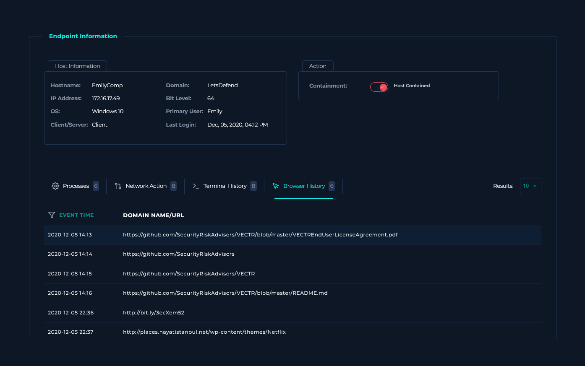

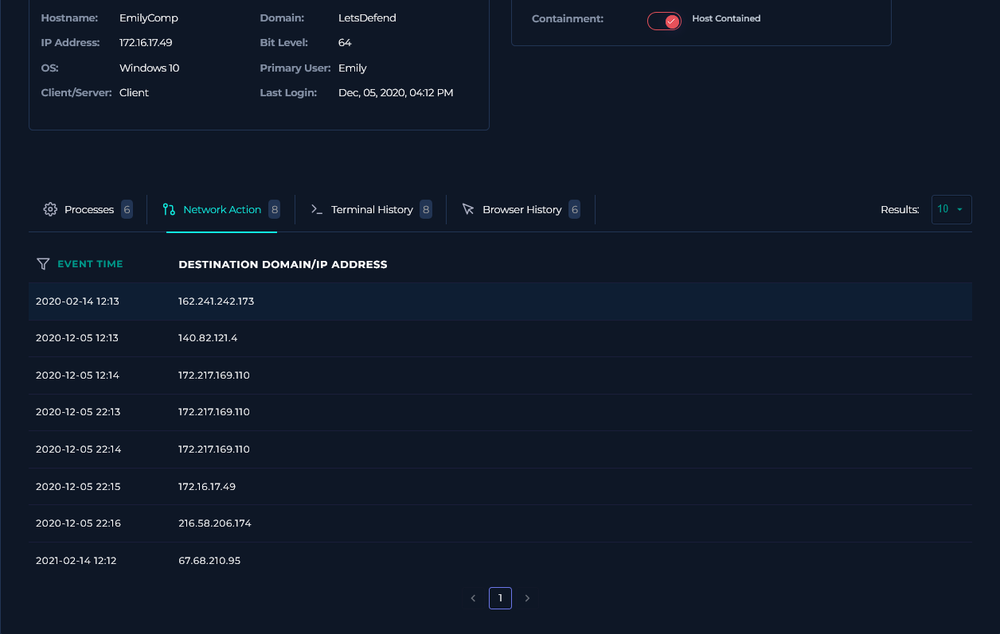

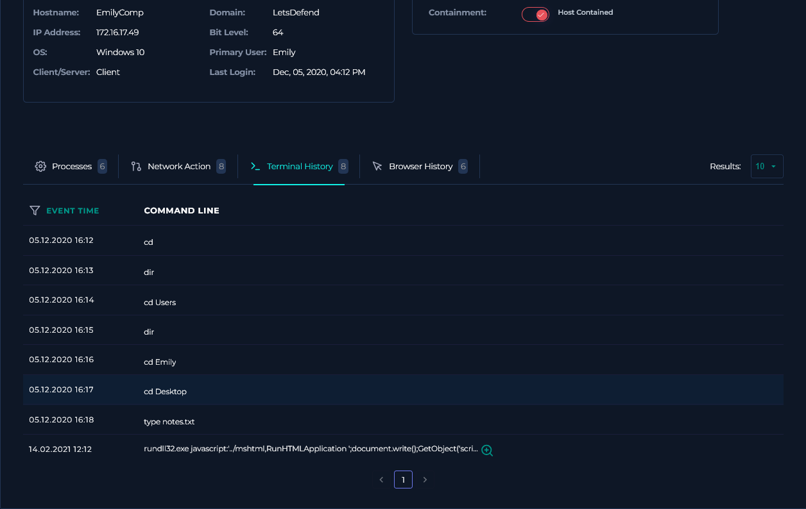

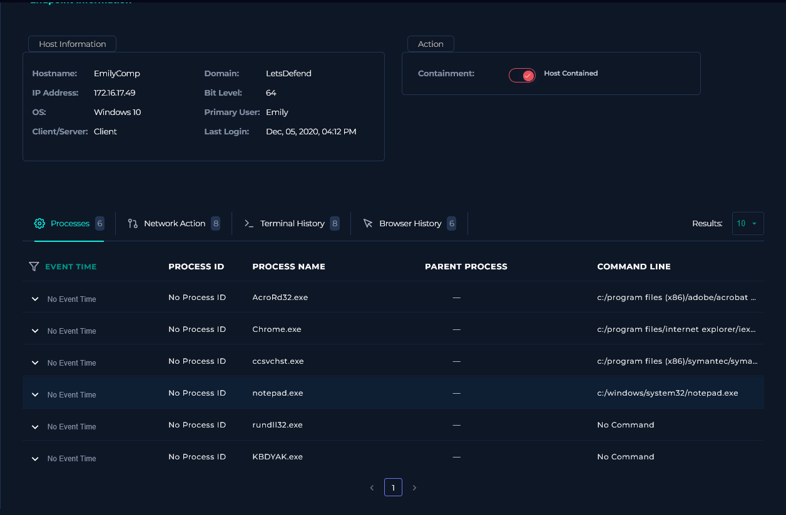

---

## Containment & Remediation

**Containment**

- Host `EmilyComp` (`172.16.17.49`) was isolated via the EDR platform.

**Remediation**

- Credential reset carried out for `ellie@letsdefend.io`. The phishing URL passed her email address as a parameter, if the page loaded, her address was pre-filled on whatever form was served. Credentials were treated as compromised rather than waiting on confirmation.
- Escalated to Tier 2 for full endpoint forensics. The EDR date gap covers the entire incident window, so manual forensic review of the host is the only way to determine what happened after the connection.
- Block `91.189.114.8`, `mogagrocol.ru`, and `195.24.68.4` at the perimeter firewall and web proxy.
- Search email logs for any message containing the `mogagrocol.ru` domain or the full phishing URL, the delivery method for this link was not identified during the investigation.

---

## Playbook Notes

**EDR date gap:** Every tab in Endpoint Security showed data from December 2020 and February 2021 only. Nothing in the EDR corresponds to March 22, 2021. The last recorded login is December 5, 2020. I treated all EDR findings from prior dates as unrelated to this incident, they belong to a different time window and cannot be attributed to this alert. The gap means the endpoint side of this investigation is unresolved and needs Tier 2.

---

## Indicators of Compromise (IOCs)

| Type                | Value                                                                                          |
|---------------------|------------------------------------------------------------------------------------------------|
| Malicious Domain    | `mogagrocol.ru`                                                                                |
| Malicious IP        | `91.189.114.8`                                                                                 |
| Serving IP          | `195.24.68.4`                                                                                  |
| Phishing URL        | `http://mogagrocol.ru/wp-content/plugins/akismet/fv/index.php?email=ellie@letsdefend.io`     |
| Affected Account    | `ellie@letsdefend.io`                                                                          |
| Affected Host       | `EmilyComp` / `172.16.17.49`                                                                  |

---

## MITRE ATT&CK Mapping

| Tactic           | Technique                                                                                      |
|------------------|------------------------------------------------------------------------------------------------|
| Initial Access   | T1566.002 — Phishing: Spearphishing Link                                                       |
| Reconnaissance   | T1598.003 — Phishing for Information: Spearphishing Link (email address passed as URL parameter confirms targeted collection intent) |
| Defense Evasion  | T1584.004 — Compromise Infrastructure: Server (compromised WordPress site used as phishing host) |

---

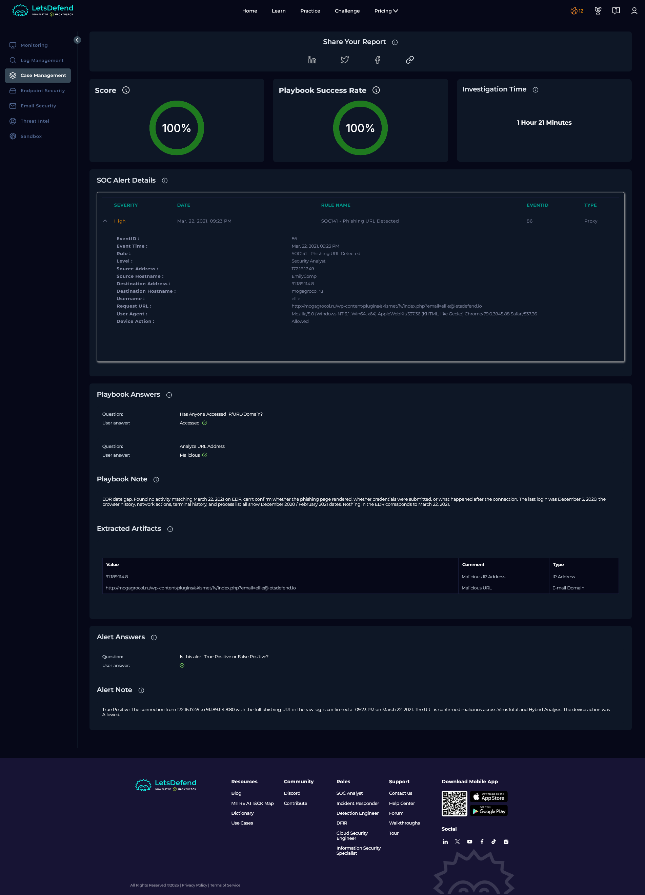

---

*Written by: Supawat H. (uriel0byte) | LetsDefend SOC Practice*
