# SOC251  Quishing Detected (QR Code Phishing)

| Field          | Value                                                              |
|----------------|--------------------------------------------------------------------|
| **Platform**   | LetsDefend                                                         |
| **Alert ID**   | EventID 214                                                        |
| **Alert Time** | January 1, 2024 - 12:37 PM                                        |
| **Category**   | Phishing for Information / Reconnaissance                          |
| **Verdict**    | True Positive - Credentials Potentially Compromised                |
| **Status**     | Closed                                                             |

---

## Executive Summary

On January 1, 2024, a phishing email was delivered to `claire@letsdefend.io` from `security@microsecmfa.com` a domain crafted to impersonate Microsoft MFA communications. The firewall allowed it through. The email carried no traditional file attachment. The attack vector was a QR code embedded in the email body pointing to a credential harvesting page hosted on IPFS a decentralized file system that specifically resists takedown. Claire's workstation showed no evidence of a click, but QR code attacks are designed to bypass EDR entirely by targeting the user's phone camera. No compromise was confirmed, but credentials must be treated as potentially stolen. The email was purged and the host contained.

---

## Kill Chain

### 1. IP Reputation

Before touching any logs, I queried the SMTP IP `158.69.201.47` across four sources.

| Source        | Result                                                                                                  |
|---------------|---------------------------------------------------------------------------------------------------------|
| LetsDefend TI | Flagged. Tagged: **phishing**. Source: Anonymous. Logged January 9, 2024.                              |
| VirusTotal    | 7/91 vendors flagged as malicious or phishing. Origin: Canada (AS16276, OVH SAS).                     |
| AbuseIPDB     | 339 reports from 91 distinct sources since February 2022. Confidence score reads 0% this is a stale-report weighting artifact, not a clean result. Community comments document brute force, SQL injection, web app attacks, and unauthorized access attempts. |
| Cisco Talos   | Neutral. Not on their block list.                                                                       |

LetsDefend TI and VirusTotal both independently confirmed phishing. The AbuseIPDB 0% confidence number is the kind of thing that trips up less experienced analysts reading the actual community reports tells a different story than the headline score.

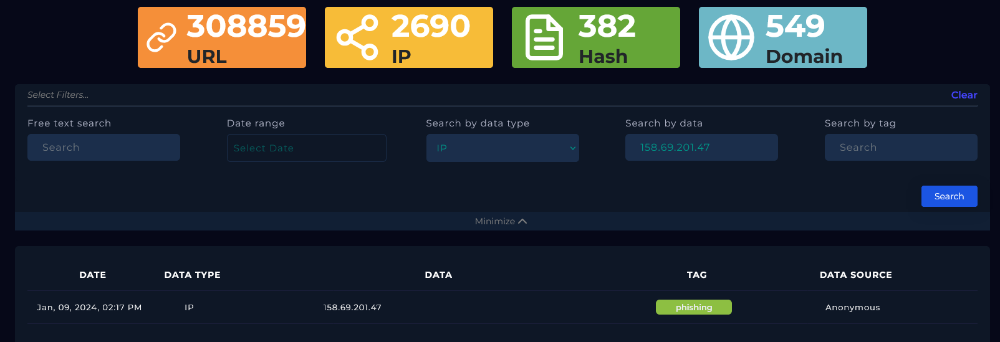

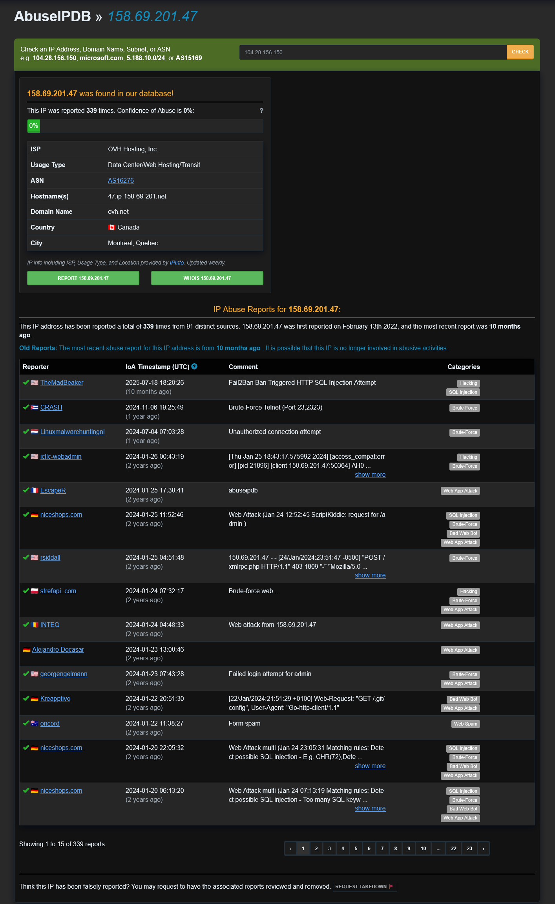

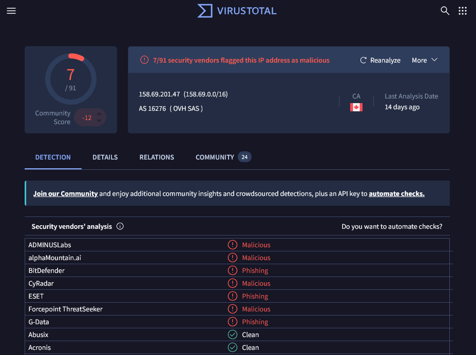

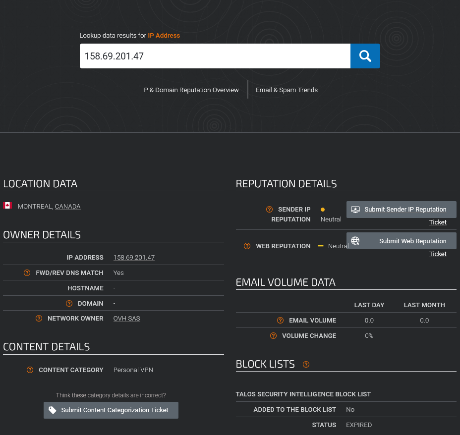

---

### 2. Alert Verification

Searched Log Management filtering by source IP `158.69.201.47`. One Exchange event returned: January 1, 2024, 12:00 PM, destination `172.16.20.3`, port 25. The raw log confirmed sender `security@microsecmfa.com`, destination `Claire@letsdefend.io`, subject matching the alert, device action: Allowed. One hit. Targeted at a single recipient.

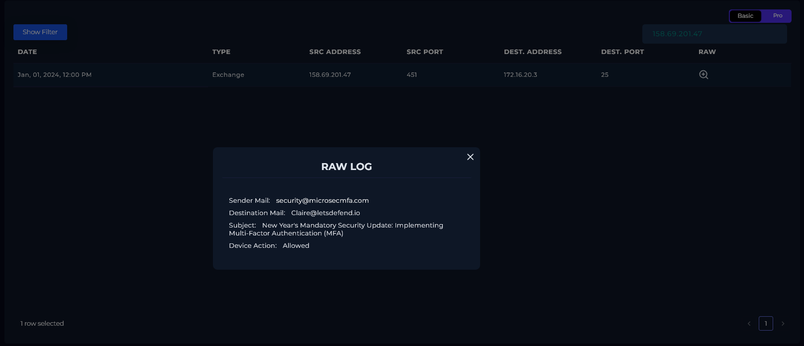

---

### 3. Email Analysis

Searched Email Security by sender `security@microsecmfa.com`, date range January 1–7, 2024. One result.

| Field     | Value                                                                                |
|-----------|--------------------------------------------------------------------------------------|
| Sender    | `security@microsecmfa.com`                                                           |
| Recipient | `claire@letsdefend.io`                                                               |
| Subject   | New Year's Mandatory Security Update: Implementing Multi-Factor Authentication (MFA) |
| Date      | January 1, 2024, 12:00 PM                                                           |
| Action    | Allowed                                                                              |

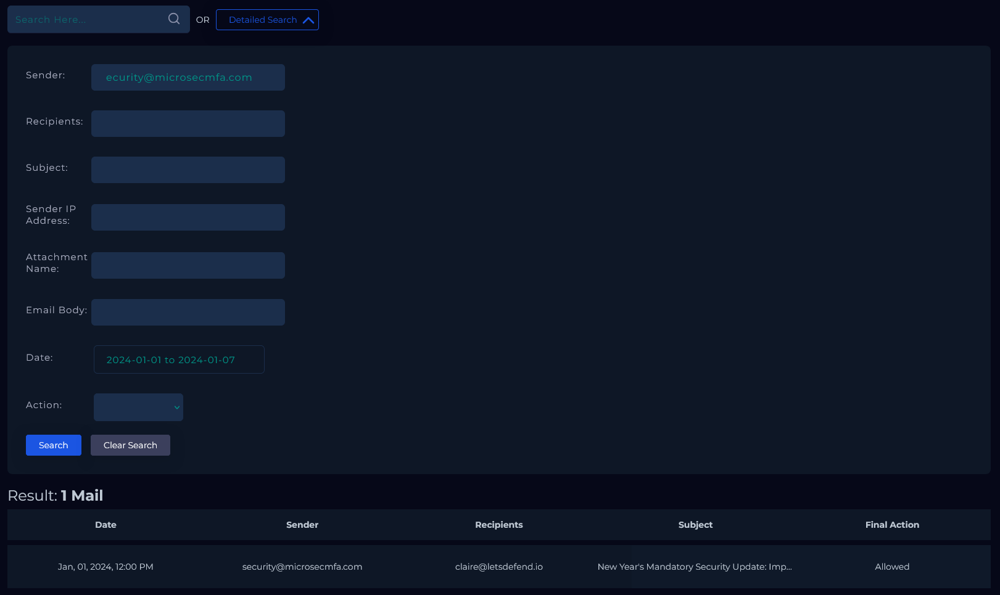

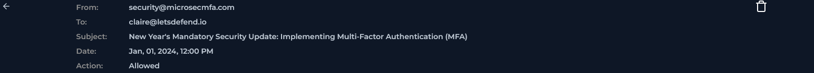

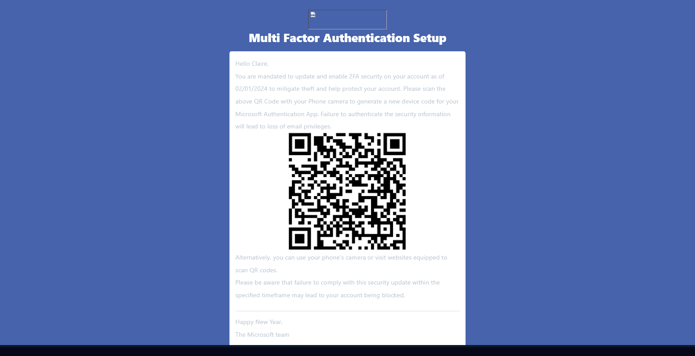

**Why this email is suspicious:**

- `microsecmfa.com` is crafted to look like a Microsoft MFA domain at a glance. "micro-sec-mfa" reads as Microsoft Security MFA a deliberate construction, not a coincidence.
- The email renders a full Microsoft branding template with the Microsoft logo. The signature reads "The Microsoft team."
- The body imposes a hard deadline ("as of 02/01/2024") and threatens account suspension for non-compliance, standard urgency and fear tactics.
- Instead of a link or file attachment, the attack delivers a QR code. The instruction to "scan the above QR Code with your Phone camera" is deliberate, this routes the victim through their personal phone, bypassing any corporate email security gateway or EDR.
- A fallback line reads: "Alternatively, you can use your phone's camera or visit websites equipped to scan QR codes." The attacker provides multiple paths to the same trap.

---

### 4. QR Code Extraction

Extracted the QR code image from the email and decoded it using CyberChef (Parse QR Code recipe).

**Extracted URL:**
```
https://ipfs.io/ipfs/Qmbr8wmr41C35c3K2GfiP2F8YGzLhYpKpb4K66KU6mLmL4#
```

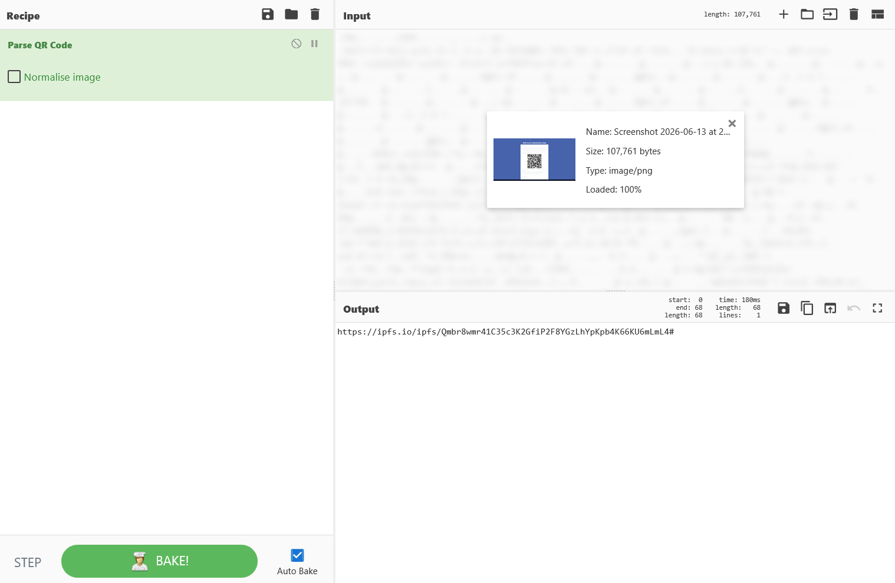

---

### What Is IPFS and Why Attackers Use It

**IPFS (InterPlanetary File System)** is a decentralized, peer-to-peer file storage protocol. Unlike a traditional website hosted on a single server, content on IPFS is distributed across thousands of independent nodes worldwide. Each piece of content is addressed by a unique cryptographic hash rather than a domain name.

This matters for threat analysis because:

- **Standard takedown requests don't work.** If a phishing page is hosted on a normal web server, a takedown request to the hosting provider removes it within hours. On IPFS, there is no single hosting provider to contact, the content lives across the network.
- **The URL looks legitimate at a glance.** `ipfs.io` is a real, well-known gateway operated by Protocol Labs. The malicious content is buried in the path hash, not the domain.
- **The page can be cached indefinitely.** Even if the original submitter removes the content, nodes that have already cached it may continue serving it.

Hosting phishing pages on IPFS is an active and growing evasion technique. URLScan returning status 410 (Gone) means the page was eventually blocked or expired at the gateway level but it was live when Claire received the email.

---

### 5. URL Analysis

Ran the extracted IPFS URL through VirusTotal and URLScan.io.

**VirusTotal:** 13/92 vendors flagged the URL as malicious or phishing. Community context: "Phishing, Sharepoint with URL to fake Microsoft login page."

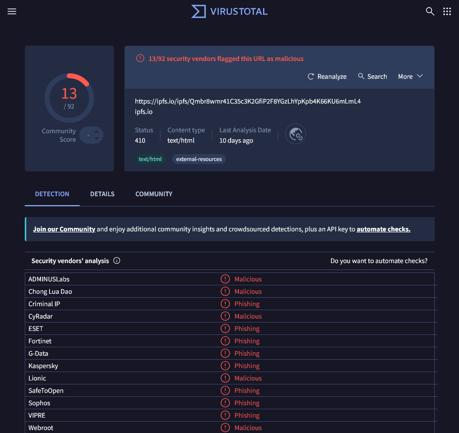

**URLScan.io:** Status 410 Gone, blocked or taken down by the time of analysis. Resolved IP: `209.94.90.3` (Protocol Labs, US, the organization that operates the IPFS infrastructure).

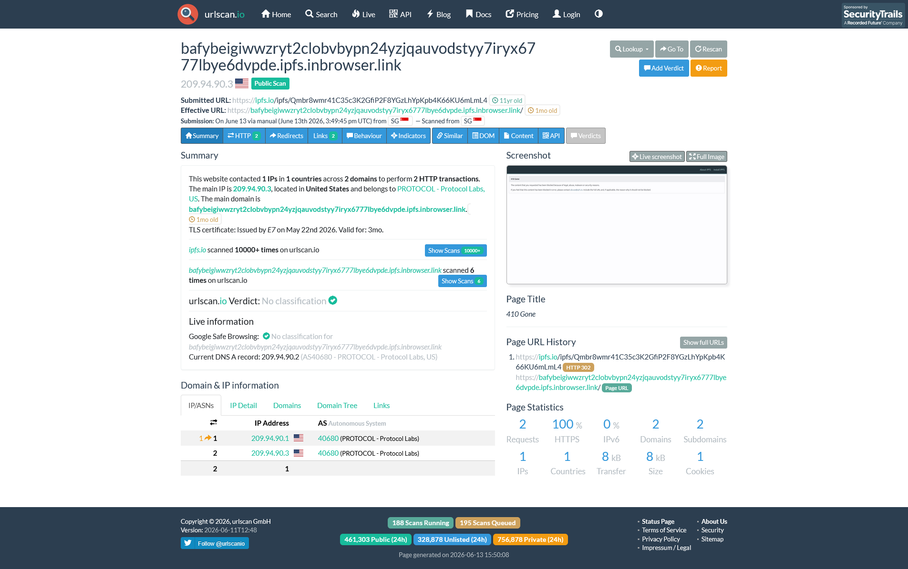

**Sandbox analysis (official report calibration):** I did not perform sandbox analysis on this URL during my investigation. The official LetsDefend report ran the URL through Any.run and found it renders a fake Webmail sign-in page. The page source contained JavaScript sending captured credentials via POST request to `https://www.nsggroup.it/fhfh/ffftt/hhnew.php`. VirusTotal flags `nsggroup.it` as malicious across 9 vendors. Running the extracted URL in Any.run or a similar sandbox should have been part of my workflow here, documenting this as a missed step. The credential exfiltration endpoint is logged in the IOC table regardless.

---

### 6. Endpoint Analysis

Checked Claire's host (`172.16.17.181`) in Endpoint Security.

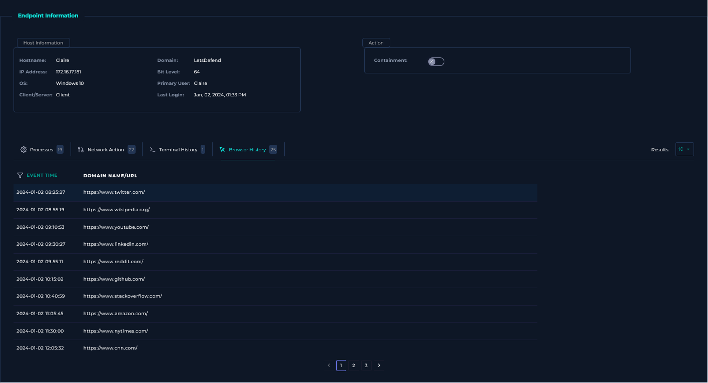

**Browser history:** Three pages of results, all starting January 2. Nothing from January 1. No visits to the IPFS URL or any related domain at any point.

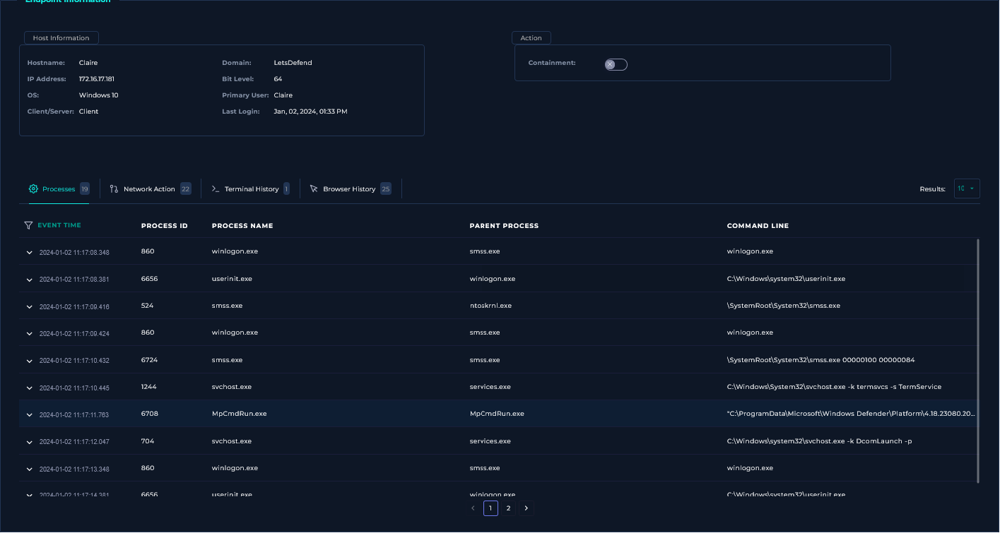

**Network action:** 22 outbound connections, all January 2. None match any IOC from this investigation.

**Processes / Terminal History:** No malicious files executed. Process list is standard Windows system processes.

The workstation is clean. This does not mean Claire didn't scan the QR code. Quishing attacks specifically instruct the victim to use a phone camera that scan never touches the workstation, never generates a browser log, and is completely invisible to EDR. Her phone is outside scope. Credentials must still be treated as potentially compromised.

---

## Containment & Remediation

**Containment**
Host `172.16.17.181` (Claire) was isolated via the EDR platform. Email purged from inbox via Email Security Gateway.

> **Playbook miss Containment:** I initially answered No for containment because the workstation showed no direct compromise. The correct answer is Yes. When a credential-harvesting phishing page is in play and phone-based scanning cannot be ruled out, the account and host should be contained and credentials reset regardless of what the workstation shows. The EDR blind spot on phones is exactly why the platform requires containment in quishing cases you can't confirm the threat didn't execute just because you can't see where it went.

> **Missed step Sandbox analysis:** I didn't run the extracted IPFS URL through Any.run or a similar dynamic sandbox. That step would have revealed the fake Webmail login page and the JavaScript credential exfiltration to `nsggroup.it`. Adding sandbox analysis to the QR extraction workflow going forward.

**Remediation**

- Force an immediate credential reset for Claire's account. Treat her credentials as compromised until confirmed otherwise.
- Block `158.69.201.47`, `microsecmfa.com`, `nsggroup.it`, and the full IPFS URL at the email gateway and perimeter firewall.
- Investigate whether `nsggroup.it/fhfh/ffftt/hhnew.php` received any submissions tied to this organization.
- Implement QR code scanning in the email security stack. Standard attachment scanning does not cover embedded QR codes, this was the exact evasion technique used here.
- Enroll company mobile devices in an MDM solution. Personal phones used for work email are a persistent blind spot for EDR, and quishing attacks are designed around that gap.
- Enforce MFA across all accounts. The irony of this attack is that it impersonated an MFA setup prompt, accounts already using real MFA would have significantly reduced the risk of credential theft being useful.

---

## Indicators of Compromise (IOCs)

| Type                     | Value                                                                                      |
|--------------------------|--------------------------------------------------------------------------------------------|
| Malicious SMTP IP        | `158.69.201.47`                                                                            |
| Sender Domain            | `microsecmfa.com`                                                                          |
| Sender Address           | `security@microsecmfa.com`                                                                 |
| Extracted QR URL         | `https://ipfs.io/ipfs/Qmbr8wmr41C35c3K2GfiP2F8YGzLhYpKpb4K66KU6mLmL4#`                 |
| IPFS Hosting IP          | `209.94.90.3` (Protocol Labs - IPFS gateway infrastructure)                               |
| Credential Exfil Domain  | `nsggroup.it` (from official report sandbox analysis)                                     |
| Credential Exfil URL     | `https://www.nsggroup.it/fhfh/ffftt/hhnew.php` (from official report sandbox analysis)   |

---

## MITRE ATT&CK Mapping

| Tactic           | Technique                                                                            |
|------------------|--------------------------------------------------------------------------------------|
| Reconnaissance   | T1598.004 - Phishing for Information: Spearphishing via QR Code                     |
| Reconnaissance   | T1589 - Gather Victim Identity Information (credential harvesting intent)            |
| Initial Access   | T1566.001 - Phishing: Spearphishing Attachment (QR code image as delivery vehicle)  |
| Defense Evasion  | T1656 - Impersonation (Microsoft branding and MFA security lure)                    |
| Defense Evasion  | T1027 - Obfuscated Files or Information (QR code hides the URL from gateway scanning) |

> **Note:** The official LetsDefend report cites T1589.002 (Gather Victim Email Addresses) in the body text. That sub-technique is about collecting email addresses for targeting  not what happened here. The correct sub-technique for QR code phishing is T1598.004, which was introduced specifically to cover quishing attacks. Calibrating against the official report does not mean following it where it's wrong.

---

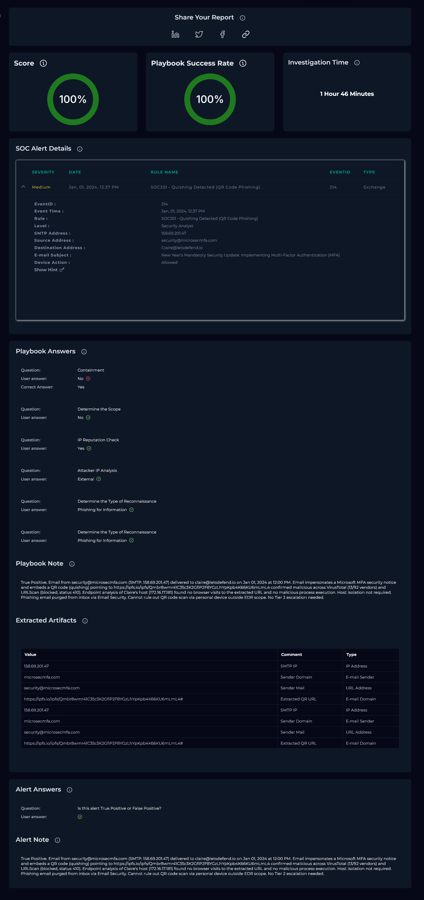

---

*Written by: Supawat H. (uriel0byte) | LetsDefend SOC Practice*
