# SOC282 — Phishing Alert - Deceptive Mail Detected

| Field | Value |
| --- | --- |
| **Platform** | LetsDefend |
| **Alert ID** | EventID 257 |
| **Alert Time** | May 13, 2024 — 09:22 AM |
| **Category** | Phishing / Initial Access |
| **Verdict** | True Positive — Host Compromised |
| **Status** | Closed |

---

## Executive Summary

An alert triggered for a deceptive email sent to Felix from `free@coffeeshooop.com` on May 13, 2024. The email gateway allowed the delivery. The email used a "Free Coffee Voucher" lure with a malicious embedded URL and a password-protected zip attachment. Endpoint analysis confirmed the user clicked the link, downloaded the zip, and executed the malicious payload (`Coffee.exe`). The malware spawned a command shell one second after execution and immediately ran system discovery commands while establishing an outbound connection to its C2 at `37.120.233.226`. The host was isolated and the email purged.

---

## Kill Chain

### 1. Threat Intelligence & IP Reputation

Before touching internal logs, I queried the alert's SMTP IP (`103.80.134.63`) across four sources.

| Source | Result |
| --- | --- |
| LetsDefend TI | Flagged. Tagged: **phishing**. Source: Anonymous. |
| VirusTotal | Flagged malicious. Tagged for phishing, origin: South Korea. |
| AbuseIPDB | 0 reports, but Whois confirmed South Korea (AS3786). No reports does not mean clean — the IP may simply not have been submitted yet. |
| Cisco Talos | Flagged as Poor/Untrusted Reputation. |

The sender domain (`coffeeshooop.com`) had no reputation data anywhere, but the SMTP IP was confirmed malicious across three independent sources.

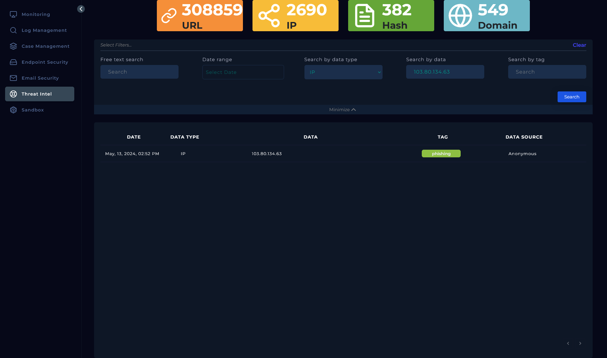

---

### 2. Alert Verification

I queried SIEM (Log Management) for source IP `103.80.134.63`, filtering May 13 to May 31, 2024. One hit returned, an Exchange event at `09:20 AM` with the raw log confirming sender `free@coffeeshooop.com` to destination `Felix@letsdefend.io` on port 25. Action: **Allowed**.

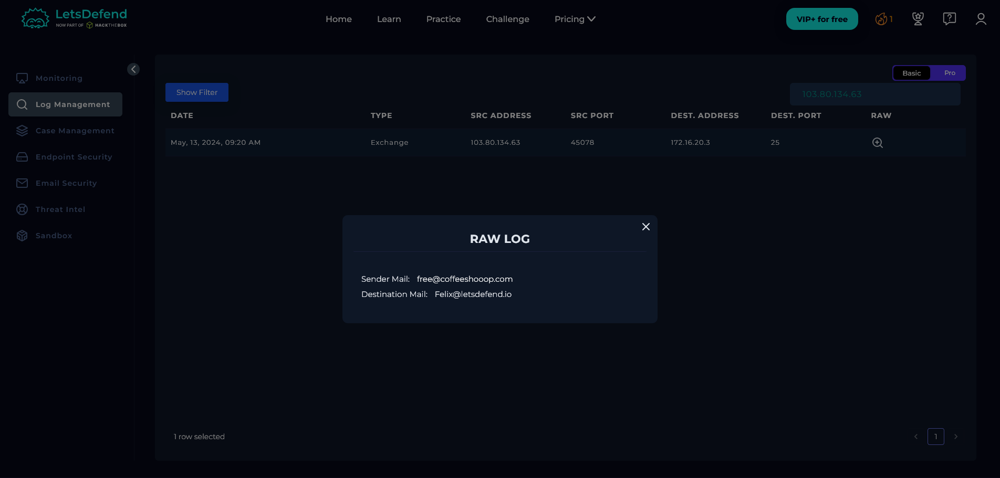

---

### 3. Email Analysis

I pivoted to Email Security, searched by sender IP `103.80.134.63`, and found one result matching the alert.

| Field | Value |
| --- | --- |
| Sender | `free@coffeeshooop.com` |
| Recipient | `Felix@letsdefend.io` |
| Subject | Free Coffee Voucher |
| Date | May 13, 2024, 09:22 AM |
| Action | Allowed |

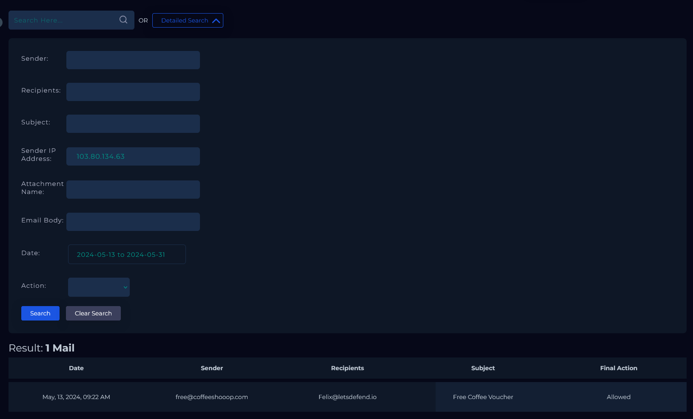

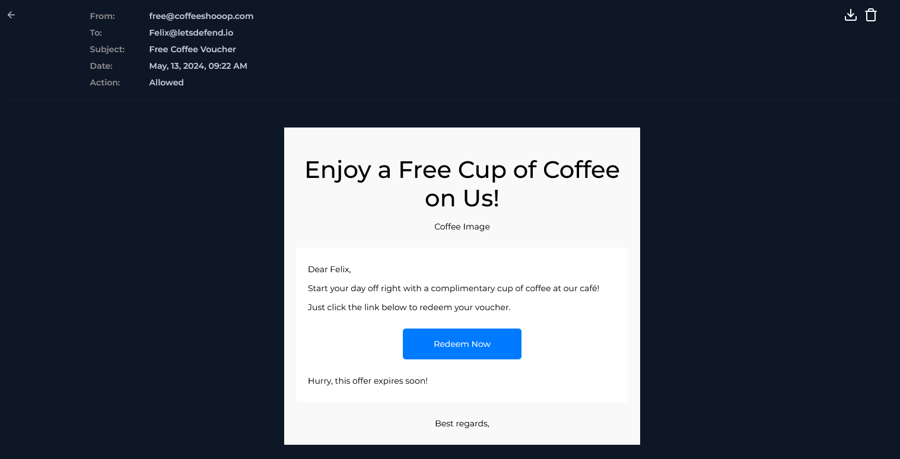

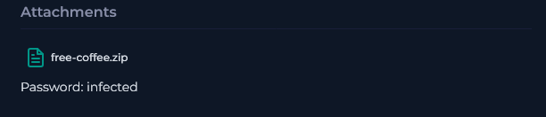

**Why this email is suspicious:**

- The sender domain `coffeeshooop.com` has three 'o's, a deliberate typosquat designed to pass a quick glance.
- The "Redeem Now" button routes through `download.cyberlearn.academy` and directly triggers a zip download from an AWS S3 bucket, bypassing the user's expectation of a normal webpage.
- The zip attachment (`free-coffee.zip`) is password-protected with the password "infected" provided in plaintext in the email. This is a standard evasion technique, password-protected archives cannot be scanned by email gateways.
- The body uses urgency language: "Hurry, this offer expires soon!"

---

### 4. Endpoint Analysis

With the firewall action confirmed as Allowed, I checked Felix's host (`172.16.20.151`) in Endpoint Security, filtering from the email timestamp forward.

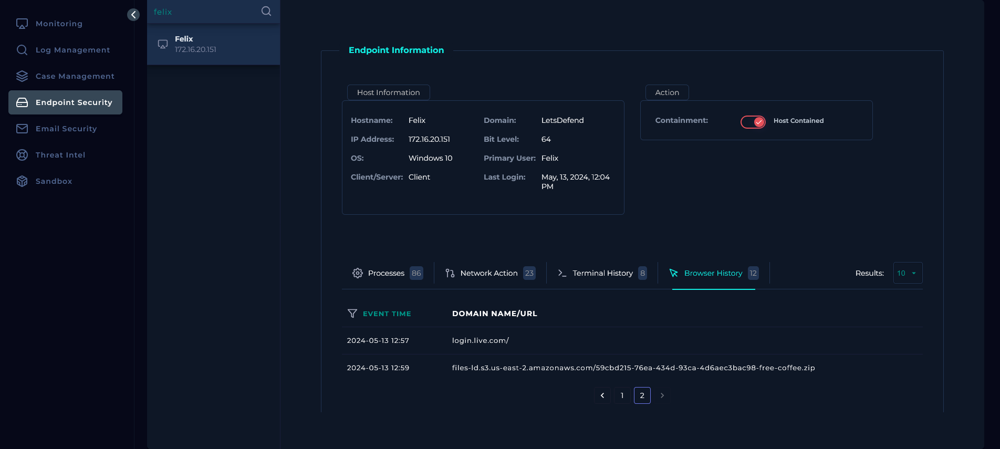

**Browser history:** At `12:59`, Felix visited the AWS S3 URL about 3.5 hours after the email arrived. The file was downloaded.

**Process execution:** At `13:00:38`, `Coffee.exe` (PID 6697) launched from `C:\Users\Felix\Downloads\Coffee.exe`, spawned by `explorer.exe`.

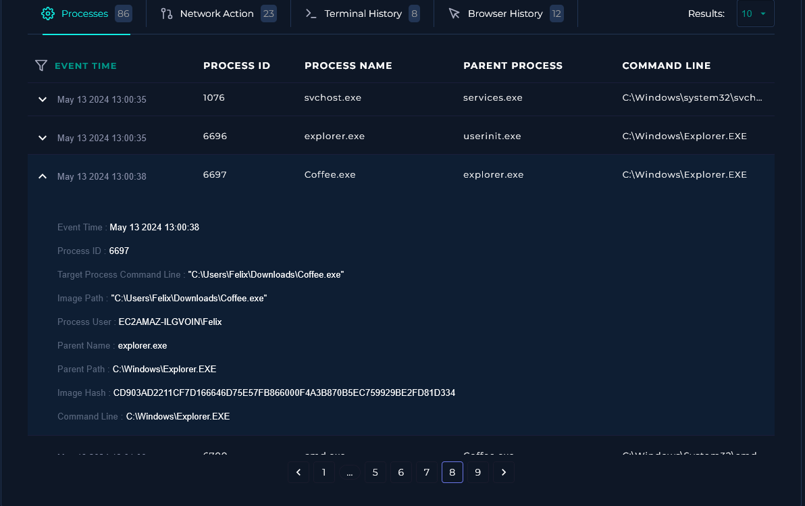

At `13:01:00`, `Coffee.exe` spawned `cmd.exe` (PID 6700).

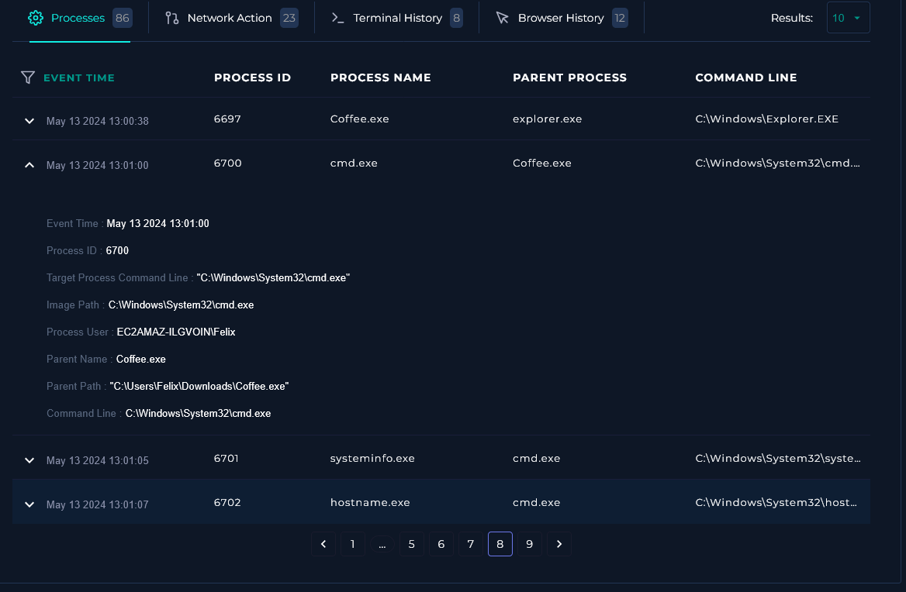

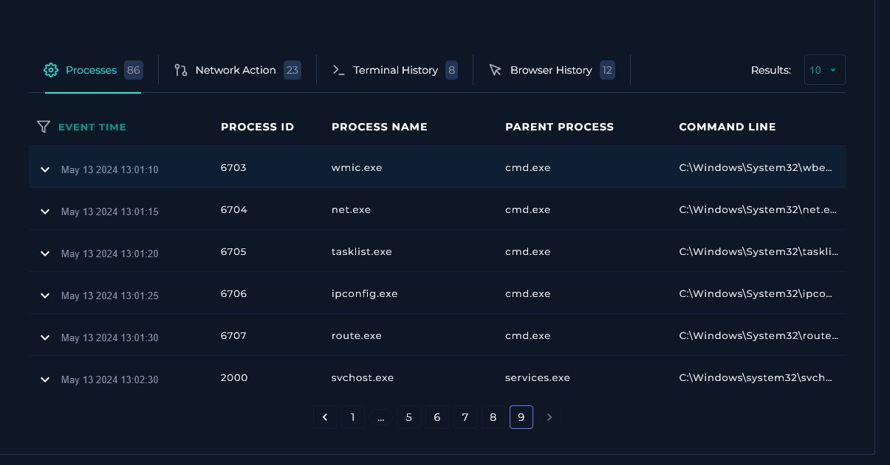

**Terminal history:** Starting at `13:01`, the malware ran a rapid automated discovery sequence through the spawned shell:

| Time | Command | Purpose |
| --- | --- | --- |
| 13:01:00 | `cmd.exe` | Shell opened |
| 13:01:05 | `systeminfo` | Full system information |
| 13:01:07 | `hostname` | Machine name |
| 13:01:10 | `wmic logicaldisk get caption,description...` | Disk enumeration |
| 13:01:15 | `net user` | Local account enumeration |
| 13:01:20 | `tasklist /svc` | Running services enumeration |
| 13:01:25 | `ipconfig /all` | Full network configuration |
| 13:01:30 | `route print` | Routing table |

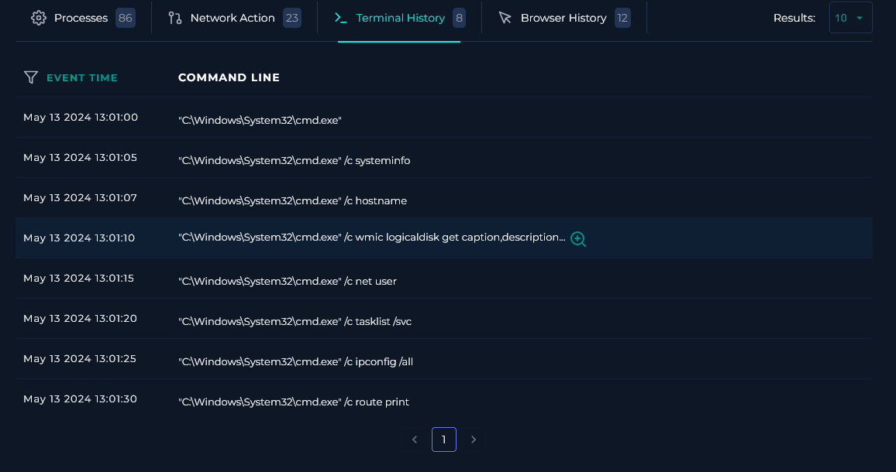

**C2 connection:** At `13:00:39`, one second after `Coffee.exe` executed, the host connected to `37.120.233[.]226` on port 3451 over TCP. This is the confirmed C2 address. The connection was established before the discovery commands even ran, meaning the malware phoned home immediately on execution.

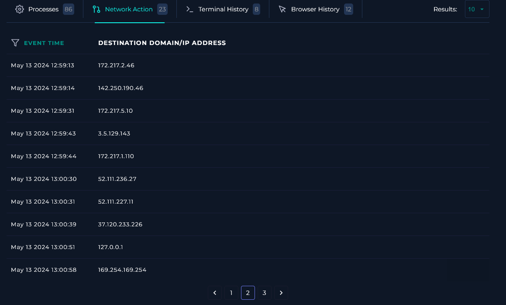

---

## Containment & Remediation

**Containment**
- Host `172.16.20.151` (Felix) was isolated via the EDR platform to sever the active C2 connection and prevent lateral movement.
- The phishing email was permanently deleted from Felix's inbox via Email Security Gateway.

**Remediation**

- Escalate to Tier 2 for full endpoint forensics and reimaging. The malware executed, ran discovery, and established C2, the extent of what was exfiltrated is unknown without deeper analysis.
- Force a full credential reset for Felix's account. Any credentials stored on the host or in the browser should be treated as compromised.
- Block `103.80.134.63`, `coffeeshooop.com`, and `37.120.233.226` at the perimeter firewall and email gateway.
- Block the payload URL at the web proxy.
- Enforce email attachment scanning policies, password-protected archives from external senders should be quarantined by default, not allowed through.

---

## Indicators of Compromise (IOCs)

| Type | Value |
| --- | --- |
| Malicious SMTP IP | `103.80.134.63` |
| Phishing Domain | `coffeeshooop.com` |
| Sender Address | `free@coffeeshooop.com` |
| Payload URL | `https://download.cyberlearn.academy/download/download?url=https://files-ld.s3.us-east-2.amazonaws.com/59cbd215-76ea-434d-93ca-4d6aec3bac98-free-coffee.zip` |
| Malicious File | `Coffee.exe` |
| SHA256 (Coffee.exe) | `CD903AD2211CF7D166646D75E57FB866000F4A3B870B5EC759929BE2FD81D334` |
| C2 IP | `37.120.233.226` |

---

## MITRE ATT&CK Mapping

| Tactic | Technique |
| --- | --- |
| Initial Access | T1566.002 — Phishing: Spearphishing Link |
| Execution | T1204.002 — User Execution: Malicious File |
| Execution | T1059.003 — Command and Scripting Interpreter: Windows Command Shell |
| Command and Control | T1071.001 — Application Layer Protocol: Web Protocols (Coffee.exe → 37.120.233.226) |
| Discovery | T1082 — System Information Discovery (systeminfo, hostname, wmic) |
| Discovery | T1087.001 — Account Discovery: Local Account (net user) |
| Discovery | T1007 — System Service Discovery (tasklist /svc) |
| Discovery | T1016 — System Network Configuration Discovery (ipconfig /all, route print) |

---

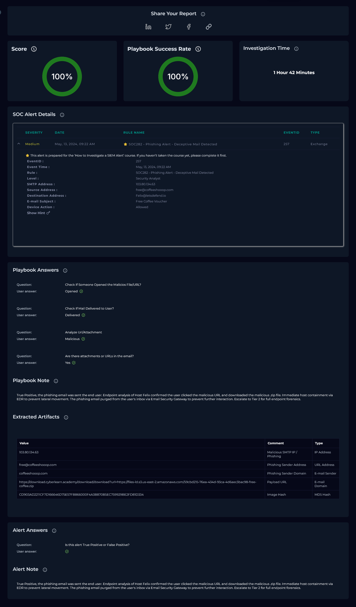

---

*Written by: Supawat H. (uriel0byte) | LetsDefend SOC Practice*
