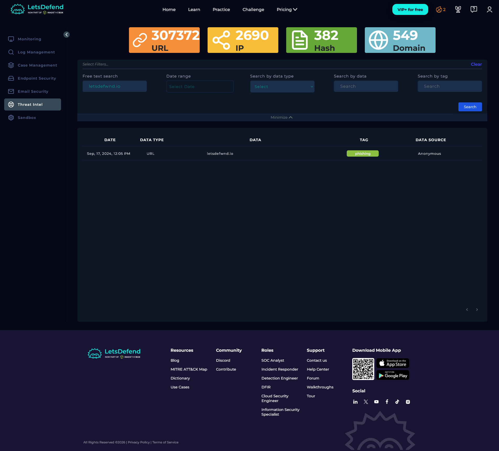
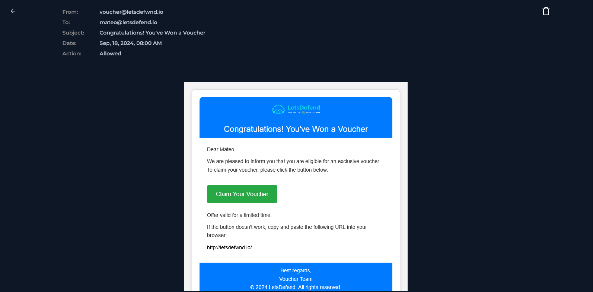
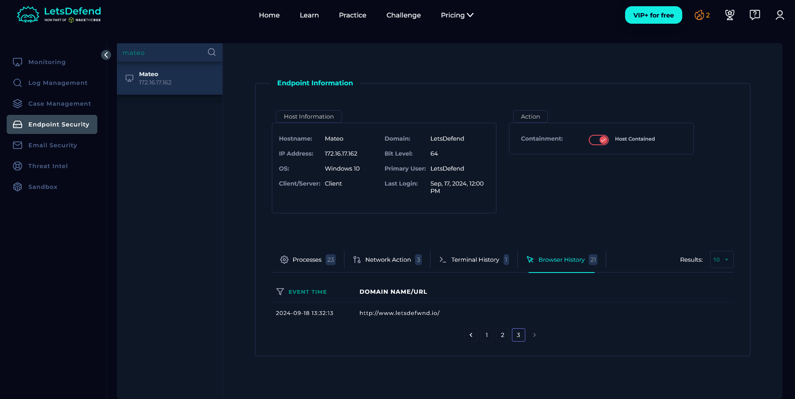

# SOC326 — Impersonating Domain MX Record Change Detected

| Field          | Value                                                        |
|----------------|--------------------------------------------------------------|
| **Platform**   | LetsDefend                                                   |
| **Alert ID**   | EventID 304                                                  |
| **Alert Time** | September 17, 2024 — 12:05 PM                                |
| **Category**   | Threat Intel / Phishing Infrastructure                       |
| **Verdict**    | True Positive — Host Compromised                         |
| **Status**     | Closed                                                       |

---

## Executive Summary

A CTI feed flagged a domain change: `letsdefwnd.io` — a typosquat of `letsdefend.io` — had its MX record updated to `mail.mailerhost[.]net`. The MX record change was detected on September 17. The next morning, a phishing email originating from `voucher@letsdefwnd.io` was delivered to `mateo@letsdefend.io` with a voucher lure and an embedded link back to the typosquatted domain. The firewall allowed it through. EDR confirmed Mateo visited the URL. The host was isolated and the email was purged before further damage could occur.

---

## Kill Chain

### 1. Threat Intelligence Trigger

The alert was not generated by a firewall or SIEM rule on live traffic. It came from an external CTI feed (`no-reply@cti-report.io`) notifying the SOC that the MX record for `letsdefwnd[.]io` had changed — a known pre-attack signal for phishing infrastructure setup.

Before touching internal logs, I queried the domain across five sources.

| Source        | Result                                                                          |
|---------------|---------------------------------------------------------------------------------|
| LetsDefend TI | Flagged. Domain categorized as malicious.                                       |
| VirusTotal    | Positive detection. Domain flagged across multiple vendors.                     |
| AbuseIPDB     | Could not resolve domain — likely newly registered, not yet indexed.            |
| Cisco Talos   | Unknown — no reputation data available.                              |
| URLscan.io    | Could not resolve — same reason as AbuseIPDB.                                   |

Three out of five sources returned no data because the domain was newly registered. **LetsDefend TI and VirusTotal both flagged it.** The absence of data in AbuseIPDB and URLscan is not a clean bill of health — it reflects the domain being too new to appear in those feeds.

> **Playbook note:** I answered "Non-malicious" during the playbook's URL analysis step because the majority of external tools returned no result. The correct answer was Malicious. The lesson here is that a newly registered typosquatted domain with zero reputation history should raise suspicion on its own — and when LetsDefend TI explicitly flags it, that should be the deciding vote.

---

### 2. Domain Analysis

`letsdefwnd[.]io` is a typosquat of `letsdefend.io`. The swap is one character: `e → w` in the middle of the domain name, visually easy to miss.

The MX record update to `mail.mailerhost[.]net` means this external server was configured to handle inbound email routing for the fake domain. This is standard phishing infrastructure preparation — set up the domain, configure mail routing, then launch the campaign. The CTI alert caught this at the infrastructure stage, one day before the phishing email hit an inbox.

---

### 3. Email Analysis

Email Security Gateway confirmed one email matching Event ID 304, timestamped **September 18, 2024, 08:00 AM** — the morning after the infrastructure change was detected.

| Field     | Value                                      |
|-----------|--------------------------------------------|
| Sender    | `voucher@letsdefwnd.io`                    |
| Recipient | `mateo@letsdefend.io`                      |
| Subject   | Congratulations! You've Won a Voucher      |
| URL       | `http://letsdefwnd.io/`                    |

**Why this email is suspicious:**

- The sending domain `letsdefwnd.io` is a character-swap typosquat of `letsdefend.io` — easy to miss in a notification email.
- The subject line uses a reward lure designed to prompt clicks without scrutiny.
- The body includes urgency language ("Offer valid for a limited time") — a standard social engineering tactic.
- The fallback URL is included in plaintext: `http://letsdefwnd.io/` — a red flag since legitimate voucher systems use tracked links, not raw domain URLs.
- No file attachment, but the embedded button and the fallback URL both point to the same phishing domain.

The firewall action was **Allowed** — the email was delivered to Mateo's inbox without any interception.

---

### 4. Endpoint Analysis

I checked Mateo's host (`172.16.17.162`) in Endpoint Security, filtering activity from the email timestamp onward (September 18, 08:00 AM).

**Browser history confirmed:** Mateo visited `http://letsdefwnd.io/` after receiving the email. The click is documented.

**Network action tab:** No related connections appeared. This discrepancy is noted — the browser history confirms the visit occurred, but EDR network logs didn't capture it. This may reflect a limitation in how the EDR logs short-lived or redirected HTTP connections rather than the visit not happening. The browser history is the more reliable record here.

**Containment:** Host `172.16.17.162` was isolated via the EDR platform immediately after confirming the click.

**Email purge:** The phishing email was permanently deleted from Mateo's inbox via the Email Security Gateway to prevent any further interaction with the link.

---

## Containment & Remediation

**Containment**
Host `172.16.17.162` (Mateo) was isolated via EDR, cutting any active session and preventing lateral movement. Phishing email removed from inbox.

**Remediation**

- Escalate to Tier 2 for full endpoint forensics on Mateo's host — the URL was visited and the outcome of that visit is unknown without deeper analysis.
- Force a password reset for the Mateo account and revoke all active sessions in case credentials were captured via the phishing page.
- Enforce MFA across all accounts. Stolen credentials become significantly less useful if a second factor is required.
- Block `letsdefwnd.io` and `mail.mailerhost.net` at the email gateway and perimeter firewall.
- Review email filtering rules — a typosquatted internal domain reaching a user's inbox is a gap. DMARC/DKIM/SPF enforcement and lookalike domain detection should catch this class of attack earlier.

---

## Indicators of Compromise (IOCs)

| Type                | Value                          |
|---------------------|--------------------------------|
| Phishing Domain     | `letsdefwnd.io`                |
| Phishing URL        | `http://letsdefwnd.io/`        |
| Sender Address      | `voucher@letsdefwnd.io`        |
| Malicious MX Record | `mail.mailerhost.net`          |
| Compromised Account | `mateo@letsdefend.io`          |
| Affected Host       | `172.16.17.162`                |

---

## MITRE ATT&CK Mapping

| Tactic               | Technique                                                                       |
|----------------------|---------------------------------------------------------------------------------|
| Resource Development | T1583.001 — Acquire Infrastructure: Domains (typosquatted domain registration + MX record configuration) |
| Initial Access       | T1566.002 — Phishing: Spearphishing Link                                        |
| Execution            | T1204.001 — User Execution: Malicious Link (Mateo clicked the URL)              |

---

*Written by: Supawat H. (uriel0byte) | LetsDefend SOC Practice*
